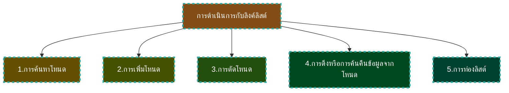
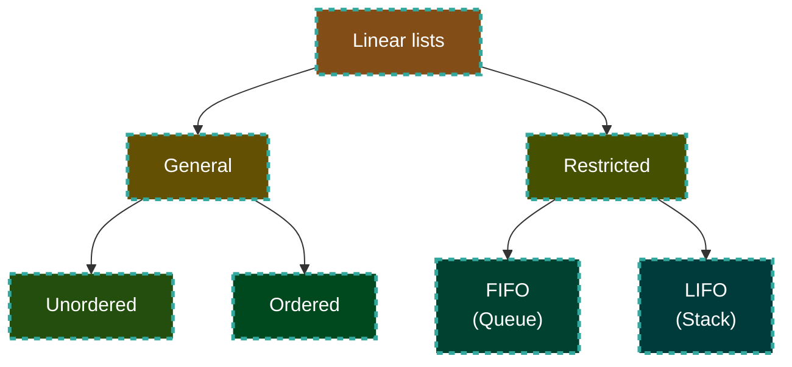

# โครงสร้างข้อมูล Data structure

---

# โครงสร้างข้อมูล

- เราจะศึกษาโครงสร้างข้อมูล 3 แบบคือ 

1. อะเรย์ (Array)
2. ระเบียน (Record)
3. ลิงค์ลิสท์ (Link List)

โปรแกรมคอมพิวเตอร์ส่วนมากจะใช้โครงสร้างข้อมูล 2 ประเภทแรก 
- ส่วนลิงค์ลิสท์จะทำการจำลองแบบโดยใช้ ตัวชี้ (pointers) 
- และ ระเบียน


---
layout: section
---

# Arrays

---
layout: two-cols
---

# Arrays (อะเรย์)

- สมมติว่าท่านมีโจทย์ปัญหาที่จำเป็นต้องประมวลผลตัวเลข 20 จำนวน ท่านต้องอ่านเลขทั้ง 20 จำนวน ประมวลผลทั้ง 20 จำนวน และพิมพ์ผลลัพธ์ ยิ่งกว่านั้น ท่านจะต้องเก็บเลขทั้ง 20 จำนวนไว้ในหน่วยความจำตลอดช่วงเวลาการประมวลผลของโปรแกรม ท่านอาจกำหนดตัวแปร 20 ตัวเพื่อเก็บตัวละค่า แต่ละตัวมีชื่อที่แตกต่างกัน

::right::


---
layout: two-cols
---

# Arrays (อะเรย์) (2)

- การตั้งชื่อตัวแปร 20 ตัวที่แตกต่างกันมีความลำบากและก่อให้เกิดปัญหาที่ตามาอีกอย่างหนึ่งคือ เราจะอ่านข้อมูลจากคีย์บอร์ดและนำเข้าไปเก็บอย่างไร? การอ่านเลขจำนวน 20 จำนวนต้องใช้การอ้างอิงรวม 20 ครั้ง ตัวแปรละ 1 ครั้ง นอกจากนี้การพิมพ์ก็ต้องมีการอ้างอิงอีก 20 ครั้ง 

::right::

<div class="w-[125px]">


</div>

---

# Arrays (อะเรย์) (3)

- จากตัวอย่างที่กล่าวมา อาจยอมรับได้สำหรับข้อมูลที่มี 20 จำนวน แต่ถ้าโจทย์ปัญหาของเราต้องใช้ข้อมูลมากๆเช่น 200 หรือ 2,000 หรือ 20,000 จำนวนก็คงดำเนินการเช่นที่ผ่านมาอย่างมีประสิทธิภาพไม่ได้
- การประมวลผลกับข้อมูลที่มีจำนวนมากๆ ในทางคอมพิวเตอร์จะต้องใช้โครงสร้างข้อมูลที่มีประสิทธิภาพทั้งในเรื่องการตั้งชื่อ การอ่าน การประมวลผล และการพิมพ์ โครงสร้างข้อมูลดังกล่าวคือ อะเรย์ (array)
- อะเรย์เป็นโครงสร้างข้อมูลที่มี ขนาดคงที่ เป็นข้อมูลประเภทเดียวกัน และเรียงกันอยู่ตามลำดับของหน่วยความจำที่ใช้เก็บ การอ้างถึงข้อมูลในอะเรย์สามารถอ้างถึงตัวที่หนึ่ง ตัวที่สอง และตัวต่อๆไปจนหมด
---
layout: two-cols
---

# Arrays (อะเรย์) (4)

- ถ้าเราต้องการเก็บเลข 20 จำนวนไว้ในอะเรย์ เราสามารถเก็บข้อมูลตัวแรกอยู่ที่ number<sub>0</sub> ในทำนองเดียวกันข้อมูลตัวที่สองเก็บอยู่ที่ number<sub>1</sub> และเป็นเช่นนี้ไปจนข้อมูลตัวสุดท้ายจะเก็บไว้ที่ number<sub>19</sub> โดยตัวเลขที่ห้อย (subscript) จะระบุเลขที่ลำดับของข้อมูลที่นับลำดับจากตำแหน่งเริ่มต้นของอะเรย์

::right::

<div class="w-[300px] mx-auto">


</div>

---
layout: two-cols
---

# Arrays (อะเรย์) (5)

- จะเห็นว่าข้อมูลแต่ละตัวในอะเรย์จะมี ตำแหน่งที่อยู่ (address) เป็นของตัวเองโดยเฉพาะซึ่งกำหนดโดยตัวเลขที่ห้อย โครงสร้างอะเรย์โดยรวมแล้วมีชื่อเดียวคือ number และข้อมูลแต่ละตัวในอะเรย์สามารถเข้าถึงได้อย่างเป็นอิสระต่อตัวอื่นโดยใช้ตัวเลขที่ห้อย

::right::

<div class="w-[300px] mx-auto">


</div>

---


# Arrays (อะเรย์) (6)

- ข้อดีอย่างหนึ่งของโครงสร้างข้อมูลอะเรย์คือมีโครงสร้าง (constructs) ของภาษาคอมพิวเตอร์ที่ช่วยให้การประมวลผลอะเรย์ได้อย่างมีประสิทธิภาพมากขึ้น โครงสร้างดังกล่าวคือการทำซ้ำๆ (loops) ซึ่งทำให้การประมวลผลอะเรย์ง่ายขึ้น

- เราสามารถใช้การทำซ้ำๆเพื่ออ่าน เขียน บวก ลบ คูณ หรือ หารสมาชิกของอะเรย์ นอกจากนี้เรายังสามารถใช้การทำซ้ำๆเพื่อการระมวลผลที่ซับซ้อนมากขึ้นเช่นการคำนวณหาค่าเฉลี่ยของค่าทั้งหมดในอะเรย์ ไม่ว่าจะมีข้อมูล 2, 20, 200, 2000 หรือ 20,000 จำนวนก็ตาม การทำซ้ำๆทำให้การประมวลผลโครงสร้างอะเรย์สะดวกและรวดเร็วยิ่งขึ้น

---
layout: two-cols
---

# Arrays (อะเรย์) (7)

- ยังมีปัญหาที่จะต้องคิดต่อคือเราจะเขียนคำสั่งเพื่อเข้าถึงสมาชิกตัวแรกและตัวต่อๆไปอย่างไร? แนวทางคือใช้ตัวเลขที่ห้อยให้เกิดประโยชน์ โดยการเขียนตัวเลขที่ห้อยไว้ในวงเล็บใหญ่ [ ] เช่น number0 จะเขียนแทนด้วย number[0] และ number1 แทนด้วย number[1] เป็นต้น การแทนด้วยวิธีการดังกล่าวรู้จักกันในชื่อดัชนี (indexing) การอ้างถึงข้อมูลในอะเรย์จะใช้ชื่อตัวแปรที่เป็นชื่อของอะเรย์ 


::right::

<div class="mx-auto w-full">
<div class="font-bold text-center text-2xl">
การประมวลผล array
</div>

<div class="w-[130px] mx-auto">


</div>
</div>

---
layout: two-cols
---

# 2D Arrays (อะเรย์ 2-มิติ)

- โครงสร้างข้อมูลอะเรย์ที่กล่าวมาแล้วเรียกว่าอะเรย์ 1-มิติ ที่เรียกเช่นนี้เพราะว่าข้อมูลจัดเรียงตามแนวไปในทิศทางเดียว แต่ในการประยุกต์ใช้จริงยังมีความต้องการในการใช้ข้อมูลที่มีมากกว่า 1-มิติ ที่เราพบเสมอคือข้อมูลที่อยู่ในรูปเมตริกซ์ซึ่งมี 2 แถวในแนวนอน (row) และ 2 แถวในแนวตั้ง (column) ดังรูป  แสดงตารางซึ่งปกติจะเรียกว่าอะเรย์ 2-มิติ จากรูปนี้เราสามารถกำหนดอะเรย์  3-มิติ อะเรย์ 4-มิติ และต่อๆไปได้ อะเรย์ที่มีมิติที่สูงกว่า 2 เราเรียกว่าอะเรย์หลายมิติ (multidimensional array) ซึ่งจะไม่กล่าวถึง ณ ที่นี้ เอาไว้เรียนในวิชาที่สูงขึ้น

::right::

<div class="mx-auto w-[300px]">


</div>

---
layout: two-cols
---

# 2D Arrays (อะเรย์ 2-มิติ)

- ดัชนีของอะเรย์ 2-มิติแทน row และ column ซึ่งรูปแบบนี้จะแทนรูปแบบการเก็บข้อมูลในหน่วยความจำ ถ้าเราพิจารณาหน่วยความจำประกอบด้วยแถวของไบท์โดยที่ตำแหน่งที่อยู่ (address) ที่น้อยที่สุดอยู่ทางซ้ายมือสุด และตำแหน่งที่อยู่ (address) ที่มากที่สุดอยู่ทางขวามือสุด ดังนั้น อะเรย์จะเก็บค่าข้อมูลตัวแรกไว้ที่หน่วยความจำซ้ายมือสุด และค่าข้อมูลตัวสุดท้ายจะเก็บไว้ที่หน่วยความจำขวามือสุด
ในกรณีที่เป็นอะเรย์ 2-มิติ มิติแรกคือแถวของข้อมูลที่เก็บอยู่ด้านซ้าย วิธีการเก็บแบบนี้เรียกว่า “row-major” storage ดังแสดงในรูป

::right::

<div class="mx-auto w-[400px]">


</div>

---
layout: section
---

# ระเบียน Records

---

# ระเบียน

- ระเบียนเป็นโครงสร้างข้อมูลที่ประกอบด้วยกลุ่มของข้อมูลที่สัมพันธ์กันซึ่งข้อมูลอาจต่างประเภทกันและมีชื่อเรียกเพียงชื่อเดียว แต่ละส่วน ประกอบที่เป็นส่วนย่อยที่เล็กที่สุดในระเบียนเรียกว่าฟิลด์ (field) โดยที่ฟิลด์เป็นชื่อของข้อมูลที่มีความหมาย ฟิลด์ต้องระบุประเภทของข้อมูลและลักษณะการเก็บในหน่วยความจำ ฟิลด์สามารถกำหนดให้เก็บข้อมูล  และสามารถเข้าถึงได้ ฟิลด์แตกต่างจากตัวแปรคือฟิลด์เป็นส่วนหนึ่งของระเบียนเท่านั้น คุณสมบัติอื่นๆจะเหมือนกับตัวแปรทั่วไป

---
layout: two-cols
---

# ระเบียน (2)

- ความแตกต่างระหว่างอะเรย์กับระเบียนคือทุกข้อมูลในอะเรย์จะต้องเป็นประเภทเดียวกัน แต่ข้อมูลในระเบียนอาจเหมือนหรือต่างประเภทกันได้ ตัวอย่างในรูป  ประกอบด้วยระเบียน  2 ระเบียน โดยระเบียนแรกชื่อ fraction ประกอบด้วย  2 ฟิลด์ แต่ละฟิลด์เป็นประเภทจำนวนเต็ม (integer) ในระเบียนที่สองที่ชื่อ student มี 3 ฟิลด์ โดยฟิลด์แรกชื่อ id อาจมีประเภทของข้อมูลเป็นสตริงหรือจำนวนเต็มก็ได้ ส่วนฟิลด์ name มีประ เภทข้อมูลเป็นสตริง ส่วนฟิลด์ gradePoint มีปรเภทข้อมูลเป็นจำนวนจริง เป็นต้น

::right::

<div>

<div class="text-center font-bold text-2xl">ระเบียน</div>


</div>

---

# ระเบียน (3)

- ข้อมูลในระเบียนอาจเป็นประเภทเดียวกันหรือต่างประเภทกันก็ได้ แต่ข้อมูลทั้งหมดภายในระเบียนเดียวกันจะต้องสัมพันธ์กัน  

---
layout: two-cols
---

# การเข้าถึงระเบียน

- ข้อพึงระวัง: ข้อมูลแต่ละฟิลด์ในระเบียนจะต้องสัมพันธ์ซึ่งกันและกัน ระเบียนแรกในรูป ประเภทของข้อมูลทั้งสองฟิลด์เป็นจำนวนเต็มของเศษส่วนจำนวนเดียวกัน ส่วนข้อมูลในระเบียนที่สองของทั้งสามฟิลด์มีความสัมพันธ์กันทั้งหมดเพราะเป็นข้อมูลของนักเรียนคนเดียวกัน

- การเข้าถึงข้อมูลในแต่ละฟิลด์ของระเบียนสามารถกระทำได้โดยการเขียนเป็นคำสั่งที่ประกอบด้วยตัวกระทำ (operator) การกระทำใดก็ตามที่เราสามารถทำได้กับตัวแปรปกติ เราสามารถทำได้กับฟิลด์ในระเบียนเช่นเดียวกัน แต่จะต้องระบุเฉพาะฟิลด์ที่ต้องการเท่านั้น


::right:: 

<div>

<div class="text-center font-bold text-2xl">ระเบียน</div>


</div>

---
layout: two-cols
---

# การเข้าถึงระเบียน(2)

- เนื่องจากแต่ละฟิลด์ในระเบียนมีชื่อเฉพาะที่ไม่ซ้ำกัน การเข้าถึงทำได้โดยการระบุชื่อของฟิลด์เท่านั้น แต่ถ้าต้องการเปรียบเทียบค่าข้อมูลในฟิลด์ที่มีชื่อเดียวกันแต่อยู่ในระเบียนที่มีชื่อต่างกัน เราทำได้โดยระบุชื่อระเบียนตามด้วย . (จุด) แล้วตามด้วยชื่อฟิลด์ เช่นถ้าเรามี 2 ระเบียน ชื่อ student1 กับ student2 ซึ่งเป็นระเบียนประเภทเดียวกัน เราสามารถเข้าถึงระเบียนทั้งสองได้ดังนี้

```
	student1.id,  student1.name,  และ student1.gradePoint
	student2.id,  student2.name,  และ student2.gradePoint
```

- เราสามารถอ่านและเขียนข้อมูลจากระเบียนได้เช่นเดียวกับตัวแปร


::right:: 

<div>

<div class="text-center font-bold text-2xl">ระเบียน</div>


</div>

---
layout: section

---

# ลิงค์ลิสต์ LINKED LISTS

---

# ลิงค์ลิสต์

- ลิงค์ลิสต์เป็นโครงสร้างข้อมูลที่ประกอบด้วยกลุ่มของข้อมูลที่จัดเรียงตามลำดับที่ข้อมูลแต่ละตัวจะมีตำแหน่งที่อยู่ (location/address) ของข้อมูลในลำดับถัดไป นั่นคือข้อมูลแต่ละตัวประกอบด้วย 2 ส่วนคือส่วนที่เป็นข้อมูล (data) และส่วนที่เป็นตัวเชื่อมโยง (link) ส่วนข้อมูลจะมีข้อมูลตามที่กำหนดให้ใช้ในการประมวลผล ส่วนตัวเชื่อมโยงเป็นตัวชี้ (pointer) ที่เก็บตำแหน่งที่อยู่ของข้อมูลตัวถัดไปที่อยู่ในลิสต์นั้น จุดเริ่ม ต้นของลิงค์ลิสต์เป็นตัวแปรประเภทตัวชี้ที่ชี้ไปยังสมาชิกตัวแรกของลิสต์ ชื่อของลิสต์จะเป็นชื่อเดียวกับชื่อตัวแปรที่เป็นตัวชี้ ลิงค์ลิสต์ที่จะอธิบายต่อไปนี้เป็นลิสต์ธรรมดาที่เรียกว่า singly linked list เพราะว่าเป็นลิสต์ที่มีเพียงลิงค์เดียวที่ชี้ไปยังข้อมูลตัวถัดไป

---
layout: two-cols
---

# ลิงค์ลิสต์

- ลิงค์ลิสต์ไม่ใช่โครงสร้างข้อมูลโดยตัวของมันเอง แต่เกิดจากการจำลองแบบโครงสร้างด้วยโครงสร้างของภาษาคอมพิวเตอร์ที่ใช้ รูปแสดงลิงค์ลิสต์ชื่อ pList (แทนตัวชี้ที่ชี้ไปยังข้อมูลตัวแรก หรือ head ของลิสต์) ที่ประกอบด้วยข้อมูล 4 ชุด ลิงค์ของข้อมูลแต่ละตัวยกเว้นตัวสุดท้ายชี้ไปยังข้อมูลตัวถัดไป ส่วนลิงค์ของข้อมูลตัวสุดท้ายไม่ได้ชี้ไปที่ใด เรียกตัวชี้ตัวสุดท้ายนี้ว่า null pointer เป็นตัวบ่งบอกว่าจบลิงค์ลิสต์

::right::
<div>

<div class="text-center font-bold text-2xl">ลิงค์ลิสต์</div>


</div>

---
layout: two-cols
---

# ลิงค์ลิสต์ (2)

- เรานิยามลิงค์ลิสต์ที่ไม่มีสมาชิก หรือลิสต์ว่าง (empty linked list) ว่าคือลิสต์ที่มี head pointer เป็น null รูปแสดงลิงค์ลิสต์ชื่อ pList แต่เป็นลิสต์ว่าง

::right::
<div>

<div class="text-center font-bold text-2xl">ลิงค์ลิสต์</div>


</div>

---
layout: two-cols
---

# โหนด (nodes)

- โดยปกติ สมาชิกในลิงค์ลิสต์มักจะเรียกว่าโหนด (node) โดยแต่ละโหนดเปรียบได้กับหนึ่งระเบียนที่ประกอบด้วยอย่างน้อย 2 ฟิลด์คือฟิลด์แรกเก็บข้อมูล และฟิลด์ที่สองเก็บตำแหน่งที่อยู่ของโหนดถัดไปในลิสต์ แสดงดังรูป โหนดในลิงค์ลิสต์มักเรียกว่าระเบียนที่อ้างอิงตัวเอง (self-referential records) ในระเบียนประเภทนี้ แต่ละกรณีของระเบียน (instance) จะมี pointer ที่ชี้ไปยังกรณีของระเบียนตัวต่อไปที่มีโครงสร้างเดียวกัน


::right::

<div class="mx-auto w-[300px]">

<div class="text-center font-bold text-2xl">Node</div>


</div>


---
layout: two-cols
---

# ตัวชี้ไปยังลิงค์ลิสต์

- ลิงค์ลิสต์จะต้องมี head pointer เสมอ ส่วน pointer ที่อยู่ในแต่ละโหนดนั้นอาจมีมากกว่าหนึ่งก็ได้ ขึ้นอยู่กับวัตถุประสงค์ในการใช้งาน เช่นถ้าเราต้องการค้นหาข้อมูลในลิงค์ลิสต์ เราจะต้องมี pointer (pLoc) ที่ชี้ไปยังตำแหน่งที่อยู่ของข้อมูลที่เราต้องการค้นหา ในกรณีที่มีระเบียนจำนวนมากๆ การประมวลผลจะมีประสิทธิภาพมากขึ้นถ้ามีการใช้ pointer 2 ตัว คือตัวหนึ่งชี้ไปยัง head ของลิงค์ลิสต์ อีกตัวหนึ่งชี้ไปที่โหนดสุดท้ายของลิสต์ pointer ที่ชี้ไปยังโหนดตัวสุดท้ายนี้มักจะเรียกว่า pLast หรือ pRear การตั้งชื่อเช่นนี้ก็เพื่อให้สอดคล้องกับความหมายที่ pointer นี้แทนเท่านั้น เราอาจตั้งชื่อเป็นอย่างอื่นก็ได้


::right::

<div class="">

<div class="text-center font-bold text-2xl">Node</div>


</div>

---

# การดำเนินการกับลิงค์ลิสต์

- เรานิยามการดำเนินการกับลิงค์ลิสต์ 5 รูปแบบซึ่งเพียงพอสำหรับการแก้ ปัญหาที่เกี่ยวกับลิสต์แบบลำดับ (sequential list) แต่ถ้าการประยุกต์กับปัญหาใดที่ต้องการการดำเนินการเพิ่มเติม ก็สามารถเพิ่มได้โดยง่าย การดำเนินการทั้ง 5 มีดังนี้




---
layout: two-cols
---

# 1. การค้นหาโหนด

- การค้นหาโหนดในลิสต์ (Searching a List): การค้นหาโหนดในลิสต์เป็นการดำเนินการที่ถูกเรียกใช้โดยการดำเนินการอื่น เช่นการเพิ่มโหนดเข้าไปในลิสต์ เราต้องทราบตำแหน่งของโหนดที่อยู่ก่อนหน้าโหนดที่เราต้องการเพิ่ม และถ้าต้องการตัดโหนดที่ไม่ต้องการออก เราก็จะต้องค้นหาโหนดนั้นให้พบก่อน ในทำนองเดียวกัน ถ้าเราต้องการดึงข้อมูลจากโหนดที่ต้องการ ก็ต้องค้นหาโหนดนั้นให้พบก่อนเช่นกัน
- การค้นหาโหนดในลิสต์โดยใช้คีย์ แต่ละโหนดในลิสต์จะต้องมีฟิลด์ที่ใช้เป็นคีย์ อย่างไรก็ตาม ถ้าการค้นหาใช้ข้อมูลเป็นตัวค้น ฟิลด์ที่เป็นคีย์จะเป็นฟิลด์เดียวกับฟิลด์ข้อมูลก็ได้

::right::


<div class="">

<div class="text-center font-bold text-2xl">การค้นหาโหนด</div>


</div>

---
layout: two-cols
---

# 1. การค้นหาโหนด (2)

- ในกรณีที่โหนดเป็นระเบียนที่มีความซับซ้อน ฟิลด์ที่เป็นคีย์โดยเฉพาะจำเป็นจะต้องมี เมื่อกำหนดคีย์ที่ต้องการให้ การค้นหาโหนดที่ต้องการในลิงค์ลิสต์คือพยายามหาตำแหน่งที่อยู่ของโหนดที่มีค่าข้อมูลในฟิลด์ที่เป็นคีย์เท่ากับค่าคีย์ที่กำหนด ถ้ามีโหนดซึ่งมีค่าคีย์ตรงตามที่กำหนด การค้นหาก็ประสบความสำเร็จด้วยการส่งผลไปยังผู้เรียกใช้ (อาจเป็นการดำเนินการอื่น)ว่า “true” หรือ “success” แต่ถ้าไม่มีโหนดที่มีค่าคีย์ตรงตามที่กำหนด การค้นหาก็ประสบกับความล้มเหลว (failure) พร้อมทั้งส่งผลไปยังผู้ใช้ว่า “false” หรือ “failure”


::right::


<div class="">

<div class="text-center font-bold text-2xl">การค้นหาโหนด</div>


</div>

---

# การค้นหาโหนด

<v-switch>

<template #0>

```
search: 178
Move : 0
pre : null
cur : Node(102)
```


</template>

<template #1>

```
search: 178
Move : 1
pre : Node(102)
cur : Node(302)
```


</template>

<template #2>

```
search: 178
Move : 2
pre : Node(302)
cur : Node(178)
return : "success"
```


</template>
</v-switch>

---
layout: two-cols
---

# 2. การเพิ่มโหนด

- การเพิ่มโหนด (Inserting a Node): ดำเนินการตาม 3 ขั้นตอนต่อไปนี้
    1. ✔จัดหาหน่วยความจำสำหรับโหนดใหม่พร้อมทั้งใส่ข้อมูล
    2. กำหนดค่าให้ลิงค์ฟิลด์ของโหนดใหม่ชี้ไปยังโหนดถัดไป
    3. กำหนดให้ลิงค์ฟิลด์ของโหนดก่อนหน้า ชี้ไปยังโหนดใหม่


::right::


<div class="">

<div class="text-center font-bold text-2xl">การเพิ่มโหนด</div>


</div>


---
layout: two-cols
---

# 2. การเพิ่มโหนด (2)

- การเพิ่มโหนด (Inserting a Node): ดำเนินการตาม 3 ขั้นตอนต่อไปนี้
    1. จัดหาหน่วยความจำสำหรับโหนดใหม่พร้อมทั้งใส่ข้อมูล
    2. ✔กำหนดค่าให้ลิงค์ฟิลด์ของโหนดใหม่ชี้ไปยังโหนดถัดไป
    3. กำหนดให้ลิงค์ฟิลด์ของโหนดก่อนหน้า ชี้ไปยังโหนดใหม่


::right::


<div class="">

<div class="text-center font-bold text-2xl">การเพิ่มโหนด</div>


</div>


---
layout: two-cols
---

# 2. การเพิ่มโหนด (3)

- การเพิ่มโหนด (Inserting a Node): ดำเนินการตาม 3 ขั้นตอนต่อไปนี้
    1. จัดหาหน่วยความจำสำหรับโหนดใหม่พร้อมทั้งใส่ข้อมูล
    2. กำหนดค่าให้ลิงค์ฟิลด์ของโหนดใหม่ชี้ไปยังโหนดถัดไป
    3. ✔กำหนดให้ลิงค์ฟิลด์ของโหนดก่อนหน้า ชี้ไปยังโหนดใหม่


::right::


<div class="">

<div class="text-center font-bold text-2xl">การเพิ่มโหนด</div>


</div>


---
layout: two-cols
---

# 2. การเพิ่มโหนด (4)

- ตั้งค่า pointer new ให้เป็น null

::right::


<div class="">

<div class="text-center font-bold text-2xl">การเพิ่มโหนด</div>


</div>


---
layout: two-cols
---

# 3. การตัดโหนด

- การตัดโหนด (Deleting a node): การตัดโหนดในลิงค์ลิสต์ ก่อนอื่นต้องค้นหาโหนดที่ต้องการให้พบก่อน เมื่อพบแล้วก็เพียงทำการเปลี่ยนลิงค์ฟิลด์ของโหนดก่อนหน้าให้ชี้ไปยังโหนดที่ถัดไปจากโหนดที่ต้อง การตัด (ดังรูป) การตัดโหนดต้องระวังกรณีที่ในลิงค์ลิสต์มีเพียงโหนดเดียว เพราะผลลัพธ์คือลิสต์ว่าง เช่นเดียวกัน การตัดโหนดแรกก็ต้องใช้ความระมัดระวังเช่นเดียวกัน เพราะขั้นตอนที่อธิบายข้างต้นจะต้องมีการปรับเปลี่ยนบ้าง มิฉะนั้นอาจก่อให้เกิดผลที่ผิดพลาดได้

::right::


---

# 4. การดึงหรือการค้นข้อมูลจากโหนด

- การดึงหรือการค้นคืนข้อมูลจากโหนด (Retrieving a Node): การค้นคืนข้อมูลจากลิงค์ลิสต์ทำได้โดยการค้นหาโหนดที่ต้องการก่อน ถ้าพบจึงจะสามารถดึงข้อมูลออกมาได้จาก cur pointer

---

# 5. การท่องลิสต์ 

- การท่องลิสต์ (Traversing a List): อัลกอริธึมสำหรับการท่องลิสต์เริ่มต้นจากโหนดแรกในลิสต์ ทำการตรวจสอบและประมวลผลแต่ละโหนดตามลำดับจนถึงโหนดสุดท้าย การท่องลิสต์จำเป็นต้องใช้เพื่อเป็นส่วนหนึ่งของหลายๆ อัลกอริธึมเช่น การเปลี่ยนค่าในแต่ละโหนด การพิมพ์ค่าในลิสต์ การหาผลรวมของข้อมูลในลิสต์ การหาค่าเฉลี่ย เป็นต้น


---
layout: cover

---

# Abstract Data Type

---
layout: section
---


# LINEAR  LISTS

---

# ประเภทของ Linear list



---

# Linear Lists

- เราจะเริ่มด้วยการนิยามและอธิบาย ADT ตัวแรกคือ linear list โดย linear list เป็นรายการเชื่อมโยงที่สมาชิกแต่ละตัวในรายการจะมีตัวตามเพียงตัวเดียวที่ไม่ซ้ำกัน หรือกล่าวอีกอย่างหนึ่งคือ linear list มีโครง สร้างที่เป็นลำดับ (sequential structure) ลักษณะของ linear list แสดงดังรูป


Linear list แบ่งออกเป็น 2 ประเภทใหญ่ๆคือ แบบมีข้อจำกัด (restricted list) กับ แบบทั่วไป (general list) มีรายละเอียดดังนี้
1. Restricted list เป็นรายการที่ข้อมูลสามารถแทรกหรือลบทิ้งได้เฉพาะส่วนหัว (head) หรือส่วนท้าย (tail) ของลิสต์เท่านั้น 

ลิสต์ประเภทนี้  2 ชนิดคือ 
- First In First Out list (FIFO) ได้แก่ Queue กับ 
- Last In First Out list (LIFO)  ได้แก่ Stack

---

# Linear Lists (2)

2. General list เป็นรายการที่ข้อมูลอาจแทรกหรือลบทิ้ง ณ ส่วนใดของลิสต์ก็ได้ และไม่มีข้อจำกัดเกี่ยวกับการกระทำที่จะใช้ทำการประมวลผลรายการในลิสต์ ลิสต์แบบทั่วไปแบ่งได้อีกเป็น 2 ชนิดคือ 
- random list กับ 
- ordered list 

ใน random list จะไม่มีการจัดลำดับของข้อมูล ส่วนใน ordered list ข้อมูลจะมีการเรียงลำดับตามคีย์  ซึ่งคีย์อาจประกอบด้วยข้อมูลของฟิลด์ตั้งแต่หนึ่งฟิลด์ขึ้นไปภายในโครงสร้าง ในโครงสร้างอะเรย์หนึ่งมิติที่ได้ศึกษามาแล้ว ข้อมูลในอะเรย์จะทำหน้าที่เป็นคีย์ด้วย 


---
layout: section
---

# Stack (Last In First Out Restricted Linear List)

---
layout: two-cols
---

# Stack

- Stack เป็น linear list ที่จำกัดให้การเพิ่มและการลบสมาชิกต้องทำที่ส่วนหัวของลิสต์ (ภาษาอังกฤษเรียกว่า “top”) ถ้าเราใส่ (push) ข้อมูลหลายๆตัวเข้าไปใน stack แล้วทำการดึงออก (pop)

- ลำดับของข้อมูลที่ดึงออกจะสลับกับข้อมูลที่เข้า หมายความว่าข้อมูลที่เข้าทีหลังจะถูกดึงออกมาก่อน 
    - เช่นถ้าข้อมูลนำเข้าเป็น 5, 10, 15, 20 
    - เมื่อถูกดึงออกจะเป็น 20, 15, 10, 5 
- ด้วยเหตุนี้ทำให้ stack รู้จักกันในนามโครงสร้างข้อมูลประเภท Last In, First Out (LIFO)
 
- รูปนี้แสดงให้เห็นตัวอย่างของ stack 3 ประเภทคือ stack กองเหรียญ stack กองหนังสือ และ stack ที่ใช้ในคอมพิวเตอร์

::right::


<div class="mx-auto w-[400px]">

<div class="text-center font-bold text-2xl">ตัวอย่างของ Stack</div>


</div>

---
layout: two-cols
---

# การดำเนินการกับ Stack

- แม้ว่าเราสามารถนิยามการดำเนินการกับ stack ได้หลายรูปแบบ แต่การดำเนินการที่เป็นพื้นฐานของ stack มี 3 แบบคือ push, pop, และ empty รายละเอียดของการดำเนินการแต่ละแบบมีดังนี้

1. Push เป็นการเพิ่มสมาชิกหรือข้อมูลเข้าไปใน stack (ดังรูป) หลังจากทำการ push แล้วสมาชิกหรือข้อมูลใหม่จะอยู่ที่ top ของ stack 
    - ปัญหาหนึ่งที่อาจเกิดขึ้นคือ stack ไม่มีที่ว่างสำหรับข้อมูลใหม่ ในกรณีนี้เราเรียกว่า stack เกิด overflow และข้อมูลนั้นจะไม่สามารถใส่เข้าไปใน stack ได้

::right::


<div class="mx-auto w-[400px]">

<div class="text-center font-bold text-2xl">การดำเนินการ Push กับ Stack</div>


</div>

---
layout: two-cols
---

# การดำเนินการกับ Stack (2)

2. Pop เป็นการดำเนินการที่ตัด (remove) สมาชิกหรือข้อมูลที่อยู่ top ของ stack ออก (ดังรูป) 
    - เมื่อข้อมูลที่ top ของ stack ถูก pop ออก ค่าของ top จะชี้ไปยังสมาชิกหรือข้อมูลตัวถัดไป (กรณีที่เป็น Array ค่าของ top จะลดลง 1 คือ top = top – 1) 
    - ในกรณีที่ข้อมูลตัวสุดท้ายใน stack ถูก pop ออกไปจะทำให้ stack ว่าง ถ้าการกระทำ pop เรียกใช้กับ stack ที่ว่าง จะทำให้เกิดสถานะ underflow

::right::


<div class="mx-auto w-[400px]">

<div class="text-center font-bold text-2xl">การดำเนินการ Push กับ Stack</div>


</div>

---
layout: two-cols
---

# การดำเนินการกับ Stack (3)


3. Empty เป็นการดำเนินการที่ตรวจสอบว่า stack ว่างหรือไม่? 
    - ถ้า stack ว่าง การดำเนินการ empty จะส่งกลับค่า “true” 
    - แต่ถ้า stack ไม่ว่าง การกระทำ empty จะส่งค่า “false” กลับไปยังผู้เรียกใช้
::right::


<div class="mx-auto w-[400px]">

<div class="text-center font-bold text-2xl">การดำเนินการ Push กับ Stack</div>


</div>

---
layout: two-cols
---

# ตัวอย่างที่ 1 : จงแสดงผลลัพธ์จากการดำเนินการกับ stack S

````md magic-move {at:1, lines: true}

``` {0}
No instruction
```

```js {1|2|3|4|5}
push(S, 10)
push(S, 12)
push(S, 8)
if not empty(S), then pop(S)
push(S, 2)
```

````

::right::

<v-switch>

<template #0>

<div class="flex flex-col justify-center items-center w-full">
    <div class="w-[200px] h-[300px] border border-black dark:border-white flex justify-center items-center">
    Empty Stack
    </div>
</div>

</template>

<template #1>

<div class="flex justify-center items-center w-full">
    <div class="flex flex-col w-[200px] h-[300px] border border-black dark:border-white justify-end">
        <div class="border-t border-t-black dark:border-t-white h-[100px] w-full flex items-center justify-center">10</div>
    </div>
</div>

</template>
<template #2>

<div class="flex justify-center items-center w-full">
    <div class="flex flex-col w-[200px] h-[300px] border border-black dark:border-white justify-end">
        <div class="border-t border-t-black dark:border-t-white h-[100px] w-full flex items-center justify-center">12</div>
        <div class="border-t border-t-black dark:border-t-white h-[100px] w-full flex items-center justify-center">10</div>
    </div>
</div>

</template>
<template #3>

<div class="flex justify-center items-center w-full">
    <div class="flex flex-col w-[200px] h-[300px] border border-black dark:border-white justify-end">
        <div class="h-[100px] w-full flex items-center justify-center">8</div>
        <div class="border-t border-t-black dark:border-t-white h-[100px] w-full flex items-center justify-center">12</div>
        <div class="border-t border-t-black dark:border-t-white h-[100px] w-full flex items-center justify-center">10</div>
    </div>
</div>

</template>
<template #4>

<div class="flex justify-center items-center w-full">
    <div class="flex flex-col w-[200px] h-[300px] border border-black dark:border-white justify-end">
        <div class="border-t border-t-black dark:border-t-white h-[100px] w-full flex items-center justify-center">12</div>
        <div class="border-t border-t-black dark:border-t-white h-[100px] w-full flex items-center justify-center">10</div>
    </div>
</div>

</template>

<template #5>

<div class="flex justify-center items-center w-full">
    <div class="flex flex-col w-[200px] h-[300px] border border-black dark:border-white justify-end">
        <div class="h-[100px] w-full flex items-center justify-center">2</div>
        <div class="border-t border-t-black dark:border-t-white h-[100px] w-full flex items-center justify-center">12</div>
        <div class="border-t border-t-black dark:border-t-white h-[100px] w-full flex items-center justify-center">10</div>
    </div>
</div>

</template>
</v-switch>

---

# การ Implement Stack

- ถึงแม้ว่าเราสามารถ implement stack โดยใช้ Array หรือ Linked List ก็ได้ แต่ที่นิยมใช้กันมากคือใช้ linked list เนื่องจากว่าการดำเนินการ pop และ push สามารถทำได้โดยง่าย ส่วนการประยุกต์ใช้ stack มีมากมายหลายสถานการณ์ แบ่งออกเป็นกลุ่มหลักได้  4 กลุ่มดังนี้

1. Reversing data เป็นการใช้ stack เพื่อทำการสลับที่ของข้อมูลซึ่งข้อมูลตัวสุดท้ายจะเปลี่ยนตำแหน่งกับข้อมูลตัวแรก ตัวที่สองสลับที่กับตัวรองสุดท้าย ตัวต่อๆไปก็สลับเช่นเดียวกัน เช่นข้อมูล 1  2  3   4 เปลี่ยน เป็น 4  3  2  1 เป็นต้น

---

# การ Implement Stack (2)

2. Parsing เป็นกระบวนการแบ่งแยกข้อมูลออกเป็นส่วนย่อยๆ ที่เป็นอิสระต่อกันเพื่อนำไปใช้ประมวลตามวัตถุประสงค์อื่นต่อไป เช่นการแปลโค๊ดโปรแกรมเป็นภาษาเครื่อง ตัวแปลภาษาจะต้องแบ่งแยกโปรแกรมออกเป็นส่วนย่อยๆเช่น คำสำคัญ (keywords) ชื่อ (names) และ เครื่องหมาย (tokens) เป็นต้น
    - ปัญหาที่พบเสมอในการเขียนโปรแกรมคือการไม่เท่ากันของวงเล็บเปิดกับวงเล็บปิด ซึ่งเกิดจากจำนวนวงเล็บเปิดไม่เท่ากับวงเล็บปิด 
    - การประยุกต์โดยใช้ stack คือเมื่อพบวงเล็บเปิดให้ทำการ push เข้าไปใน stack และเมื่อพบวงเล็บปิดให้ pop วงเล็บเปิดที่อยู่ที่ top ของ stack ทิ้งไป 
    - เมื่อประมวลผลเสร็จและ stack ว่าง แสดงว่าจำนวนวงเล็บเท่ากัน

---

# การ Implement Stack (3)

3. Postponement เป็นกระบวนการยืดเวลาการใช้ข้อมูลออกไปจน กว่าจะถึงเหตุการณ์ตามที่กำหนด stack สามารถใช้เป็นเครื่องมือเพื่อบรรลุวัตถุประสงค์นี้ได้ ซึ่งนักศึกษาจะเห็นได้ในหัวข้อต่อๆไป

4. Backtracking เป็นกระบวนการดำเนินการที่ย้อนกลับไปยังข้อมูลก่อนข้อมูลปัจจุบันเช่นการเล่นเกม การวิเคราะห์การตัดสินใจ และวิธีการที่ใช้ในระบบผู้เชี่ยวชาญเป็นต้น

---
layout: section
---

# QUEUES (First In First Out Restricted Linear List)

---

# QUEUE

- Queue เป็น linear list ที่ข้อมูลสามารถเพิ่ม (add) ได้เฉพาะที่ส่วนท้าย (rear หรือ tail) ของลิสต์ ส่วนการตัดออก (delete) กระทำได้เฉพาะที่ส่วนหน้าหรือหัว (front หรือ head) ของลิสต์เท่านั้น ข้อกำหนดนี้เป็นการประกันว่าข้อมูลที่ถูกประมวลผลโดยใช้ queue นั้นจะถูกดำเนินการตามลำดับของการเข้าสู่ queue กล่าวอีกอย่างหนึ่งคือ queue เป็นกลไกที่มีโครงสร้างเป็นแบบ First In, First Out (FIFO)
- Queue มีความหมายเหมือนกับแถวหรือเส้น (line) เช่นเมื่อท่านต้องการจ่ายเงินเพื่อซื้อสินค้าตามห้างสรรพสินค้า ถ้ามีคนจำนวนมากท่านจะต้องเข้าแถวหรือเข้าคิว 
---
layout: two-cols
---
# QUEUE (2)

- เครื่องบินที่จะบินขึ้นจากสนามบิน ถ้าเครื่องบินมีหลายลำ แต่ละลำก็จะต้องเข้าคิวเพื่อรอขึ้น โทรศัพท์ที่เรียกเข้ามายังศูนย์เพื่อรับบริการจะถูกจัดให้อยู่ในคิวตามลำดับเป็นต้น รูปนี้ แสดงการแทน queue สองชนิดคือคิวของคนกับคิวของข้อมูลในคอมพิวเตอร์ ทั้งคนและข้อมูลเข้าสู่คิวทางด้านท้ายแล้วค่อยๆเลื่อนไปอยู่ด้านหน้าหรือหัวของคิว จากนั้นจะถูกตัดออกไปใช้งานตามวัตถุประสงค์

::right::

<div class="mx-auto w-[500px]">

<div class="text-center font-bold text-2xl">การแทน Queue</div>


</div>

---

# การดำเนินการกับ Queue

- การดำเนินการกับ queue เราสามารถกำหนดการดำเนินการกับ queue ได้หลายรูปแบบ แต่การดำเนินการพื้นฐานมี 3 แบบคือ 
1. การใส่ข้อมูลเข้าไปในคิว (insert/enqueue) 
2. การตัดข้อมูลออกจากคิว (remove/dequeue) 
3. และการทดสอบว่าคิวว่างหรือไม่? (empty) รายละเอียดมีดังนี้

---
layout: two-cols
---

# การดำเนินการกับ Queue (2)

1. Enqueue/Insert เป็นการดำเนินการที่เพิ่มข้อมูลเข้าไปในคิว ดังรูป หลังจากข้อมูลถูกใส่เข้าไปในคิวแล้ว ข้อมูลใหม่จะอยู่ที่ตำแหน่งท้ายสุด ปัญหาการเพิ่มข้อมูลเข้าไปในคิวก็เช่นเดียวกับ stack คือถ้าคิวไม่มีที่ว่างหรือคิวเต็มก็จะเกิดสถานะที่เรียกว่า overflow ขึ้น


::right::

<div class="mx-auto w-[400px]">

<div class="text-center font-bold text-2xl">การ Enqueue</div>


</div>

---
layout: two-cols
---

# การดำเนินการกับ Queue (3)

2. Dequeue/Remove เป็นการตัดสมาชิกหรือข้อมูลที่อยู่ตรงหัวหรือด้านหน้าออกจากคิว ดังรูป ข้อมูลที่อยู่ที่หัวคิวถูกตัดออกแล้วส่งค่าไปให้ผู้ใช้ ถ้าไม่มีข้อมูลอยู่ในคิวและต้องการตัด ก็จะก่อให้เกิดสถานะที่รียกว่า underflow ขึ้น

::right::

<div class="mx-auto w-[400px]">

<div class="text-center font-bold text-2xl">การ Enqueue</div>


</div>

---

# การดำเนินการกับ Queue (4)

3. Empty เป็นการดำเนินการที่ตรวจสอบว่าคิวว่างหรือไม่? ถ้าว่างจะส่งค่า “true” ไปยังผู้ใช้ ถ้าคิวยังมีข้อมูลอยู่ก็จะส่งค่า “false” 

---
layout: two-cols
---

# ตัวอย่างที่ 2: จงแสดงผลที่เกิดขึ้นการกระทำกับคิว Q ต่อไปนี้


````md magic-move {at:1, lines: true}

``` {0}
No instruction
```

```js {1|2|3|4|5}
enqueue (Q , 23)
If not empty (Q) Then dequeue (Q)
enqueue (Q, 20)
enqueue (Q, 19)
If not empty (Q) Then dequeue (Q)

```

````

::right::

<v-switch>

<template #0>

<div class="flex justify-center items-center w-full">
    <div class="w-[300px] h-[100px] border border-black dark:border-white flex justify-center items-center">
    Empty Queue
    </div>
</div>

</template>

<template #1>

<div class="flex justify-center items-center w-full">
    <div class="flex w-[300px] h-[100px] border border-black dark:border-white justify-end">
        <div class="h-[100px] w-full flex items-center justify-center">23</div>
    </div>
</div>

</template>
<template #2>

<div class="flex justify-center items-center w-full">
    <div class="w-[300px] h-[100px] border border-black dark:border-white flex justify-center items-center">
    Empty Queue
    </div>
</div>

</template>
<template #3>

<div class="flex justify-center items-center w-full">
    <div class="flex w-[300px] h-[100px] border border-black dark:border-white justify-end">
        <div class="h-[100px] w-full flex items-center justify-center">20</div>
    </div>
</div>

</template>
<template #4>

<div class="flex justify-center items-center w-full">
    <div class="flex w-[300px] h-[100px] border border-black dark:border-white justify-end">
        <div class="h-[100px] w-full flex items-center justify-center">20</div>
        <div class="border-l border-l-black dark:border-l-white h-[100px] w-full flex items-center justify-center">19</div>
    </div>
</div>

</template>

<template #5>

<div class="flex justify-center items-center w-full">
    <div class="flex w-[300px] h-[100px] border border-black dark:border-white justify-end">
        <div class="h-[100px] w-full flex items-center justify-center">19</div>
    </div>
</div>

</template>
</v-switch>


---

# การ Implement Queue

- Queue อาจ implement ได้โดยใช้ Array หรือ Linked list ก็ได้ ส่วนการประยุกต์ของคิวนั้นมีใช้กับทุกภาคส่วนเช่นการประมวลผลของระบบปฏิบัติการคอมพิวเตอร์ การทำงานของระบบเครือข่าย การทำงานในทางธุรกิจเช่นการประมวลคำร้องของลูกค้า และการประมวลใบสั่งซื้อ   

- โดยเฉพาะอย่างยิ่งในระบบคอมพิวเตอร์ คิวมีความจำเป็นสำหรับการประมวลผลงาน และระบบบริการก็จำเป็นต้องใช้คิวเช่น spool ในการพิมพ์ เป็นต้น ในการศึกษาที่สูงขึ้น อาจมีการนิยามคิวเพิ่มเติมที่ซับซ้อนกว่าที่เรียนมาแล้วเช่น priority queue, circular queue ที่รายละเอียดมี มากขึ้น

---
layout: section
---

# General Linear List

---

# General Linear List

<div>


</div>

ข้อกำหนดสำหรับ General Linear List
1. Element มีลักษณะของข้อมูลเป็นชนิดเดียวกัน
2. Element มีลำดับ นั่นคือมี Element แรก และมี Element สุดท้าย
3. แต่ละ Element จะต้องมี Element ก่อนหน้า (ยกเว้น Element แรก)
4. แต่ละ Element จะต้องมี Element ตามหลัง (ยกเว้น Element สุดท้าย)
5. แต่ละ Element เป็นรูปแบบของ Record ที่มี Key
6. Element จะถูกจัดเรียงลำดับตามค่า Key

---

# การดำเนินการกับ Linear Lists

- การดำเนินการกับ linear list ที่น่าสนใจมี 4 รูปแบบคือ 
    - การแทรก (insert) 
    - การตัดออก (delete) 
    - การค้นคืน (retrieve) 
    - และการสำรวจ (traverse) 
- ซึ่งจะมีกระบวนการเช่นเดียวกันกับการดำเนินการของ Linked List

---
layout: section
---

# TREES

---

# TREE

- Tree เป็น ADT (Abstract Data Type) ที่มีบทบาทการประยุกต์มากมายในการทำงานของระบบคอมพิวเตอร์     
    - เป็นโครงสร้างที่มีประสิทธิภาพมากสำหรับการค้นหาข้อมูลที่มีขนาดใหญ่ 
    - ข้อมูลที่มีการเคลื่อนไหวและเปลี่ยนแปลงอยู่เสมอ 
    - มีการประยุกต์ใช้ tree ในหลายสาขาเช่น ปัญญาประดิษฐ์ และ อัลกอริธึมการเข้ารหัส เป็นต้น 
- ในหัวข้อนี้จะอธิบายแนวคิดพื้นฐานของ tree ส่วนในหัวข้อต่อไปจะอธิบายแนะนำ tree ชนิดพิเศษที่มีชื่อว่า binary tree ซึ่งเป็นโครงสร้างที่นิยมใช้กันมากในศาสตร์คอมพิวเตอร์

---
layout: two-cols
---

# นิยาม

- Tree เป็นโครงสร้างที่ประกอบด้วยส่วนสำคัญ 2 ส่วนคือ 

    1. เซตของโหนด (nodes) ที่มีจำนวนจำกัด และ

::right::

<div class="w-[400px] mx-auto">

<div class="font-bold text-center text-2xl">การแทนโครงสร้าง Tree</div>


</div>
---
layout: two-cols
---

# นิยาม (2)

2. เซตจำกัดของ edges หรือ branches เป็นเส้นที่มีทิศทาง (directed lines) ที่เชื่อมต่อระหว่างโหนด จำนวนของ edge ที่เกี่ยวโยงกับโหนดใด เราจะเรียกว่าเป็น “degree” ของโหนดนั้น เมื่อ edge เชื่อมตรงไปยังโหนดใด จะเรียก edge นั้นว่า “indegree edge” ของโหนดนั้น เมื่อ edge เชื่อมโยงออกจากโหนดใด จะเรียก edge นั้นว่า “outdegree edge” ของโหนดนั้น ผลบวกของ indegree edge กับ outdegree edge ของโหนดใดๆ จะเรียกว่า “degree” ของโหนดนั้น ตัวอย่างในรูป degree ของโหนด B เท่ากับ 3

::right::

<div class="w-[400px] mx-auto">

<div class="font-bold text-center text-2xl">การแทนโครงสร้าง Tree</div>


</div>

---
layout: two-cols
---

# นิยาม (3)

- ถ้า tree ไม่เป็น empty tree โหนดแรกใน tree เรียกว่า “root” ขอให้สังเกตว่าข้อความต่อไปนี้เป็นจริงเสมอ:
    1.  indegree ของ root มีค่าเท่ากับ 0 
    2. โหนดทุกโหนดนอกจาก root มี indegree เท่ากับ 1  
    3. ทุกโหนดใน tree อาจมี outdegree เป็น 0, 1, หรือมากกว่าก็ได้

::right::

<div class="w-[400px] mx-auto">

<div class="font-bold text-center text-2xl">การแทนโครงสร้าง Tree</div>


</div>


---
layout: two-cols
---

# คำศัพท์เฉพาะ

- นิยาม: Leaf คือโหนดที่มี outdegree เท่ากับ 0 ในรูป โหนด C, D, E, G, H, I เป็น leaf ของ tree ส่วนโหนดที่ไม่ได้เป็นทั้ง root และ leaf เรียกว่า “โหนดภายใน” หรือ “internal node” ที่เรียกเช่นนี้อาจเป็นเพราะว่าโหนดเหล่านี้อยู่ภายใน tree ก็ได้ จากรูป โหนด B และ โหนด F เป็น internal nodes

- นิยาม: โหนดใดๆจะเรียกว่าเป็น “parent node” ถ้าโหนดนั้นมี outdegree มากกว่า 0 (คือโหนดที่มีโหนดตามหรือมี successor)


::right::

<div class="w-[400px] mx-auto">

<div class="font-bold text-center text-2xl">การแทนโครงสร้าง Tree</div>


</div>

---

# คำศัพท์เกี่ยวกับ Tree

<div>


</div>

---

# คำศัพท์เกี่ยวกับ Tree (2)

<div>


</div>

---
layout: section
---

# Binary Trees

---
layout: two-cols
---

# Binary Tree

- Binary Tree (ต้นไม้ทวิภาค) เป็นโครงสร้างข้อมูลแบบต้นไม้ชนิดหนึ่งที่มีกฎพิเศษ ดังนี้:
1. แต่ละ Node (โหนด) ใน Binary Tree สามารถมีลูก (Child Node) ได้ไม่เกิน 2 ลูก โดยแยกเป็น 
    - Left Child (โหนดย่อยด้านซ้าย)
    - Right Child (โหนดย่อยด้านขวา)
2. Root Node (โหนดราก) เป็นโหนดแรกสุดของ Binary Tree จะมีเพียงโหนดเดียว
3. Terminal Node (โหนดปลายทาง) หรือ Leaf Node (โหนดใบ) เป็นโหนดที่ไม่มีลูก (Child Node)

::right::


<div class="mx-auto w-[400px]">
<div class="text-2xl font-bold text-center">Binary tree</div>


</div>

---

# ตัวอย่าง Binary Trees

<div class="mx-auto w-[500px]">


</div>
---

# การ Traverse Binary Tree แบบ Depth-first

<div class="mx-auto w-[500px]">


</div>

---

# การ Traverse Binary Tree แบบ Preorder 

<div class="mx-auto w-[500px]">


</div>
---

# การ Traverse Binary Tree แบบ Inorder


<div class="mx-auto w-[500px]">


</div>

---

# การ Traverse Binary Tree แบบ Postorder

<div class="mx-auto w-[500px]">


</div>

---

# การ Traverse Binary Tree แบบ Breadth-first


<div class="mx-auto w-[500px]">


</div>

---

# Expression tree

<div class="mx-auto w-[500px]">


</div>

---
layout: section

---

# Graphs

---

# Directed and undirected graphs

<div class="mx-auto w-[500px]">


</div>

---

# Add vertex

<div class="mx-auto w-[500px]">


</div>
---

# Delete vertex

<div class="mx-auto w-[500px]">


</div>

---

# Add edge

<div class="mx-auto w-[500px]">


</div>

---

# Delete edge

<div class="mx-auto w-[500px]">


</div>

---

# Find vertex

<div class="mx-auto w-[500px]">


</div>