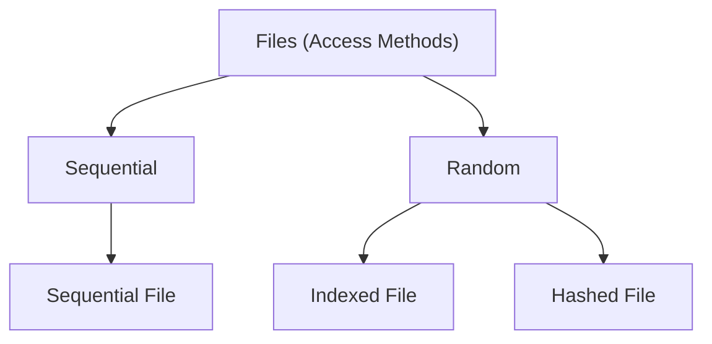
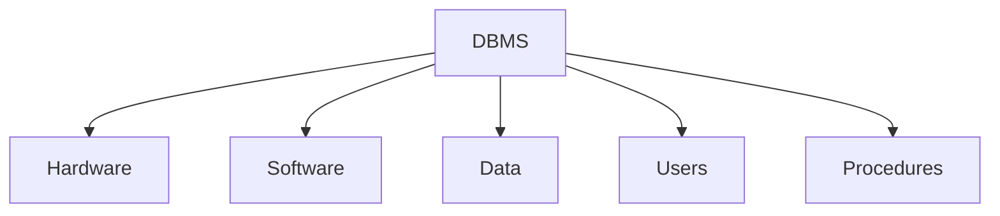

# โครงสร้างแฟ้มข้อมูล

---

# แฟ้มข้อมูลเบื้องต้น

- แฟ้มข้อมูล (file) คือกลุ่มของข้อมูลที่สัมพันธ์กันและถือว่าเป็นหนึ่งหน่วยข้อมูล วัตถุประสงค์เบื้องต้นของแฟ้มข้อมูลคือการจัดเก็บข้อมูล เนื่องจากข้อมูลในหน่วยความจำหลักจะหายไปเมื่อจบโปรแกรมหรือเมื่อปิดเครื่องคอมพิวเตอร์ จึงจำเป็นที่จะต้องเก็บแฟ้มข้อมูลไว้ในสื่อที่ถาวร นอกจากนี้จำนวนข้อมูลในแฟ้มข้อมูลมักจะมีขนาดใหญ่เกินกว่าที่จะเก็บในหน่วยความจำหลักในเวลาใดเวลาหนึ่ง ดังนั้นเราจะต้องทำการอ่านและเขียนบางส่วนของข้อมูลในหน่วยความจำหลัก ในขณะที่ข้อมูลที่เหลือจะยังถูกเก็บไว้ในแฟ้มข้อมูล

---
layout: section
---

# วิธีการเข้าถึงแฟ้มข้อมูล ACCESS METHODS

---

# การเข้าถึงข้อมูล

- เมื่อเราออกแบบแฟ้มข้อมูลเราไม่เพียงแต่สนใจว่าจะเก็บแฟ้มข้อมูลอย่างไร แต่เราจะถามต่อว่าเราจะสามารถดึงหรือค้นคืนข้อมูลในแฟ้มข้อมูลได้อย่างไร บางครั้งเราต้องการประมวลผลทุกๆเรคคอร์ดในแฟ้มข้อมูล และบางครั้งเราก็ต้องการประมวลผลข้อมูลที่อยู่ในเรคคอร์ดที่เฉพาะเจาะจง วิธีการเข้าถึงข้อมูล (access method) จะบอกว่าเรค คอร์ดในแฟ้มข้อมูลจะสามารถดึงออกมาได้อย่างไร โดยปกติการเข้าถึงข้อมูลมี 2 แบบคือการเข้าถึงตามลำดับ (sequential access) กับการเข้าถึงแบบสุ่ม (random access) ซึ่งรายละเอียดมีดังนี้

---
layout: two-cols
---

# วิธีการเข้าถึงแฟ้มข้อมูล

1. การเข้าถึงตามลำดับ ถ้าเราต้องการเข้าถึงแฟ้มข้อมูลตามลำดับของเรคคอร์ดที่จัดเรียงอยู่ในแฟ้มข้อมูลจากเรคคอร์ดแรกถึงเรคคอร์ดสุดท้าย เราจะใช้แฟ้มข้อมูลที่มีโครงสร้างเป็นแบบ sequential file

2. การเข้าถึงแบบสุ่ม ถ้าเราต้องการเข้าถึงเรคคอร์ดใดเรคคอร์ดหนึ่งโดยตรงโดยไม่ต้องผ่านทุกๆเรคคอร์ดก่อนหน้า เราจะใช้แฟ้มข้อมูลที่มีโครงสร้างแบบ random access ซึ่งมี 2 ลักษณะคือ แฟ้มข้อมูลแบบดัชนี (indexed file) กับแฟ้มข้อมูลแบบแฮช (hashed file) การแบ่งประเภทของแฟ้มข้อมูลแสดงตามรูป
::right::

<div class="mx-auto w-[400px]">

<div class="text-center text-2xl font-bold">
การแบ่งประเภทของแฟ้มข้อมูล
</div>


</div>

---
layout: section
---

# แฟ้มข้อมูลลำดับ SEQUENTIAL FILES

---
layout: two-cols
---

# แฟ้มข้อมูลลำดับ

- แฟ้มข้อมูลลำดับคือแฟ้มข้อมูลที่เรคคอร์ดทั้งหมดสามารถเข้าถึงได้โดยวิธีการเข้าถึงตามลำดับเท่านั้น นั่นคือเข้าถึงเรคคอร์ดที่ 1 เรคคอร์ดที่ 2 … เรคคอร์ดสุดท้าย ตามลำดับ 
- จากรูปแสดงโครงร่างของแฟ้มข้อมูลลำดับ เรคคอร์ดทั้งหมดถูกจัดเก็บตามลำดับในหน่วยความจำสำรอง (เทป หรือ ดิสค์) และมีเครื่องหมาย EOF (end-of-file) หลังเรคคอร์ดสุดท้าย 
- ระบบปฏิบัติการไม่รู้อะไรเกี่ยวกับแฟ้มข้อมูลเลย ยกเว้นรู้ว่าในแฟ้มข้อมูลแบบลำดับนั้น เรคคอร์ดจัดเรียงกันตามลำดับเท่านั้น


::right::

<div>

<div class="text-center text-2xl font-bold">แฟ้มข้อมูลลำดับ</div>


</div>

---
layout: two-cols
---

# การเข้าถึงแฟ้มข้อมูลแบบลำดับ

- แฟ้มข้อมูลแบบลำดับใช้กับการประยุกต์ที่ต้องการเข้าถึงเรคคอร์ดทั้งหมดจากเรคคอร์ดแรกจนถึงเรคคอร์ดสุดท้าย เช่นในแฟ้มข้อมูลพนักงานโดยทั่วไป 
- ตอนสิ้นเดือนที่มีการประมวลผลเงินเดือน ทุกๆเรคคอร์ดที่แทนข้อมูลพนักงานจะต้องถูกเข้าถึงเพื่อประมวลผลตามลำดับ 
- เมื่อประมวลผลเสร็จ
    - ถ้าองค์กรกำหนดให้จ่ายเงินเดือนพนักงานเป็นเช็ค ระบบก็จะพิมพ์เช็คพร้อมรายละเอียดเงินเดือนตามลำดับ 
    - แต่ถ้าองค์กรกำหนดให้จ่ายเงินเดือนโดยผ่านธนาคาร กระบวนการโอนเงินผ่านธนาคารก็จะดำเนินการตามลำดับเรคคอร์ดของพนักงานเช่นเดียวกันจะเห็นว่าสะดวกกว่าแฟ้มข้อมูลแบบสุ่ม


::right::

<div>

<div class="text-center text-2xl font-bold">แฟ้มข้อมูลลำดับ</div>


</div>


---
layout: two-cols
---

# การเข้าถึงแฟ้มข้อมูลแบบลำดับ (2)

- อย่างไรก็ตาม แฟ้มข้อมูลแบบลำดับไม่เหมาะสำหรับการเข้าถึงแบบสุ่ม 
- นั่นคือหากเราต้องการเข้าถึงเรคคอร์ดใดเรคคอร์ดหนึ่งโดยเฉพาะ เช่นถ้าข้อมูลลูกค้าของธนาคารจัดเก็บในแฟ้มข้อมูลแบบลำดับ เมื่อลูกค้าไปกด ATM เพื่อถอนเงิน ลูกค้าจะต้องรอให้ระบบทำการอ่านและตรวจสอบเรคคอร์ดทั้งหมดที่อยู่ก่อนหน้าเรคคอร์ดลูกค้าคนนั้น 
- ลองคิดดูว่าถ้าธนาคารมีลูกค้าอยู่ 2,000,000 คน โดยเฉลี่ยแล้วเรคคอร์ดจะถูกเข้าถึงประมาณ 1,000,000 เรคคอร์ด ก่อนที่เรคคอร์ดที่ต้องการจะถูกเข้าถึงจะเห็นว่าเสียเวลามากและไม่มีประสิทธิภาพเลย 


::right::

<div>

<div class="text-center text-2xl font-bold">แฟ้มข้อมูลลำดับ</div>


</div>


---

# รหัสเทียมแสดงการประมวลผลเรคคอร์ดในแฟ้มข้อมูลลำดับ

```
while (not EOF)
{
    Read the next record from storage to memory
    Process the record
}

```


---
layout: two-cols
---

# การปรับปรุงแก้ไขข้อมูลในแฟ้มข้อมูลลำดับ

- แฟ้มข้อมูลลำดับจะต้องมีการปรับปรุงแก้ไข (update) เป็นระยะๆ เพื่อสะท้อนถึงการเปลี่ยนแปลงของข้อมูล กระบวนการปรับปรุงแก้ไขเป็นส่วนสำคัญเพราะทุกๆเรคคอร์ดในแฟ้มข้อมูลจะต้องถูกตรวจสอบและแก้ไขตามลำดับ


::right::

<div>

<div class="text-center text-2xl font-bold">การปรับปรุงแก้ไขข้อมูลในแฟ้มข้อมูลลำดับ</div>


</div>


---
layout: two-cols
---

# การปรับปรุงแก้ไขข้อมูลในแฟ้มข้อมูลลำดับ (2)

- แฟ้มข้อมูลที่เกี่ยวข้องกับการปรับปรุงแก้ไขมีอยู่ทั้งหมด 4 แฟ้มคือ 
    1. New Master File: เป็นแฟ้มข้อมูลที่เก็บข้อมูลใหม่ล่าสุด
    2. Old Master File: เป็นแฟ้มข้อมูลที่จะทำการแก้ไข


::right::

<div>

<div class="text-center text-2xl font-bold">กระบวนการแก้ไขปรับปรุง</div>


</div>


---
layout: two-cols
---

# การปรับปรุงแก้ไขข้อมูลในแฟ้มข้อมูลลำดับ (3)

3. Transaction File: เป็นแฟ้มข้อมูลที่เก็บรายการที่จะทำการเปลี่ยนแปลงกับ master file ซึ่งกระบวนการปรับปรุงใดๆ จะใช้คีย์ (key) ในการค้นหาเรคคอร์ดของ master file
โดยปกติการปรับปรุง master file มี 3 รูปแบบคือ
    1. Add เก็บข้อมูลของเรคคอร์ดใหม่ที่จะเพิ่มเข้าไปเก็บใน master file
    2. Delete ระบุรายละเอียดของเรคคอร์ดที่จะลบออกจาก master file
	3. Change เก็บรายละเอียดข้อมูลใหม่ที่จะใช้สำหรับการเปลี่ยนแปลงกับเรคคอร์ดใน master file
4. Error Report Files: เป็นแฟ้มข้อมูลที่ใช้เก็บความผิดพลาดที่เกิดจากการปรับปรุงแก้ไขข้อมูลเพื่อรายงานให้ผู้ใช้ทราบและแก้ไข


::right::

<div>

<div class="text-center text-2xl font-bold">กระบวนการแก้ไขปรับปรุง</div>


</div>


---
layout: section

---

# แฟ้มข้อมูลดัชนี INDEXED FILES

---
layout: two-cols
---

# แฟ้มข้อมูลดัชนี

- การเข้าถึงเรคคอร์ดในแฟ้มข้อมูลแบบสุ่ม เราจะต้องทราบตำแหน่งที่อยู่ (address) ของเรคคอร์ดนั้น ตัวอย่างเช่นสมมติว่าลูกค้าต้องการตรวจสอบบัญชีธนาคารของตนว่ามียอดคงเหลือเท่าไร ทั้งเจ้าหน้าที่ธนาคารและลูกค้าต่างก็ไม่ทราบตำแหน่งที่อยู่ของเรคคอร์ดในแฟ้มข้อมูล ในทางปฏิบัติลูกค้าจะบอกเลขที่บัญชี (key) กับเจ้าหน้าที่ ณ จุดนี้แฟ้มข้อมูลแบบดัชนีจะบอกความสำพันธ์ระหว่างเลขที่บัญชี(key) กับตำแหน่งที่อยู่ของ เรคคอร์ดในแฟ้มข้อมูลได้ ดังรูป

::right::


<div>

<div class="text-center text-2xl font-bold">การจับคู่ในแฟ้มข้อมูลดัชนี</div>


</div>

---

# มุมมองเชิงตรรกะของแฟ้มข้อมูลดัชนี

<div class="mx-auto w-[600px]">


</div>

---
layout: section

---

# HASHED FILES

---
layout: two-cols
---

# Hashed Files

- ในแฟ้มข้อมูลดัชนีนั้น ดัชนีจะจับคู่ (map) ระหว่างคีย์กับตำแหน่งที่อยู่ (address) ของเรคคอร์ด สำหรับแฟ้มข้อมูลแบบแฮชจะใช้ฟังก์ชั่นทำการจับคู่แทนดัชนี โดยผู้ใช้เป็นผู้ระบุคีย์ ฟังก์ชั่นจะทำการคำนวณหาตำแหน่งที่อยู่ของเรคคอร์ดเพื่อการเข้าถึงข้อมูลต่อไป (ดังรูป)

- แฟ้มข้อมูลแบบแฮชแตกต่างจากแฟ้มข้อมูลดัชนีคือแฟ้มข้อมูลแบบแฮชไม่มีดัชนี การค้นหาเรคคอร์ดทำได้โดยใช้ฟังก์ชั่นทำการคำนวณหาตำแหน่งที่อยู่ของเรคคอร์ดจากคีย์โดยตรง ทำให้ประหยัดหน่วยความจำที่ไม่ต้องเก็บดัชนี อย่างไรก็ตามแฟ้มข้อมูลแบบแฮชก็ยังมีปัญหาในตัวของมันเองซึ่งจะอธิบายต่อไป


::right::


<div>

<div class="text-center text-2xl font-bold">การจับคู่ใน hashed file
</div>


</div>

---
layout: two-cols
---

# วิธีการคำนวณหาตำแหน่งที่อยู่

- การคำนวณหาตำแหน่งที่อยู่ของเรคคอร์ดจากคีย์สามารถทำได้หลายวิธี ผู้ใช้สามารถเลือกได้ตามความเหมาะสม ในที่นี้จะอธิบายบางวิธีดังนี้

1. วิธีจับคู่โดยตรง (Directed Hashing) เป็นวิธีที่ใช้คีย์เป็นตำแหน่งที่อยู่โดยตรงโดยไม่มีการคำนวณหรือเปลี่ยนแปลงใดๆ ดังนั้นแฟ้มข้อมูลมีเรคคอร์ดสำหรับทุกๆค่าของคีย์ที่เป็นไปได้ ถึงแม้ว่าวิธีนี้จะมีข้อจำกัดหลายประการ แต่ก็เป็นวิธีที่มีประสิทธิภาพสูงกับการประยุกต์บางประเภท เพราะวิธีนี้ประกันได้ว่าจะไม่มีเรคคอร์ดใดที่จัดเก็บไว้ ณ ตำแหน่งที่อยู่เดียวกัน (เกิดการชนกันของเรคคอร์ด) ซึ่งจะอธิบายต่อไป

::right::


<div>

<div class="text-center text-2xl font-bold">Direct hashing
</div>


</div>

---
layout: two-cols
---

# วิธีการคำนวณหาตำแหน่งที่อยู่ (2)

- เพื่อจะได้เข้าใจมากขึ้น ขอยกตัวอย่างดังนี้ สมมติว่าหน่วยงานแห่งหนึ่งมีพนักงานน้อยกว่า 100 คนโดยพนักงานแต่ละคนกำหนดให้มีเลขประจำตัวอยู่ในช่วงตั้งแต่ 1 ถึง 100 ในกรณีนี้ ถ้าเราสร้างแฟ้มข้อมูลพนักงานจำนวน 100 เรคคอร์ด เราสามารถใช้เลขประจำตัวพนักงานเป็นตำแหน่งที่อยู่ของเรคคอร์ดของพนักงานแต่ละคนได้เลย ดังแสดงในรูป เช่นเรคคอร์ดที่มีคีย์เท่ากับ 025 (Vu Nguyen…) ถูกแฮชไปยังตำแหน่งที่อยู่ 025 (sector บนดิสค์) 
- ขอให้สังเกตว่าในกรณีที่มีจำนวนพนักงานไม่ครบ 100 คน อาจเกิดจากไม่ครบตั้งแต่แรกหรือมีพนักงานลาออก จะมีช่องว่างเกิดขึ้นในแฟ้มข้อมูลซึ่งทำให้สูญเสียเนื้อที่บนดิสค์

::right::


<div>

<div class="text-center text-2xl font-bold">Direct hashing
</div>


</div>

---
layout: two-cols
---

# วิธีการคำนวณหาตำแหน่งที่อยู่ (3)

2. วิธี Modulo Division หรือรู้จักกันในอีกชื่อหนึ่งคือ Division Remainder Hashing (DRH) วิธีนี้จะทำการหารคีย์ของเรคคอร์ดด้วยขนาดของแฟ้มแล้วบวกด้วย 1 ผลลัพธ์ที่ได้ใช้เป็นตำแหน่งที่อยู่ สามารถเขียนเป็นสมการความสัมพันธ์ได้ดังนี้:

<div class="text-red-500">

- ตำแหน่งที่อยู่ = (key DIV file-size) + 1 
    - เมื่อ file-size คือขนาดของแฟ้มข้อมูล (จำนวนเรคคอร์ดทั้งหมด)
</div>


- ถึงแม้ว่าวิธี DRH จะใช้ได้กับทุกขนาดของแฟ้มข้อมูล แต่ถ้าขนาดของแฟ้มข้อมูลเป็นเลขจำนวนเฉพาะ จะทำให้เรคคอร์ดต่างๆถูกจับคู่ไปยังตำแหน่งเดียวกันมีน้อยลง (ชนกันน้อยลง) 

::right::


<div>

<div class="text-center text-2xl font-bold">Modulo division

</div>


</div>

---
layout: two-cols
---

# วิธีการคำนวณหาตำแหน่งที่อยู่ (4)

<div class="">

- ตัวอย่าง: สมมติว่าท่านก่อตั้งบริษัทขนาดเล็กที่วางแผนว่าในอนาคตจะมีพนักงานมากกว่า 100 คน ท่านอาจวางแผนล่วงหน้าโดยกำหนดให้เลขที่พนักงานสามารถรองรับพนักงานได้ถึง 1 ล้านคน ในอนาคตอันใกล้ท่าน ตัดสินใจที่จะเตรียมที่ไว้สำหรับพนักงาน 300 คน เลขจำนวนเฉพาะตัวแรกที่มากกว่า 300 คือ 307 ดังนั้นท่านควรเลือกขนาดของแฟ้มข้อมูลเท่ากับ 307 ตัวอย่างแฟ้มข้อมูลแสดงในรูป ในกรณีนี้ Vu Nguyen ที่มีคีย์เท่ากับ 121267 ถูกแฮชไปเก็บยังตำแหน่ง 003 เพราะ <div class="text-red-500 inline-block">121267 DIV 307 +1 = 3 </div> ซึ่งตรงกับตำแหน่งที่อยู่ 003
- [จำนวนเฉพาะ 1 - 1000 https://byjus.com/maths/prime-numbers-from-1-to-1000/](https://byjus.com/maths/prime-numbers-from-1-to-1000/)
</div>


::right::


<div>

<div class="text-center text-2xl font-bold">Modulo division

</div>


</div>


---
layout: two-cols
---

# วิธีการคำนวณหาตำแหน่งที่อยู่ (5)

3. วิธี Digit Extraction เป็นวิธีที่เราเลือกตัวเลขบางตัวจากคีย์เพื่อนำ มาเป็นตำแหน่งที่อยู่ของเรคคอร์ด เช่นถ้าเราใช้เลข 6 หลักเป็นรหัสของ พนักงาน เพื่อที่จะแปลงไปเป็นตำแหน่งที่อยู่ที่ประกอบด้วยเลข 3 ตัว (000-999) เราสามารถกำหนดว่าเราจะเลือกเลขจากรหัสซึ่งอยู่ตำแหน่งที่ 1, 3, และ 4 จากทางซ้ายมือแล้วใช้เป็น address 

- ดังตัวอย่าง: 125870 ------> 158
- นอกจากนี้ยังมีวิธีอื่นๆที่นิยมใช้อีกเช่น Midsquare method, Folding method, Rotational method, และ Pseudorandom method เป็นต้น ให้นักศึกษาไปค้นคว้าหารายละเอียดเอง


::right::


<div>

<div class="text-center text-2xl font-bold">การชนกัน</div>


</div>

---
layout: two-cols
---

# การชนกัน (Collision)

- โดยทั่วไปแล้ว จำนวนคีย์ที่ทำการแฮชจะมีมากกว่าจำนวนเรคคอร์ดในแฟ้มข้อมูล ตัวอย่างเช่นถ้าเรามีแฟ้มข้อมูลของนักศึกษาจำนวน 50 คน โดยที่นักศึกษาแต่ละคนใช้คีย์เป็นเลขสี่ตัวสุดท้ายของเลขประจำตัวประชาชน (มีค่าได้ตั้งแต่ 0000-9999 จำนวน 10,000 ตัว) ดังนั้นจะมี 200 คีย์ (10000/50) ที่เป็นไปได้สำหรับแต่ละตำแหน่งที่อยู่ภายในแฟ้มข้อมูล (ซึ่งมีอยู่ 50 ตำแหน่งเท่านั้น) เนื่องจากมีคีย์หลายคีย์ต่อหนึ่ง address ในแฟ้มข้อมูล เราเรียกกลุ่มของคีย์ที่แฮชไปยัง address เดียวกันว่าเป็นคีย์ที่ synonym กัน เหตุการณ์ที่คีย์ชนกันแสดงอยู่ในรูป


::right::


<div>

<div class="text-center text-2xl font-bold">การชนกัน</div>


</div>


---
layout: two-cols
---

# การแก้ปัญหาการชนกันของเรคคอร์ด

- จากรูป เมื่อเราคำนวณหา address ของ 2 เรคคอร์ดที่ต่างกันจะพบว่าได้ค่า address ของทั้งสองเรคคอร์ดเท่ากับ 4 แน่นอนว่าเรคคอร์ดทั้งสองไม่สามารถจัดเก็บที่ address เดียวกันได้ เราจำเป็นจะต้องหาทางแก้สถานการณ์เช่นนี้เพื่อให้เรคคอร์ดทั้งสองสมารถเก็บในแฟ้มข้อมูลได้

- ถ้าข้อมูลที่เรามีอยู่มีเรคคอร์ดที่ synonym กันอยู่ตั้งแต่สองเรคคอร์ดขึ้นไป เราเรียกว่าเกิดสถาการณ์การชนกัน (collision) การชนกันเกิดขึ้นเมื่อฟังก์ชั่นแฮชหรืออัลกอริธึมทำการแฮชเรคคอร์ดที่จะนำเข้าไปจัดเก็บในแฟ้มข้อมูลที่ address นั้นมีเรคคอร์ดอื่นเก็บอยู่ก่อนแล้ว ค่า address ที่คำนวณจากฟังก์ชั่นแฮชเรียกว่า home address


::right::


<div>

<div class="text-center text-2xl font-bold">การชนกัน</div>


</div>

---

# การแก้ปัญหาการชนกันของเรคคอร์ด (2)

- ส่วนของแฟ้มข้อมูลที่ประกอบด้วย home address ทั้งหมดเราเรียกว่า prime area เมื่อสองคีย์ใดๆเกิดการชนกันขึ้นที่ home address เราจะต้องแก้ปัญหาการชนนี้โดยการเก็บเรคคอร์ดที่นำเข้าไปเก็บไว้ใหม่ ณ ตำแหน่งที่อยู่อื่น

- จากวิธีการคำนวณหาตำแหน่งที่อยู่ที่กล่าวมาแล้ว มีวิธีเดียวเท่านั้นที่ไม่ก่อให้เกิดการชนขึ้น วิธีนั้นคือวิธี Direct method วิธีนอกนั้นมีโอกาสชนทั้งสิ้น วิธีแก้การชนกันของเรคคอร์ดมีหลายวิธี แต่ละวิธีไม่ขึ้นอยู่กับอัลกอริธึมหรือฟังก์ชั่นที่ใช้แฮช นั่นคือเมื่อเกิดการชนกันขึ้น วิธีต่อไปนี้สามารถนำมาใช้ได้ ไม่ว่าเราใช้ฟังก์ชั่นหรืออัลกอริธึมแฮชใดๆก็ตาม 


---
layout: two-cols
---

# การแก้ปัญหาการชนกันของเรคคอร์ด (3)

1. Open Addressing: เมื่อเกิดการชนกันขึ้น พื้นที่ในส่วน prime area จะถูกค้นหา address ที่ว่างเพื่อที่จะได้นำเรคคอร์ดใหม่เข้าไปเก็บ วิธีที่ง่ายที่สุดคือหา home address ถัดไป (home address + 1) ตัวอย่างในรูปแสดงการแก้ปัญหาการชนจากรูปที่แล้ว โดยใช้วิธีนี้ เรคคอร์ดแรกจัดเก็บที่ address 4 ส่วนเรคคอร์ดที่นำเข้าไปเก็บใหม่จัดเก็บที่ address 5


::right::


<div>

<div class="text-center text-2xl font-bold">การชนกัน</div>


<div class="text-center text-2xl font-bold">Open address resolution</div>


</div>

---
layout: two-cols
---

# การแก้ปัญหาการชนกันของเรคคอร์ด (4)

2. Linked List: ข้อเสียของวิธี Open addressing คือการชนแต่ละครั้งที่เกิดขึ้นทำให้โอกาสที่จะเกิดการชนในครั้งต่อๆไปมีมากขึ้นตามไปด้วย วิธี Linked List จะแก้ปัญหานี้ได้ โดยที่เรคคอร์ดแรกจะเก็บที่ home address และในเรคคอร์ดแรกจะมี pointer ชี้ไปยังเรคคอร์ดที่เข้ามาใหม่ ดังรูป

::right::


<div>


<div class="text-center text-2xl font-bold">Linked list resolution</div>


</div>


---
layout: two-cols
---

# การแก้ปัญหาการชนกันของเรคคอร์ด (5)

3. Bucket Hashing: Bucket เปรียบเสมือนถังหรือกล่องที่สามารถเก็บเรคคอร์ดได้มากกว่า 1 เรคคอร์ด วิธี Bucket Hashing เป็นการแฮชคีย์ของเรคคอร์ดไปเก็บไว้ในกล่อง ดังรูป

::right::


<div>

<div class="text-center text-2xl font-bold">Bucket hashing resolution</div>


</div>

---
layout: cover
---

# ฐานข้อมูลเบื้องต้น

---

# ข้อมูลและสารสนเทศ (Data Versus Information)

- ข้อมูล (Data) หมายถึง ข้อเท็จจริง วัตถุ หรือเหตุการณ์ที่เกิดขึ้น กล่าวคือ เป็นข้อมูลดิบ (Row Data) ที่ยังไม่ได้ผ่านการประมวลผล

- สารสนเทศ (Information) หมายถึง ข้อมูลที่ผ่านการประมวลผลแล้ว และสามารถนำไปใช้ให้เกิดประโยชน์

---
layout: two-cols
---

<div class="w-[400px]">

<div class="text-center text-2xl font-bold">ข้อมูล (Data)</div>


<div class="text-center text-2xl font-bold">สารสนเทศ (Information)</div>

<div class="w-[350px] mx-auto">


</div>
</div>

::right::


<div class="w-[400px]">

<div class="text-center text-2xl font-bold">สารสนเทศ (Information)</div>


</div>


---

# หน่วยในการเก็บข้อมูลในคอมพิวเตอร์

<div class="mx-auto w-[600px]">


</div>

---
layout: two-cols
---

# โครงสร้างแฟ้มข้อมูล

- บิต(bit) : ประกอบไปด้วยเลขฐานสอง ใช้แทนค่าหน่วยที่เล็กที่สุดของข้อมูลคอมพิวเตอร์ โดยหน่วยที่ใช้จะมีค่า 0 และ 1 เท่านั้น
- ไบต์(byte) : คือการนำเอาบิตหลาย ๆ บิตมาเรียงต่อกัน ตัวอย่างเช่น 1 ไบต์มี 8 บิต ก็คือการนำเอาเลข 0 กับ 1 มาเรียงต่อกัน 8 ตัวจนครบ 1 ไบต์ เพื่อให้ได้อักขระหนึ่งตัว เช่น 01000001 คือ เลขฐานสองที่มี 8 บิตเป็นรหัสแทนตัว A 
     ดังนั้น 1 ไบต์ แทนข้อมูลได้  28  หรือ 256 อักขระ

::right::


<div class="mx-auto w-[400px]">
<div class="text-center text-2xl font-bold">หน่วยในการจัดเก็บข้อมูล</div>


</div>

---
layout: two-cols
---

# โครงสร้างแฟ้มข้อมูล (2)

- ฟิลด์(field) : คือการนำเอาอักขระตั้งแต่หนึ่งตัวขึ้นไปมารวมกันเพื่อให้เกิดความหมาย เช่น ฟิลด์ std_name ใช้เก็บข้อมูลนักศึกษา ฟิลด์ salary  ใช้เก็บข้อมูลเงินเดือน เป็นต้น
- เรคอร์ด(record) : คือกลุ่มของฟิลด์ที่สัมพันธ์กัน เช่น ในหนึ่งเรคคอร์ดประกอบด้วยฟิลด์ต่างๆ ที่เกี่ยวข้องเป็นชุด เช่น เรคคอร์ดประวัตินักศึกษา ประกอบด้วย 
	- ฟิลด์ 
		- รหัสนักศึกษา 
		- ชื่อ-สกุล 
		- ที่อยู่ , จังหวัด ,เบอร์โทรศัพท์

::right::


<div class="mx-auto w-[400px]">

<div class="text-center text-2xl font-bold">หน่วยในการจัดเก็บข้อมูล</div>


</div>


---
layout: two-cols
---

# โครงสร้างแฟ้มข้อมูล (3)

- ระเบียนข้อมูล (Record) 
    - ชุดของ field ที่มีความสัมพันธ์กันเชิงตรรกะ (logical relation)
เช่น ระเบียนข้อมูลสินค้า

<div class="mx-auto w-[400px]">


</div>

::right::


<div class="mx-auto w-[400px]">
<div class="text-center text-2xl font-bold">หน่วยในการจัดเก็บข้อมูล</div>


</div>

---
layout: two-cols
---

# โครงสร้างแฟ้มข้อมูล (4)

- ฟิลด์(field) : คือการนำเอาอักขระตั้งแต่หนึ่งตัวขึ้นไปมารวมกันเพื่อให้เกิดความหมาย เช่น ฟิลด์ std_name ใช้เก็บข้อมูลนักศึกษา ฟิลด์ salary  ใช้เก็บข้อมูลเงินเดือน เป็นต้น
- เรคอร์ด(record) : คือกลุ่มของฟิลด์ที่สัมพันธ์กัน เช่น ในหนึ่งเรคคอร์ดประกอบด้วยฟิลด์ต่างๆ ที่เกี่ยวข้องเป็นชุด เช่น เรคคอร์ดประวัตินักศึกษา ประกอบด้วย 
	- ฟิลด์ 
		- รหัสนักศึกษา 
		- ชื่อ-สกุล 
		- ที่อยู่ , จังหวัด ,เบอร์โทรศัพท์

::right::


<div class="mx-auto w-[400px]">

<div class="text-center text-2xl font-bold">หน่วยในการจัดเก็บข้อมูล</div>


</div>


---
layout: two-cols
---

# โครงสร้างแฟ้มข้อมูล (5)

- ไฟล์(file) : คือกลุ่มของเรคคอร์ดที่สัมพันธ์กันเช่น แฟ้มประวัตินักศึกษา จะประกอบด้วยเรคคอร์ดของนักศึกษาทั้งหมดในมหาวิทยาลัย ดังนั้นหนึ่งไฟล์จะต้องมีอย่างน้อยหนึ่งเรคคอร์ด เพื่อใช้การใช้งานข้อมูล เป็นต้น


::right::


<div class="mx-auto w-[400px]">
<div class="text-center text-2xl font-bold">หน่วยในการจัดเก็บข้อมูล</div>


</div>

---
layout: two-cols
---

# โครงสร้างแฟ้มข้อมูล (6)

- แฟ้มข้อมูล (File) 
คือกลุ่มของ Record ที่มีความสัมพันธ์กัน เป็นเรื่องราวเดียวกัน 
เช่น 
    - แฟ้มข้อมูลของสินค้า ประกอบด้วย สินค้าชนิดต่างๆ ของบริษัท  
    - แฟ้มข้อมูลพนักงาน ประกอบด้วย ข้อมูลของบุคลากรในบริษัท  


::right::


<div class="mx-auto w-[400px]">
<div class="text-center text-2xl font-bold">แฟ้มข้อมูลพนักงาน</div>


</div>

---

# หัวข้อที่จะเรียนเกี่ยวกับฐานข้อมูลเบื้องต้น

- ระบบจัดการฐานข้อมูล (DBMS) 
- สถาปัตยกรรมของ DBMS 
- แบบจำลองข้อมูลแบบสัมพันธ์ (Relational Database Model)
- แบบจำลองฐานข้อมูลอื่นๆ

- ฐานข้อมูลเป็นกลุ่มของข้อมูลที่มีความสัมพันธ์กันในเชิงตรรกะที่มีความกลมกลืนกัน ข้อมูลในฐานข้อมูลจะแทนรายละเอียดของกลุ่มของวัตถุประเภทเดียวกันหรือวัตถุที่มีความสัมพันธ์กันตามข้อกำหนดหรือสัมพันธ์กันโดยธรรมชาติ โดยปกติ ข้อมูลในฐานข้อมูลจะต้องมีความ หมายตามวัตถุประสงค์ของการสร้างฐานข้อมูลในเบื้องต้น


---

# ระบบจัดการฐานข้อมูล

- ระบบจัดการฐานข้อมูล (DBMS) ทำหน้าที่ในการกำหนด สร้าง และดูแลรักษาฐานข้อมูล นอกจากนี้ระบบจัดการฐานข้อมูลยังอำนวยความสะดวกให้ผู้ใช้สามารถควบคุมการใช้ข้อมูลในฐานข้อมูลได้อีกด้วย 

- ระบบจัดการฐานข้อมูลประกอบด้วยองค์ประกอบหลัก 5 ส่วนคือ ฮาร์ดแวร์ (hardware) ซอฟท์แวร์ (software)  ข้อมูล (data) ผู้ใช้ (users) และกระบวนการ (procedures) ดังรูป


<div class="mx-auto w-[700px]">
<div class="text-center text-2xl font-bold">องค์ประกอบของ DBMS</div>



</div>

---


# ระบบจัดการฐานข้อมูล (2)

- คำว่า “ผู้ใช้” ตามนัยของ DBMS จะมีความหมายที่กว้าง เราสามารถแบ่งผู้ใช้ออกได้เป็น 2 กลุ่มหลักคือผู้ใช้ที่เป็นคนหรือที่เรียกว่า end users กับผู้ใช้ที่เป็นโปรแกรมประยุกต์หรือที่เรียกว่า application program
- End Users คือคนที่สามารถเข้าถึงข้อมูลและนำข้อมูลออกมาใช้ end users แบ่งออกเป็น 2 ประเภทคือ ผู้บริหารฐานข้อมูล (Database Administrator : DBA) กับ ผู้ใช้ทั่วไป  DBA มีสิทธิ์สูงสุดในการเข้าถึงและควบคุมฐานข้อมูล เป็นผู้กำหนดสิทธิ์ในการใช้ฐานข้อมูลทั้งหมด
- Application Programs เป็นโปรแกรมที่ใช้ในการเข้าถึงและประมวลผลข้อมูลในฐานข้อมูลเช่นโปรแกรมประมวลผลเงินเดือน โปรแกรมคิดคะแนนเฉลี่ยของนักศึกษาในแต่ละภาคการศึกษาเป็นต้น

---
layout: section
---

# แบบจำลองฐานข้อมูล DATABASE MODELS

---

# Database Models

- ใช้อธิบายความสัมพันธ์ของข้อมูลต่างๆ ที่อยู่ในระบบฐานข้อมูล
- มีหลาย Model แต่ที่นิยมใช้ในปัจจุบันคือ Relational database model

---

# Relational Data Model

- โครงสร้าง ประกอบด้วย กลุ่มของตารางสำหรับเก็บข้อมูลที่สัมพันธ์กัน

<div class="mx-auto w-[700px]">


</div>

---

# Relational Data Model (2)

<div class="mx-auto w-[600px]">


</div>

---
layout: section
---

# แบบจำลองสัมพันธ์ RELATIONAL MODEL

---
layout: two-cols
---

- ตาราง หรือ Table   เรียกว่า  Relation
- ข้อมูลแต่ละแถว หรือ Row  เรียกว่า  Tuple
- ข้อมูลแต่ละสดมภ์ หรือ Column  เรียกว่า  Attribute
- ข้อมูลแต่ละ Tuple ต้องมีเอกลักษณ์ หรือ ต้องไม่ซ้ำกัน 
        โดยมีบาง Attribute เป็น Primary key  และอาจมี
        ข้อมูลเดียวกันเชื่อมโยงไป Relation อื่นๆ (Foriegn key)

::right::
<div>


</div>

---
layout: two-cols
---

# Primary Key

- Primary  Key  หมายถึง  คีย์หลักที่กำหนดจากฟิลด์ที่ไม่มีข้อมูลซ้ำซ้อน (unique) ใน Table เดียวกันโดยเด็ดขาด  และจะต้องมีค่าเสมอ  จะเป็นค่าว่าง (Null) ไม่ได้  สามารถนำมาจัดเรียงลำดับและแยกแยะข้อมูลแต่ละรายการออกจากกันได้เป็นอย่างดี 

::right::

<div class="mx-auto w-[400px]">


</div>

---
layout: two-cols
---

# Foriegn Key

- Foreign Key   หมายถึง  คีย์นอก  เป็นคีย์ที่เชื่อม Table ที่เกี่ยวข้องหรือมีความสัมพันธ์กัน

::right::

<div class="mx-auto w-[400px]">


</div>

---
layout: two-cols
---

# ตัวอย่าง

- Relation สินค้า  จัดเก็บข้อมูลจำนวน 5 tuple 
- แต่ละ tuple มีข้อมูลเกี่ยวกับรายละเอียดหรือลักษณะของแต่ละสินค้า ประกอบด้วย
    - Attribute จำนวน 4 attribute คือ รหัสสินค้า  ชื่อสินค้า  ราคาต่อหน่วย  จำนวนคงเหลือ 
- เมื่อพิจารณาแล้วจะพบว่าแต่ละสินค้า(หรือแต่ละ tuple) มีเอกลักษณ์ไม่ซ้ำกันเลยเพราะ
- มีรหัสสินค้าไม่ซ้ำกันเลย ไม่ว่าจะมีสินค้ากี่ tuple ก็ตาม
- ดังนั้น attribute รหัสสินค้า จึงเป็น Primary key ของ relation สินค้า 

::right::


<div class="mx-auto w-[400px]">


</div>

---

# ตัวอย่าง 2


<div class="mx-auto w-[400px]">


</div>

---
layout: section
---

# การดำเนินการกับความสัมพันธ์ OPERATIONS ON RELATIONS

---

# Structured Query Language (SQL)

- SQL เป็นภาษาตามมาตรฐาน ANSI และ ISO สำหรับกับ Relational Database Model
- การกระทำกับ Relation ด้วยภาษา SQL ที่สำคัญๆ มีดังนี้


---

# การดำเนินการ Insert

<div>


</div>

---

# การดำเนินการ Delete

<div>


</div>

---

# การดำเนินการ Update

<div>


</div>

---

# การดำเนินการ Select

<div>


</div>

---

# การดำเนินการ Project

<div>


</div>

---

# การดำเนินการ Join

<div class="mx-auto w-[700px]">


</div>

---

# การดำเนินการ Union

<div class="mx-auto w-[700px]">


</div>

---

# การดำเนินการ Intersection

<div class="mx-auto w-[700px]">


</div>

---

# การดำเนินการ Difference

<div class="mx-auto w-[700px]">


</div>

---
layout: section
---

# Entity-relation model (ERM)

---

# ตัวอย่าง ERM

<div class="mx-auto w-[600px]">


</div>

---

# Normalization

<div class="mx-auto w-[600px]">


</div>

---

# ตัวอย่างการทำ Normalization

<div class="mx-auto w-[400px]">


</div>

