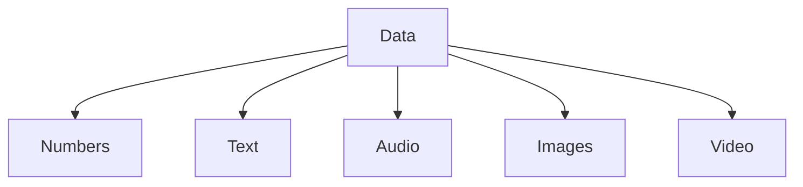
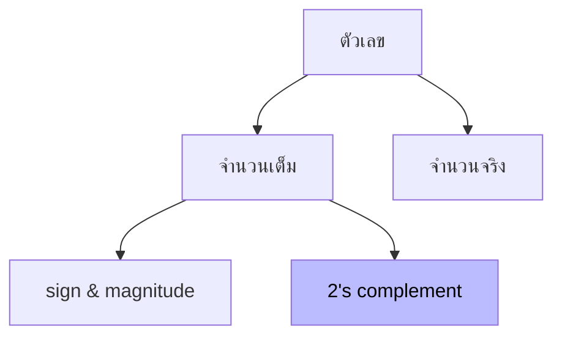

# Data Storage

---

# วัตถุประสงค์

- สามารถอธิบายความแตกต่างของข้อมูลทั้ง 5 ชนิดได้
- เข้าใจความหมายของ bit patterns
- สามารถอธิบายวิธีจัดเก็บข้อมูลทั้ง 5 ชนิดได้

---
layout: section
---

# 3.1 Data Types

---

# ชนิดของข้อมูล

- ข้อมูลที่ถูกจัดเก็บในระบบคอมพิวเตอร์แบ่งออกเป็น 5 ประเภทประกอบด้วย ตัวเลข ข้อความ เสียง ภาพ และวิดีโอ

---

# ข้อมูลในระบบคอมพิวเตอร์

- ก่อนนำข้อมูลทั้ง 5 ชนิดเก็บลงในระบบคอมพิวเตอร์ข้อมูลนั้นจะต้องถูกเปลี่ยนให้เป็นรูปแบบที่สามารถเข้าใจตรงกันได้ซึ่งเรียกว่า “Bit patterns”
- เพื่อเป็นการประหยัดพื้นที่เก็บข้อมูลอาจมีการทำ “Data Compression” เพื่อให้ข้อมูลมีขนาดเล็กลง
- นอกจากนี้อาจมีการใช้ “Error detection & correction” เพื่อช่วยปรับปรุงข้อมูลขณะสื่อสารด้วย

---

- Bit (Binary Digit) เป็นหน่วยเล็กที่สุดของข้อมูล ซึ่งถูกจัดเก็บอยู่ในระบบคอมพิวเตอร์โดยมีค่าเป็น “0” หรือ “1” ซึ่งบางครั้งอาจมีชื่อเรียกอย่างอื่น
- Bit Patterns คือกลุ่มของ Bit ที่ถูกนำมาใช้แทนรูปแบบข้อมูลชนิดต่างๆ บางครั้งเรียกว่า “String of Bits” ซึ่งจำนวนของรูปแบบที่สามารถแทนได้จะคำนวนได้จาก 2n

Here's the table converted to markdown:

| จำนวน Bit | ตัวอย่าง | รูปแบบที่เป็นได้ | ชื่อเรียก |
|-----------|---------|----------------|----------|
| 1 | "0" หรือ "1" | 2¹ = 2 | Bit |
| 4 | "1011" | 2⁴ = 16 | Nibble |
| 8 | "10010110" | 2⁸ = 256 | Byte |

---

---
layout: section
---

# 3.2 Storing numbers

---

# 3.2 Storing numbers
## การจัดเก็บตัวเลข

- การจัดเก็บตัวเลขแบ่งออกเป็นสองชนิดใหญ่คือ การเก็บตัวเลขจำนวนเต็ม และการเก็บตัวเลขจำนวนจริง
- สำหรับการเก็บตัวเลขจำนวนเต็มจะแบ่งออกเป็นสองประเภทคือ เลขจำนวนเต็มชนิดมีเครื่องหมาย และเลขจำนวนเต็มชนิดไม่มีเครื่องหมาย โดยคอมพิวเตอร์เลือกการจัดเก็บเป็น 2's complement

---
layout: section
---

# 3.2.1 Storing integer

---

# จำนวนเต็มที่ไม่มีเครื่องหมาย

- ไม่มีเลขทศนิยม มีค่าอยู่ระหว่าง 0 ไปยังจำนวนเต็มบวกอนันต์ (0…+∞)
- ค่าจำนวนเต็มสูงสุด (maximum unsigned integer) มีค่าเท่ากับ 2n-1
- ช่วงของตัวเลขจะมีค่าตั้งแต่ 0 ถึง +(2n-1)
- การจัดเก็บจะมีสองขั้นตอนคือ
    - แปลงตัวเลขให้เป็น Binary
    - กรณีที่ตัวเลขไม่เต็มจำนวน Bit Patterns ที่กำหนด จะต้องเติม “0” ด้านซ้ายเพื่อให้เต็ม Bit Patterns

---

# ตัวอย่าง (การจัดเก็บ)

- ต้องการเก็บเลข 7 ลง 8 Bit patterns memory ในรูปแบบ Unsigned Integer
    1. แปลง 7 -> (111)2
    2. เติม 0 ด้านซ้ายจนเต็ม 8 Bit (00000111)2

00000111

Memory

- ต้องการเก็บเลข 258 ลง 16 Bit patterns memory ในรูปแบบ Unsigned Integer
    - แปลง 258 -> (100000010)2
    - เติม 0 ด้านซ้ายจนเต็ม 16 Bit (0000000100000010)2

0000000100000010

Memory

---

# ตัวอย่าง (การค้นคืน)

- ค้นคืนเลข (00101001)2 จาก 8 Bit patterns memory ต้องการทราบว่ามีค่าเท่าใดในระบบ Unsigned Integer
    - แปลง (00101001)2 &rarr; 41

00101001

Memory

&rarr;

41

---

# ตัวอย่าง

- เปรียบเทียบข้อมูลในหน่วยความจำกับตัวเลขที่ต้องการจัดเก็บ
1. กรณีเลขขนาด 3 Bit patterns memory

<NumberPattern from="0" to="7" chunk="3"/>

2. กรณีเลขขนาด 4 Bit patterns memory

<NumberPattern from="0" to="15" chunk="4"/>

---

# การเกิด Overflow

- เนื่องจากขนาดของ Bit Patterns เป็นตัวกำหนดจำนวนเลขสูงสุดที่เป็นไปได้ดังนั้นตัวเลขที่จัดเก็บอาจเกิดการ Overflow ขึ้นได้

---

# การประยุกต์

- การประยุกต์ใช้เลขจำนวนเต็มไม่มีเครื่องหมาย
    - การนับจำนวนทั่วไป ซึ่งจะมีแต่ค่าบวก
    - การอ้างถึงตำแหน่ง ในการอ้างตำแหน่งของหน่วยความจำจะมีแต่ค่าบวก
    - การจัดเก็บข้อมูลชนิดอื่นที่ไม่ใช่ตัวเลข เช่นข้อความ รูปภาพ เสียง วิดีโอ

---

# ลองทำ 

1. จงแปลงเลข 34 เพื่อจัดเก็บลงใน 8 Bit patterns memory ในรูปแบบ Unsigned Integer

2. ค้นคืนเลข (00101011)2 จาก 8 Bit patterns memory มีค่าเท่าใดในระบบ Unsigned Integer

---

# เฉลย

1. จงแปลงเลข 34 เพื่อจัดเก็บลงใน 8 Bit patterns memory ในรูปแบบ Unsigned Integer
    - แปลงเลข 34 เป็นฐาน 2 ได้ 100010 และเติม 0 ให้ครบ 8 หลัก
    - จะได้  00100010

2. ค้นคืนเลข (00101011)2 จาก 8 Bit patterns memory มีค่าเท่าใดในระบบ Unsigned Integer
    - แปลง (00101011)2 เป็นฐาน 10 ได้ 43

---

## จำนวนเต็มมีเครื่องหมาย

- ไม่มีเลขทศนิยม
- มีค่าอยู่ระหว่างจำนวนเต็มลบอนันต์ ไปยังจำนวนเต็มบวกอนันต์ (-∞ … +∞)
- มี 2 รูปแบบที่นิยมใช้
    - Sign and magnitude
    - Two’s complement

---

# Sign and magnitude

- วิธีการจัดเก็บจำนวนเต็มมีเครื่องหมายจะต้องใช้บิตที่มีนัยสำคัญสูงสุด (Most significant bit, MSB) สำหรับจัดเก็บเครื่องหมาย โดยเลข 02 แทนเครื่องหมายบวก และเลข 12 แทนเครื่องหมายลบ

- กรณีเก็บข้อมูลลงใน 4 Bit pattern memory จะเหลือพื้นที่เก็บจำนวนสัมบูรณ์ (Absolute value) เพียง 3 Bit เท่านั้น

    
Sign

    
Absolute/Magnitude

    
หลักที่ 3

    
หลักที่ 2

    
หลักที่ 1

    
หลักที่ 0

    
0

    
0

    
0

    
1

    
1

    
0

    
0

    
1

- ถ้า n เป็น 4 bit แสดงว่าช่วงของจำนวนที่จะสามารถเก็บได้ คือ:
    - +(0 ถึง 24-1 -1) คือ +(0 ภึง 7) 
    - -(0 ถึง 24-1 -1) คือ -(0 ถึง 7)

    

    ➕
    

    

    ➖
    

    

        + (0 ถึง 2n-1 - 1)
    

    

        - (0 ถึง 2n-1 - 1)
    

---

# การนำเสนอ Sign-and-magnitude

- นำเสนอในรูปแบบ 4 bit pattern โดยมี 0 อยู่ 2 ตัว คือ 0000 กับ 1000

    

        
0000

        
0001

        
0010

        
0011

        
0100

        
0101

        
0110

        
0111

        
1000

        
1001

        
1010

        
1011

        
1100

        
1101

        
1110

        
1111

    

    

        
0

        
1

        
2

        
3

        
4

        
5

        
6

        
7

        
-0

        
-1

        
-2

        
-3

        
-4

        
-5

        
-6

        
-7

    

---

# ตัวอย่าง การจัดเก็บ

- ต้องการเก็บเลข +28 ลงใน 8 Bit pattern memory ในรูปแบบ Signed-and-magnitude
    - แปลง 28 &rarr; (11100)2
    - เติม 0 ด้านซ้ายจนเต็ม 7 Bit (0011100)2
    - เติม “0” (เครื่องหมายบวก) ที่หลัก MSB

0

0011100

Memory

---

# ตัวอย่าง การจัดเก็บ

- ต้องการเก็บเลข -28 ลงใน 8 Bit pattern memory ในรูปแบบ Signed-and-magnitude
    - แปลง 28 &rarr; (11100)2
    - เติม 0 ด้านซ้ายจนเต็ม 7 Bit (0011100)2
    - เติม “1” (เครื่องหมายลบ) ที่หลัก MSB

1

0011100

Memory

---

# ตัวอย่าง ค้นคืน

- ค้นคืนเลข (01001101)2 จาก 8 Bit pattern memory ต้องการทราบว่ามีค่าเท่าใดในระบบ Signed-and-magnitude
    - แปลง (1001101)2 &rarr; 77
    - บิต MSB มีค่าเป็น “0” &rarr; “+”

0

1001101

Memory

&rarr;

+77

---

# ตัวอย่าง ค้นคืน

- ค้นคืนเลข (10100001)2 จาก 8 Bit pattern memory ต้องการทราบว่ามีค่าเท่าใดในระบบ Signed-and-magnitude
    - แปลง (0100001)2 &rarr; 33
    - บิต MSB มีค่าเป็น “1” &rarr; “-”

1

10100001

Memory

&rarr;

-33

---

# การเกิด Overflow

- จากในรูปคือ อธิบายการเกิด overflow เมื่อมีการเก็บตัวเลขลงใน 4-bit memory
- สามารถเกิดได้ทั้ง positive และ negative overflow 

---

# ตัวอย่าง

1. สมมุติว่าเรามี 5 อยู่ใน memory แล้วต้องการบวก 6 เข้าไป ซึ่งในความเป็นจริงจะต้องได้ 11 แต่คอมพิวเตอร์ เก็บเป็น -3

วิธีคิดก็คือดูจากภาพ C. ถ้าต้องการบวกเข้าไป ก็จะวนตามเข็มนาฬิกาไปทางซ้าย

- 11 &rarr; 1011 

- แต่ถ้าเราดูเรื่อง MSB ทำให้เราต้องตัด บิตซ้ายสุดออกไป เพราะบิตซ้ายสุดแทน +/- ดังนั้น 1011 จึงอ่านได้ว่า -3

    

        
0000

        
0001

        
0010

        
0011

        
0100

        
0101

        
0110

        
0111

        
1000

        
1001

        
1010

        
1011

        
1100

        
1101

        
1110

        
1111

    

    

        
0

        
1

        
2

        
3

        
4

        
5

        
6

        
7

        
-0

        
-1

        
-2

        
-3

        
-4

        
-5

        
-6

        
-7

    

    

        

        

        

        

        

        

            
&uarr;

            
5

        

        

        

        

        

        

        

            
&uarr;

            
5

        

        

        

        

        

    

---

2. สมมุติว่าเรามี -5 อยู่ใน memory แล้วต้องการลบ 7 ออกไป ซึ่งในความเป็นจริงจะต้องได้ -12 แต่คอมพิวเตอร์ เก็บเป็น 6

วิธีคิดก็คือดูจากภาพ B. ถ้าต้องการบวกเข้าไป ก็จะวนทวนเข็มนาฬิกาไปทางซ้าย

- -12 &rarr; 0100

- แต่ถ้าเราดูเรื่อง MSB ทำให้เราต้องตัด บิตซ้ายสุดออกไป เพราะบิตซ้ายสุดแทน +/- ดังนั้น 1100 จึงอ่านได้ว่า -6

    

        
0000

        
0001

        
0010

        
0011

        
0100

        
0101

        
0110

        
0111

        
1000

        
1001

        
1010

        
1011

        
1100

        
1101

        
1110

        
1111

    

    

        
0

        
1

        
2

        
3

        
4

        
5

        
6

        
7

        
-0

        
-1

        
-2

        
-3

        
-4

        
-5

        
-6

        
-7

    

    

        

        

        

        

        

        

        

            
&uarr;

            
6

        

        

        

        

        

        

        

        

            
&uarr;

            
-5

        

        

        

    

---

# ลองทำ

1. จงแปลงเลข -56 เพื่อจัดเก็บลงใน 8 Bit pattern memory ในรูปแบบ Signed-and-magnitude
2. ค้นคืนเลข (11101001)2 จาก 8 Bit pattern memory มีค่าเท่าใดในระบบ Signed-and-magnitude

---

# เฉลย

1. จงแปลงเลข -56 เพื่อจัดเก็บลงใน 8 Bit pattern memory ในรูปแบบ Signed-and-magnitude
    - แปลงเลข -56 เป็นฐาน 2 ได้ 111000 เสร็จแล้วเติม 0 ให้ครบ 7 หลัก 
    - และหลักที่ 8 เติม 1 ลงไป เพราะเป็นลบ จะได้  10111000

2. ค้นคืนเลข (11101001)2 จาก 8 Bit pattern memory มีค่าเท่าใดในระบบ Signed-and-magnitude
    - แปลง (11101001)2 ตัด 1 ที่หลักซ้ายสุดออกไป แล้วหลักที่เหลือ นั่นก็คือ 1101001 แปลงเป็นฐาน 10 ได้ -105

---

# Two's complement

- มีการใช้เลข 0 ตัวเดียว
- ใช้ในการคำนวณของระบบเลขแบบมีเครื่องหมายในระบบคอมพิวเตอร์อย่างแพร่หลาย เนื่องจากสะดวกต่อการนำมาใช้บวกหรือลบ
- วิธีการจัดเก็บจำนวนเต็มมีเครื่องหมายจะต้องใช้บิตที่มีนัยสำคัญสูงสุด (Most significant bit, MSB) สำหรับจัดเก็บเครื่องหมาย โดยเลข 02 แทนเครื่องหมายบวก และเลข 12 แทนเครื่องหมายลบ

---

# กระบวนการทำ Two's complement

- มีสองกระบวนการ กระบวนการแรกมีชื่อว่า One's complement 
- กระบวนการนี้ใช้ได้กับจำนวนบวกและลบ ทำได้โดยการ flip หรือ สลับบิต : 0-bit เปลี่ยนเป็น 1-bit และ 1-bit เปลี่ยนเป็น 0-bit

    
Original Pattern

    

        

            
0

            
0

            
1

            
1

            
0

            
1

            
1

            
0

        

    

    
หลังจากทำ one's complement operation

    

        

            
1

            
1

            
0

            
0

            
1

            
0

            
0

            
1

        

    

---

- ถ้าเราทำ one's complement ซ้ำจะเกิดอะไรขึ้น ?

    
Original Pattern

    

        

            
0

            
0

            
1

            
1

            
0

            
1

            
1

            
0

        

    

    
One's complement ครั้งที่ 1

    

        

            
1

            
1

            
0

            
0

            
1

            
0

            
0

            
1

        

    

    
One's complement ครั้งที่ 2

    

        

            
0

            
0

            
1

            
1

            
0

            
1

            
1

            
0

        

    

---

- กระบวนการถัดมาจึงมีชื่อว่า two's completing สามารถทำได้ดังนี้
    1. คัดลอกบิตจากทางขวามาเรื่อยๆจนเจอ 1 และคัดลอกบิตเสร็จ
    2. บิตถัดมาให้ทำการสลับ นั่นก็คือจาก 0 ไป 1 หรือจาก 1 ไป 0

    
Original integer

    

        

            
0

            
0

            
1

            
1

            
0

            
1

            
1

            
0

        

    

    
Two's complementing อีกครั้ง

    

        

            
1

            
1

            
0

            
0

            
1

            
1

            
1

            
0

        

    

---

- แล้วถ้าเราทำการ Two's complementing ซ้ำอีกครั้งจะเกิดอะไรขึ้น

    
Original integer

    

        

            
0

            
0

            
1

            
1

            
0

            
1

            
1

            
0

        

    

    
Two's complementing ครั้งแรก

    

        

            
1

            
1

            
0

            
0

            
1

            
1

            
1

            
0

        

    

    
Two's complementing ครั้งที่สอง

    

        

            
0

            
0

            
1

            
1

            
0

            
1

            
1

            
0

        

    

- ดังนั้นจึงสรุปได้ว่า การทำ Two's complement ซ้ำอีกครั้ง จะได้ค่าเดิมกลับมา

---

# ตัวอย่างการจัดเก็บ

- ต้องการเก็บเลข +28 ลงใน 8 Bit pattern memory ในระบบ Two’s complement
    1. แปลง 28 &rarr; (11100)2
    2. เติม 0 ด้านซ้ายจนเต็ม 8 Bit (00011100)2

0

0011100

Memory

---

# ตัวอย่างการจัดเก็บ

- ต้องการเก็บเลข -28 ลงใน 8 Bit pattern memory ในระบบ Two’s complement
1. แปลง 28 &rarr; (11100)2
2. เติม 0 ด้านซ้ายจนเต็ม 8 Bit (00011100)2
3. แปลงให้เป็นเลข 2’s complement (11100100)2

0

0011100

Memory

---

# ลองทำ

1. ต้องการเก็บเลข -76 ลงใน 8 Bit pattern memory ในระบบ Two’s complement
2. ต้องการเก็บเลข -99 ลงใน 8 Bit pattern memory ในระบบ Two’s complement
3. ต้องการเก็บเลข -124 ลงใน 8 Bit pattern memory ในระบบ Two’s complement

---

# เฉลย

1. ต้องการเก็บเลข -76 ลงใน 8 Bit pattern memory ในระบบ Two’s complement

- แปลง 76 เป็นเลขฐาน 2 และเติม 0 ให้ครบ 8 bit : (01001100)2
- ทำ two's complement : 10110100

1

0110100

Memory

---

2. ต้องการเก็บเลข -99 ลงใน 8 Bit pattern memory ในระบบ Two’s complement

- แปลง 76 เป็นเลขฐาน 2 และเติม 0 ให้ครบ 8 bit : (01100011)2
- ทำ two's complement : 10011101

1

0011101

Memory

---

# ตัวอย่างค้นคืน

- ค้นคืนเลข (01001101)2 จาก 8 Bit pattern memory ต้องการทราบว่ามีค่าเท่าใดในระบบ Two’s complement
- ตรวจสอบบิต MSB มีค่าเท่ากับ “0”
- แปลง (01001101)2 &rarr; 77

0

1001101

Memory

&rarr;

+77

---

# ตัวอย่างค้นคืน

- ค้นคืนเลข (10100001)2 จาก 8 Bit pattern memory ต้องการทราบว่ามีค่าเท่าใดในระบบ Two’s complement
    - ตรวจสอบบิต MSB มีค่าเท่ากับ “1”
    - แปลง (10100001)2 ให้เป็นเลข 2’s complement (01011111)2
    - แปลง (01011111)2 &rarr; 95

1

0100001

Memory

&rarr;

-95

---

# ลองทำ

1. ค้นคืนเลข (10011101)2 จาก 8 Bit pattern memory ต้องการทราบว่ามีค่าเท่าใดในระบบ Two’s complement
2. ค้นคืนเลข (11100111)2 จาก 8 Bit pattern memory ต้องการทราบว่ามีค่าเท่าใดในระบบ Two’s complement

---

# เฉลย 

1. ค้นคืนเลข (10011101)2 จาก 8 Bit pattern memory ต้องการทราบว่ามีค่าเท่าใดในระบบ Two’s complement
- ตรวจสอบบิต MSB มีค่าเท่ากับ “1”
- แปลง (10011101)2 ให้เป็นเลข 2’s complement (01100011)2
- แปลง (01100011)2 &rarr; 99

1

0011101

Memory

&rarr;

-99

---

2. ค้นคืนเลข (11100111)2 จาก 8 Bit pattern memory ต้องการทราบว่ามีค่าเท่าใดในระบบ Two’s complement
    - ตรวจสอบบิต MSB มีค่าเท่ากับ “1”
    - แปลง (11100111)2 ให้เป็นเลข 2’s complement (00011001)2
    - แปลง (00011001)2 &rarr; 25

1

1100111

Memory

&rarr;

-25

---

# การเกิด Overflow

- สามารถเกิดได้ทั้ง positive และ negative overflow 

---
layout: section
---

# 3.2.2 Comparison of the three systems

---

# เปรียบเทียบการจัดเก็บแบบต่างๆ 

| Contents in memory | Unsigned | Sign-and-magnitude | Two's complement |
|-------------------|----------|-------------------|------------------|
| 0000              | 0        | 0                 | 0                |
| 0001              | 1        | 1                 | 1                |
| 0010              | 2        | 2                 | 2                |
| 0011              | 3        | 3                 | 3                |
| 0100              | 4        | 4                 | 4                |

---

# เปรียบเทียบการจัดเก็บแบบต่างๆ (ต่อ)

| Contents in memory | Unsigned | Sign-and-magnitude | Two's complement |
|-------------------|----------|-------------------|------------------|
| 0101              | 5        | 5                 | 5                |
| 0110              | 6        | 6                 | 6                |
| 0111              | 7        | 7                 | 7                |
| 1000              | 8        | -0                | -8               |
| 1001              | 9        | -1                | -7               |
| 1010              | 10       | -2                | -6               |

---

# เปรียบเทียบการจัดเก็บแบบต่างๆ (ต่อ)

| Contents in memory | Unsigned | Sign-and-magnitude | Two's complement |
|-------------------|----------|-------------------|------------------|
| 1011              | 11       | -3                | -5               |
| 1100              | 12       | -4                | -4               |
| 1101              | 13       | -5                | -3               |
| 1110              | 14       | -6                | -2               |
| 1111              | 15       | -7                | -1               |

---
layout: section
---

# 3.2.3 Storing reals

---

# จำนวนจริง

- จำนวนจริงคือตัวเลขที่ประกอบด้วยส่วนจำนวนเต็มและส่วนทศนิยม
- เราสามารถจัดเก็บเลขจำนวนจริงด้วยการใช้ ตัวเลขแบบจุดทศนิยมตายตัว (fixed-point number) ได้ แต่อาจพบปัญหาดังนี้
    - ผลลัพธ์ที่ได้อาจไม่แม่นยำหรืออาจไม่เที่ยงตรงตามต้องการ
    - จำนวนจริงที่มีส่วนประกอบของเลขจำนวนเต็มขนาดใหญ่มากหรือมีส่วนประกอบของเลขทศนิยมขนาดเล็กมากอาจไม่สามารถจัดเก็บได้

---

# ปัญหาของ fixed-point number

- หากต้องการเก็บเลขทศนิยมในรูปแบบเลขฐาน 10 ที่มีขนาด 8 หลัก
    - กรณีที่ 1 กำหนดให้ขนาดของ ส่วนจำนวนเต็มมีจำนวน 6 หลัก และส่วนทศนิยมมีจำนวน 2 หลัก
    - กรณีที่ 2 กำหนดให้ขนาดของ ส่วนจำนวนเต็มมีจำนวน 2 หลัก และส่วนทศนิยมมีจำนวน 6 หลัก

<v-click>

## คำถาม:  ถ้าจะเก็บ 1.00234 จะเกิดปัญหาอะไรขึ้นบ้าง 
</v-click>
<v-clicks>

1. กรณีที่ 1 จะเก็บได้ : 000001.00 ไม่สามารถเก็บพวกเลขทศนิยมได้

2. กรณีที่ 2 จะเก็บได้ : 01.002340 ไม่สามารถเก็บพวกเลขจำนวนเต็มได้มากกว่า 2 หลัก

</v-clicks>

<v-click>

## คำถาม:  ถ้าจะเก็บ 1234.00 จะเกิดปัญหาอะไรขึ้นบ้าง 
</v-click>

<v-clicks>

1. กรณีที่ 1 จะเก็บได้ : 001234.00 ไม่สามารถเก็บพวกเลขทศนิยมได้

2. กรณีที่ 2 จะเก็บได้ : 34.000000 ไม่สามารถเก็บพวกเลขจำนวนเต็มได้มากกว่า 2 หลัก

</v-clicks>

---

# จำนวนจริง

- แนวทางที่จะช่วยแก้ปัญหาให้เกิดทั้งความแม่นยำและความเที่ยงตรงคือการจัดเก็บจำนวนจริงโดยการใช้ ตัวเลขแบบจุดทศนิยมลอยตัว (floating-point number) ซึ่งจะแบ่งส่วนที่จะจัดเก็บออกเป็น 3 ส่วนคือ
    - เครื่องหมาย (sign)
    - ตัวชี้กำลัง (shifter)
    - ตัวเลขแบบจุดทศนิยมตายตัว (fixed-point number)

    

        
sign
 
shifter
 
fixed-point number

    

    
floating-point number

---

- ต้องการนำเสนอตัวเลขทศนิยมฐาน 10 ด้วยวิธี floating-point number

    

        
Actual Number

        
4,321,000,000,000,000,000,000.00

        
-0.00000000000001234

    

    

        
Scientific notation

        
4.321 x 1021

        
-1.234 x 10-14

    

    

        
Sign

        
+

        
-

    

    

        
Shifter

        
21

        
-14

    

    

        
Fixed-point number

        
4.321

        
1.234

    

- ต้องการนำเสนอตัวเลขทศนิยมฐาน 2 ด้วยวิธี floating-point number

    

        
Actual Number

        
-10101110000000000000.00

        
0.00000000000001010111

    

    

        
Scientific notation

        
-1.010111 x 219

        
1.010111 x 2-14

    

    

        
Sign

        
-

        
+

    

    

        
Shifter

        
19

        
-14

    

    

        
Fixed-point number

        
1.010111

        
1.010111

    

---

# การทำให้เป็นมาตรฐาน (Normalization)

- หากพิจารณา floating-point number ในส่วนของ fixed-point number จะพบว่าจำนวนหลักที่อยู่ด้านซ้ายของจุดทศนิยมจะมีเพียง 1 หลัก และเป็นเลขอื่นๆ ที่ไม่ใช่เลข 0 เท่านั้น ดังนั้น
    - กรณีเลขฐาน 10 ตัวเลขด้านซ้ายของจุดทศนิยม จะมีตัวเลขระหว่าง 1 ถึง 9
    - กรณีเลขฐาน 2 ตัวเลขด้านซ้ายของจุดทศนิยม จะมีตัวเลข 1 นั้น

    

        

            
Number

            
Decimal

            
Binary

        

        

            
Fixed-point number format

            
+/- d.xxxxxx

            
+/- 1.yyyyyy

        

        

            
Note

            
d แทนเลข 1 ถึง 9 และ x แต่ละตัวแทนเลข 0 ถึง 9

            
y แต่ละตัวแทนเลข 0 หรือ 1

        

    

---

    

        

            
Fixed-point number

            
1

        

        

            
&nbsp;

            
.

        

        

            
Mantissa

            
101101

        

        

            
Exponent

            
x 2-14

        

    

    

        
Exponent = Shifter + Bias

    

- ในกรณีเลขฐาน 2
    - หากพิจารณาส่วน fixed-point number จะพบว่าตัวเลขด้านซ้ายมีค่าเป็น 1 เท่านั้น เพื่อให้ประหยัดพื้นที่เก็บข้อมูลจึงไม่จำเป็นต้องจัดเก็บ และเก็บเฉพาะส่วนที่อยู่ด้านหลังทศนิยมเท่านั้น และเรียกส่วนนี้ว่า mantissa
    - เนื่องจากส่วน shifter อาจเป็นได้ทั้งเครื่องหมาย + และ - จึงอาจจัดเก็บในรูปแบบ เลขจำนวนเต็มแบบมีเครื่องหมาย แต่เพื่อให้ไม่มีข้อกังวลเรื่องเครื่องหมายจึงจะใช้วิธีจัดเก็บในรูปแบบ excess system และเรียกส่วนนี้ว่า exponent
    - เมื่อทำการ normalize แล้วการจัดเก็บจะสนใจอยู่แค่ 
        1. sign
        2. exponent
        3. mantissa

---

# Excess System

- Excess system จะจัดเก็บตัวเลขจำนวนเต็มแบบมีเครื่องหมายให้อยู่ในรูปเลขจำนวนเต็มแบบไม่มีเครื่องหมาย โดยการนำตัวเลขที่มีค่าบวกจำนวนหนึ่งบวกเพิ่มเข้าไปกับตัวเลขที่ต้องการจัดเก็บ เพื่อทำให้เลขที่จะถูกนำไปจัดเก็บกลายเป็นค่าที่ไม่ติดลบ เรียกเลขจำนวนที่นำไปบวกเพิ่มนี้ว่า bias

- bias สามารถหาได้โดยใช้สูตร $2^{m-1} - 1$

---

# ตัวอย่าง

- ถ้าเราต้องการแสดงตัวเลข 16 ตัวโดยใช้ 4 bit ซึ่ง เราจะได้ตัวเลข ในช่วง -7 ถึง 8 ดังรูปข้างล่าง
- ดังนั้นถ้าเราบวก 7 เข้าไป ยังตัวเลขทีละตัวในช่วง -7 ถึง 8 จะทำให้ตัวเลขเหล่านี้ ไม่กลายเป็นตัวเลขติดลบ
- ซึ่งกระบวนการดังกล่าว เราจึงเรียกได้ว่า Excess-7 นั่นก็คือ การ bias ด้วย 7

---

# IEEE Standards

- ทาง The Institute of Electrical and Electronics Engineers (IEEE) ได้กำหนดมาตรฐานหลายมาตรฐานในการจัดเก็บ floating point numbers
- ดังนั้นมาตรฐาน IEEE 754 จึงได้เกิดขึ้นมา โดยที่นิยมใช้จึงแบ่งได้เป็น 32 bit กับ 64 bit 

---

- ตารางเปรียบเทียบคุณสมบัติของ 32 bit กับ 64 bit

---

# ตัวอย่าง การจัดเก็บ

- ต้องการเก็บเลข 5.75 ในรูปแบบ IEEE 754 Single Precision (Excess_127)
    - แปลง 5.75 &rarr; (101.11)2
    - Normalization (101.11)2 = (1.0111)2 x 22
    - เลขเป็นจำนวนบวก ดังนั้น S = (0)2
    - Exponent = 2 + 127 = 129 = (10000001)2 
    - Mantissa = (0111)2
    - เติม 0 ด้านขวาให้ Mantissa จนเต็ม 23 Bit (01110000000000000000000)2

0

10000001

01110000000000000000000

Memory

---

# ตัวอย่าง การจัดเก็บ

- ต้องการเก็บเลข -0.0234375 ในรูปแบบ IEEE 754 Single Precision (Excess_127)
    - แปลง 0.0234375 -> (0.0000011)2
    - Normalization (0.0000011)2 = (1.1)2 x 2-6
    - เลขเป็นจำนวนลบ ดังนั้น S = (1)2
    - Exponent = -6 + 127 = 121= (01111001)2
    - Mantissa = (1)2
    - เติม 0 ด้านขวาให้ Mantissa จนเต็ม 23 Bit (10000000000000000000000)2

1

01111001

10000000000000000000000

Memory

---

# ลองทำ

1. ต้องการเก็บเลข -74.3125 ในรูปแบบ IEEE 754 Single Precision (Excess_127)

---

# เฉลย

1. ต้องการเก็บเลข -74.3125 ในรูปแบบ IEEE 754 Single Precision (Excess_127)
    - แปลง 74.3125 &rarr; (1001010.0101)2
    - Normalization (1001010.0101)2 = (1.0010100101)2 x 26
    - เลขเป็นจำนวนบวก ดังนั้น S = (1)2
    - Exponent = 6 + 127 = 133 = (10000101)2
    - Mantissa = (0010100101)2
    - เติม 0 ด้านขวาให้ Mantissa จนเต็ม 23 Bit (00101001010000000000000)2

1

10000101

00101001010000000000000

Memory

---

# ตัวอย่าง ค้นคืน

- ค้นคืนเลข (11001010000000000111000100001111)2 จาก 32 Bit pattern memory ต้องการทราบว่ามีค่าเท่าใดในระบบ IEEE 754 Single Precision (Excess_127)
    - S = (1)2 ดังนั้นเลขนี้มีค่าเป็นลบ
    - E = (10010100)2 แปลงฐานสองเป็นฐานสิบได้ 148 
    -  ดังนั้น Shifter = 148 – 127 = 21
    - M = (00000000111000100001111)2
    - หาค่า Normalization ได้เท่ากับ (1.00000000111000100001111)2 x 221
    - แปลง (1000000001110001000011.11)2 เป็นฐานสิบ จะได้ = 2,104,378.75
    - ดังนั้นผลลัพธ์จะมีค่าเท่ากับ -2,104,378.75

1

10010100

00000000111000100001111

Memory

&rarr;

-2,104,378.75

---

# ลองทำ

- ค้นคืนเลข (01000010001010110100000000000000)2 จาก 32 Bit pattern memory ต้องการทราบว่ามีค่าเท่าใดในระบบ IEEE 754 Single Precision (Excess_127)

---

# เฉลย

- ค้นคืนเลข (01000010001010110100000000000000)2 จาก 32 Bit pattern memory ต้องการทราบว่ามีค่าเท่าใดในระบบ IEEE 754 Single Precision (Excess_127)
    - S = (0)2 ดังนั้นเลขนี้มีค่าเป็นบวก
    - E = (10000100)2 = 132 ดังนั้น Shifter = 132 – 127 = 5
    - M = (01010110100000000000000)2
    - หาค่า Normalization ได้เท่ากับ (1.01010110100000000000000)2 x 25
    - ซึ่งเท่ากับ (101010.1101)2 = 42.8125
    - ดังนั้นผลลัพธ์จะมีค่าเท่ากับ 42.8125

0

10000100

01010110100000000000000

Memory

&rarr;

42.8125

---

# การเกิด Overflow และ Underflow

- floating point numbers สามารถเกิด overflow กับ underflow ได้
- การพยายามที่จะเก็บค่าที่เป็น absolute ที่น้อยเกินไป จะทำให้เกิดการ underflow
- การพยายามที่จะเก็บค่าที่เป็น absolute ที่มากเกินไป จะทำให้เกิดการ overflow

---

# การเก็บค่า 0

- การบันทึกเลข 0.0 ถือเป็นกรณีพิเศษ
โดยให้บันทึกทั้งส่วน sign, exponent และ mantissa
ให้เป็น 0 ทั้งหมดทุก bit

---
layout: section
---

# 3.3 Storing Text

---

# Representing Text

- เริ่มแรกคอมพิวเตอร์จัดเก็บข้อความเป็นภาษาอังกฤษได้เพียงอย่างเดียว 

- เพื่อแทนตัวอักษรทั้งหมด 26 ตัวในภาษาอังกฤษ จะต้องใช้จำนวนบิตอย่างน้อยกี่บิต

- เหตุผลที่ต้องใช้ 5 บิต: เนื่องจาก 2 ยกกำลัง 5 มีค่าเท่ากับ 32 ซึ่งมากกว่าจำนวนตัวอักษรในภาษาอังกฤษ (26 ตัว) ดังนั้น การใช้ 5 บิตจึงเพียงพอที่จะแทนตัวอักษรทั้งหมดได้

- แล้วถ้าจะเก็บภาษาอื่นละ?

---

# 3.3.1 Codes (รหัส)

- ชุดของ bit patterns ที่แตกต่างกันได้ถูกออกแบบมาเพื่อใช้ในการแทนค่าสัญลักษณ์ของข้อความ แต่ละชุดเรียกว่า code (รหัส) และกระบวนการในการแทนค่าสัญลักษณ์เรียกว่า coding (การเข้ารหัส) ในส่วนนี้ เราจะอธิบายเกี่ยวกับรหัสที่ใช้กันทั่วไป

1. ASCII 

    - American National Standards Institute (ANSI) ได้พัฒนารหัสที่เรียกว่า American Standard Code for Information Interchange (ASCII) รหัสนี้ใช้เจ็ดบิตสำหรับแต่ละสัญลักษณ์ ซึ่งหมายความว่าสามารถกำหนดสัญลักษณ์ที่แตกต่างกันได้ 27 = 128 สัญลักษณ์ในรหัสนี้ รูปแบบบิตทั้งหมดสำหรับรหัส ASCII ได้รวมไว้ในภาคผนวก A ปัจจุบัน ASCII เป็นส่วนหนึ่งของ Unicode ซึ่งจะกล่าวถึงในหัวข้อถัดไป

---

2. Unicode
    - พันธมิตรของผู้ผลิตฮาร์ดแวร์และซอฟต์แวร์ได้ออกแบบรหัสที่เรียกว่า Unicode ซึ่งใช้ 32 บิต และสามารถแทนค่าสัญลักษณ์ได้มากถึง 232 = 4,294,967,296 สัญลักษณ์ ส่วนต่างๆ ของรหัสนี้ถูกจัดสรรให้กับสัญลักษณ์จากภาษาต่างๆ ทั่วโลก บางส่วนของรหัสถูกใช้สำหรับสัญลักษณ์กราฟิกและสัญลักษณ์พิเศษ 

    - Unicode เดิมทีเป็นชุดอักขระแบบ 2-byte แต่ Unicode เวอร์ชัน 5 เป็นรหัส 4-byte และเข้ากันได้อย่างสมบูรณ์กับ ASCII และ Extended ASCII
        - ASCII set (ปัจจุบันเรียกว่า Basic Latin) = Unicode โดยมี 25 บิตบนสุดเป็นศูนย์
        - Extended ASCII (ปัจจุบันเรียกว่า Latin-1) = Unicode โดยมี 24 บิตบนสุดเป็นศูนย์

---
layout: section
---

# 3.4 Storing audio

---

# การจัดเก็บเสียง

- Audio คือการแทนค่าของเสียงหรือดนตรี โดยธรรมชาติแล้ว Audio แตกต่างจากตัวเลขหรือข้อความที่เราได้กล่าวถึงมา ข้อความประกอบด้วยหน่วยที่นับได้ (ตัวอักษร): เราสามารถนับจำนวนตัวอักษรในข้อความได้ ข้อความเป็นตัวอย่างของข้อมูลดิจิทัล ในทางตรงกันข้าม เสียงไม่สามารถนับได้ เสียงเป็นสิ่งที่เปลี่ยนแปลงไปตามเวลา—เราสามารถวัดได้เพียงความเข้มของเสียงในแต่ละช่วงเวลาเท่านั้น เมื่อเราพูดถึงการจัดเก็บเสียงในหน่วยความจำของคอมพิวเตอร์ หมายถึงการจัดเก็บความเข้มของสัญญาณเสียง เช่น สัญญาณจากไมโครโฟน ในช่วงระยะเวลาหนึ่ง: หนึ่งวินาที หนึ่งชั่วโมง

- Audio เป็นตัวอย่างของ analog data (ข้อมูลแอนะล็อก) แม้ว่าเราจะสามารถวัดค่าทั้งหมดในช่วงเวลาหนึ่งได้ แต่เราไม่สามารถจัดเก็บค่าเหล่านี้ในหน่วยความจำของคอมพิวเตอร์ได้ เพราะเราจะต้องใช้หน่วยความจำเป็นจำนวนอนันต์

---

- เสียงเป็นข้อมูลประเภท Analog ดังนั้นต้องทำการเปลี่ยนให้เป็นข้อมูล Digital ก่อน โดยผ่านอุปกรณ์ที่เรียกว่า Analog to Digital Converter

- ขั้นตอนของการแปลงเสียงให้เป็นข้อมูลมี 3 ขั้นตอนคือ
    1. Sampling
    2. Quantization
    3. Encoding

---

# 3.4.1 Sampling (การสุ่มตัวอย่าง)

- หากเราไม่สามารถบันทึกค่าทั้งหมดของสัญญาณเสียงในช่วงเวลาหนึ่งได้ เราก็สามารถบันทึกบางส่วนของค่าเหล่านั้นได้ Sampling หมายความว่าเราเลือกเพียงจำนวนจุดที่จำกัดบนสัญญาณแอนะล็อก วัดค่าของจุดเหล่านั้น และบันทึกไว้ จากรูปด้านล่าง
แสดงการเลือกสิบตัวอย่างจากสัญญาณ: เราสามารถบันทึกค่าเหล่านี้เพื่อแทนค่าสัญญาณแอนะล็อกได้

---

- แนวคิดของการ sampling

    - 🎯 จุดประสงค์: แปลง analog signal → digital data

    - 📊 วิธีการ: เลือกจุดตัวอย่างในช่วงเวลาที่กำหนด
    - ⏱️ ความถี่: ยิ่ง sample บ่อย = คุณภาพยิ่งดี
    - 💾 ผลลัพธ์: ได้ชุดตัวเลขที่เก็บในคอมพิวเตอร์ได้

- ตัวอย่าง:

    - CD Audio: 44,100 samples ต่อวินาที
    - โทรศัพท์: 8,000 samples ต่อวินาที
    - High-res Audio: 96,000+ samples ต่อวินาที

- ยิ่ง sampling rate สูง = เสียงยิ่งใกล้เคียงต้นฉบับ แต่ใช้พื้นที่เก็บข้อมูลมากขึ้น! 🎵

---

# 3.4.2 Quantization (การหาค่าเชิงปริมาณ)

- ค่าที่วัดได้สำหรับแต่ละตัวอย่างเป็นจำนวนจริง ซึ่งหมายความว่าเราสามารถเก็บค่าจริง 40,000 ค่าสำหรับตัวอย่างหนึ่งวินาทีได้ อย่างไรก็ตาม การใช้จำนวนเต็มแบบไม่มีเครื่องหมาย (bit pattern) สำหรับแต่ละตัวอย่างจะง่ายกว่า 

- Quantization หมายถึงกระบวนการปัดเศษค่าของตัวอย่างให้เป็นค่าจำนวนเต็มที่ใกล้เคียงที่สุด ตัวอย่างเช่น หากค่าจริงคือ 17.2 สามารถปัดลงเป็น 17 หากค่าคือ 17.7 สามารถปัดขึ้นเป็น 18

---

- แนวคิดหลักของ Quantization:
    - 🔢 จุดประสงค์: แปลงจำนวนจริง → จำนวนเต็ม
    - ⚖ วิธีการ: ปัดเศษไปยังค่าที่ใกล้เคียงที่สุด
    - 💾 เหตุผล: คอมพิวเตอร์เก็บจำนวนเต็มได้ง่ายกว่า

- ตัวอย่าง:
    - 17.2 → 17 (ปัดลง)
    - 17.7 → 18 (ปัดขึ้น)
    - 17.5 → 18 (ปัดขึ้นตามปกติ)

- จำนวน bits ที่ใช้:
    - 8-bit: 0-255 (256 levels)
    - 16-bit: 0-65,535 (65,536 levels) ← CD quality
    - 24-bit: 0-16,777,215 (16+ million levels) ← Studio quality

- ยิ่งใช้ bits เยอะ = ความแม่นยำสูง แต่ไฟล์ใหญ่ขึ้น! 🎵

---

# 3.4.3 Encoding (การเข้ารหัส)

- งานต่อไปคือการเข้ารหัส ค่าตัวอย่างที่ผ่าน quantization แล้วจำเป็นต้องถูกเข้ารหัสเป็น bit patterns ระบบบางระบบกำหนดค่าบวกและค่าลบให้กับตัวอย่าง บางระบบเพียงแค่เลื่อนเส้นโค้งไปยังส่วนที่เป็นบวกและกำหนดเฉพาะค่าบวกเท่านั้น 

- กล่าวอีกนัยหนึ่ง บางระบบใช้จำนวนเต็มแบบไม่มีเครื่องหมายเพื่อแทนค่าตัวอย่าง ในขณะที่ระบบอื่นใช้จำนวนเต็มแบบมีเครื่องหมาย อย่างไรก็ตาม จำนวนเต็มแบบมีเครื่องหมายไม่จำเป็นต้องอยู่ในรูปแบบ two's complement สามารถเป็นค่า sign-and-magnitude ได้ โดยบิตซ้ายสุดใช้แทนเครื่องหมาย (0 สำหรับค่าบวก และ 1 สำหรับค่าลบ) และบิตที่เหลือใช้แทนค่าสัมบูรณ์

- Bit per sample (บิตต่อตัวอย่าง)
ระบบจำเป็นต้องตัดสินใจว่าควรจัดสรรกี่บิตสำหรับแต่ละตัวอย่าง แม้ว่าในอดีตจะมีเพียง 8 บิตที่ถูกกำหนดให้กับตัวอย่างเสียง แต่ปัจจุบัน 16, 24 หรือแม้แต่ 32 บิตต่อตัวอย่างถือเป็นเรื่องปกติ จำนวนบิตต่อตัวอย่างบางครั้งถูกเรียกว่า bit depth (ความลึกของบิต)

- Bit rate (อัตราบิต)
หากเราเรียกความลึกของบิตหรือจำนวนบิตต่อตัวอย่างว่า B และจำนวนตัวอย่างต่อวินาทีว่า S เราจำเป็นต้องเก็บ S × B บิตสำหรับเสียงแต่ละวินาที ผลคูณนี้บางครั้งเรียกว่า bit rate, R
    - ตัวอย่างเช่น หากเราใช้ 40,000 ตัวอย่างต่อวินาทีและ 16 บิตต่อตัวอย่าง อัตราบิตคือ R = 40,000 × 16 = 640,000 บิตต่อวินาที = 640 กิโลบิตต่อวินาที

---

# 3.4.4 Standards for sound encoding (มาตรฐานสำหรับการเข้ารหัสเสียง)

- ปัจจุบันมาตรฐานหลักสำหรับการจัดเก็บเสียงคือ MP3 (ย่อมาจาก MPEG Layer 3) มาตรฐานนี้เป็นการดัดแปลงของวิธีการบีบอัด MPEG (Motion Picture Experts Group) ที่ใช้สำหรับวิดีโอ โดยใช้ 44,100 ตัวอย่างต่อวินาทีและ 16 บิตต่อตัวอย่าง ผลลัพธ์ที่ได้คือสัญญาณที่มีอัตราบิต 705,600 บิตต่อวินาที ซึ่งถูกบีบอัดโดยใช้วิธีการบีบอัดที่ทิ้งข้อมูลที่หูมนุษย์ไม่สามารถตรวจจับได้ นี่เรียกว่า lossy compression ซึ่งตรงข้ามกับ lossless compression

---
layout: section
---

# 3.5 Storing Image

---

# การจัดเก็บภาพ

- การจัดเก็บภาพลงในระบบคอมพิวเตอร์มีอยู่ 2 เทคนิค คือ
    - Raster graphics (Bitmap graphics)
    - Vector graphics

- ในการจัดเก็บรูปภาพชนิด Raster จะต้องกำหนดขนาดของ pixels ที่จะบันทึกก่อน เรียกว่าการกำหนด Resolution
- จำนวน bit ที่จะใช้ในแต่ละ pixel เพื่อกำหนดจำนวนสีเรียกว่า Color depth โดยขึ้นอยู่กับเทคนิคการเข้ารหัสสีแต่ละชนิด
- ดวงตามนุษย์ตอบสนองต่อสี แดง (Red) เขียว (Green) สีน้ำเงิน (Blue) และความเข้มของแสง (Intensity of Light, Luminance)

---

# ระบบสีจริง (True Color)

- การบันทึกภาพด้วยระบบสีจริง จะใช้พื้นที่เก็บข้อมูลขนาด 24 bit/pixel โดยเก็บข้อมูลความสว่างของสี 3 สี คือ แดง เขียว น้ำเงิน (สีละ 8 bit)
- โปรดทราบว่าระบบ True-Color สามารถเข้ารหัสได้ 224 หรือ 16,777,216 สี กล่าวอีกนัยหนึ่ง ความเข้มของสีของแต่ละพิกเซลเป็นหนึ่งในค่าเหล่านี้

---

# ระบบสีดัชนี (Indexed Color)

- การบันทึกภาพด้วยระบบสีดัชนี จะเป็นการนำสีบางส่วนจากระบบสีจริงมากำหนดค่าดัชนี โดยจะใช้จำนวนไม่เกิน 256 สี

---

# พื้นที่จัดเก็บภาพ

    

        

            
Color System

            
True color

            
Indexed color

        

        

            
Resolution x Bits of color/Pixels

            
3,000,000 x 24

            
3,000,000 x 8

        

        

            
Bits

            
72,000,000

            
24,000,000

        

    

---

# Standards for image encoding (มาตรฐานสำหรับการเข้ารหัสภาพ)

- มีมาตรฐานหลายประการสำหรับการเข้ารหัสภาพที่ใช้กันอย่างแพร่หลาย JPEG (Joint Photographic Experts Group) ใช้ระบบ True-Color แต่จะบีบอัดภาพเพื่อลดจำนวนบิต  ในทางตรงกันข้าม GIF (Graphic Interchange Format) ใช้ระบบ indexed color

---

# ข้อเสียของภาพชนิด Raster

- กราฟิกแบบ Raster มีข้อเสียสองประการ: ขนาดไฟล์ใหญ่และการปรับขนาดเป็นปัญหา การขยายภาพกราฟิกแบบ raster หมายถึงการขยายพิกเซล ดังนั้นภาพจึงดูหยักเป็นฟันเลื่อยเมื่อขยายใหญ่ขึ้น

---

# ภาพชนิด Vector

- เป็นการบันทึกภาพวาดที่เกิดจากส่วนประกอบของรูปทรงเรขาคณิต เช่น เส้น วงกลม สี่เหลี่ยม รวมถึงสามารถบันทึกรูปทรง 3 มิติได้ด้วย เช่น ทรงกลม ทรงปิรามิด ทรงลูกบาศก์ รวมถึงสามารถกำหนดสีเส้น สีเติม ค่าแสง เงา และมุมมองได้
- เมื่อขนาดของวงกลมถูกเปลี่ยน โปรแกรมจะเปลี่ยนค่ารัศมีและคำนวณข้อมูลใหม่เพื่อวาดวงกลมอีกครั้ง การปรับขนาดไม่ทำให้คุณภาพของภาพเปลี่ยนแปลง
- Vector graphics ไม่เหมาะสำหรับการเก็บรายละเอียดที่ละเอียดอ่อนของภาพถ่าย กราฟิก raster แบบ JPEG หรือ GIF ให้ภาพที่ดีกว่าและสดใสกว่ามาก Vector graphics เหมาะสำหรับแอปพลิเคชันที่ใช้รูปทรงเรขาคณิตพื้นฐานเป็นหลักในการสร้างภาพ

---
layout: section
---

# 3.6 Storing video

---

# การบันทึกวิดีโอ

- วิดีโอคือการนำเสนอภาพ (Image) หลายๆ ภาพต่อเนื่องกัน พร้อมกับเสียง (Audio) ที่เกิดขึ้นในช่วงเวลาหนึ่ง ภาพแต่ละภาพถูกเรียกว่า frame
- การบันทึกวิดีโอเข้าสู่ระบบคอมพิวเตอร์จะใช้วิธีการพื้นฐานแบบเดียวกับการบันทึกภาพ แต่เนื่องจากวิดีโอมีปริมาณข้อมูลมากจึงเพิ่มเทคนิคการบีบอัดข้อมูลลงไป
- การบันทึกภาพและเสียงจะถูกบันทึกแยกจากกัน แต่บรรจุอยู่ในไฟล์เดียวกัน
- จำนวน frame per second ส่งผลต่อพื้นที่จัดเก็บข้อมูล
