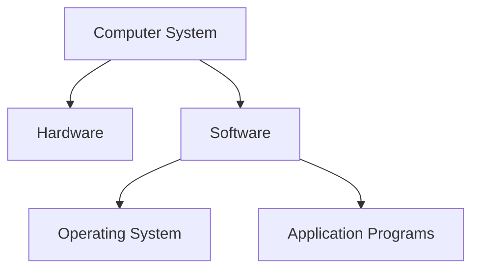
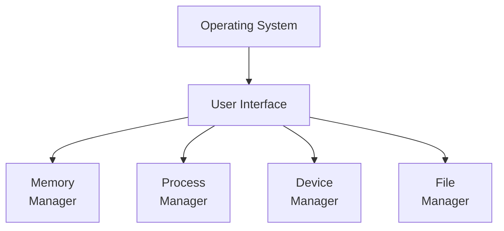
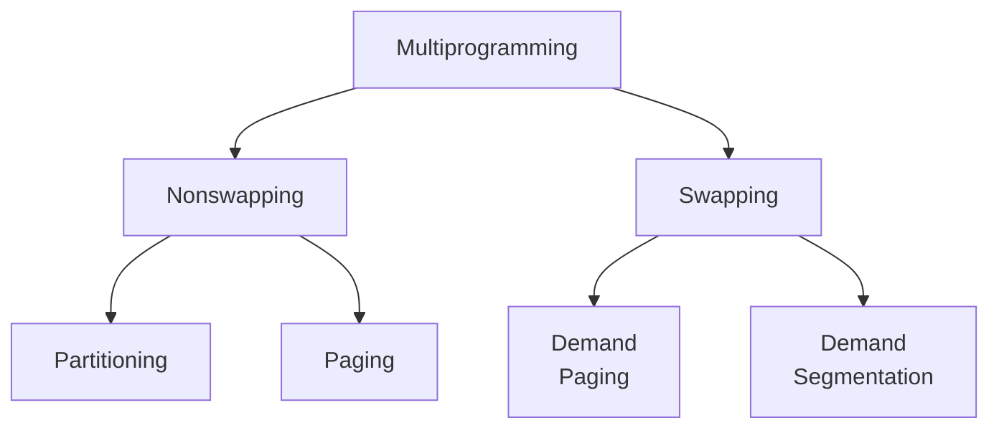

# Operating System 

---

# บทนำ

- คอมพิวเตอร์เป็นระบบที่เกิดขึ้นจากองค์ประกอบ 2 ส่วนคือ **ฮาร์ดแวร์กับซอฟท์แวร์** 
    - **ฮาร์ดแวร์** เป็นอุปกรณ์หรือเป็นตัวเครื่องที่จับต้องได้ 
    - ส่วน **ซอฟท์แวร์** เป็นเซตของโปรแกรมที่ทำให้ฮาร์ดแวร์สามารถทำงานได้

- ซอฟท์แวร์คอมพิวเตอร์แบ่งออกเป็น 2 ประเภทคือ
    - **ระบบปฏิบัติการ (operating system)** ทำหน้าที่ช่วยให้ผู้ใช้สามารถเข้าถึงและใช้ฮาร์ดแวร์ได้อย่างสะดวก
    - **ซอฟท์แวร์ประยุกต์ (application software)** ทำหน้าที่ใช้ฮาร์ดแวร์ให้แก้ปัญหาตามที่ผู้ใช้ต้องการ

---
layout: two-cols
---

# ระบบคอมพิวเตอร์

::right::

ตัวอย่างระบบปฏิบัติการ (Operating System) ที่นิยมใช้:
- Windows: พัฒนาโดย Microsoft เป็นระบบปฏิบัติการที่ใช้งานง่าย เหมาะสำหรับผู้ใช้ทั่วไป
- macOS: พัฒนาโดย Apple เป็นระบบปฏิบัติการที่โดดเด่นด้านความสวยงาม ใช้งานง่าย เหมาะสำหรับการใช้งานมัลติมีเดีย และการออกแบบ
- Linux: เป็นระบบปฏิบัติการโอเพ่นซอร์ส มีหลายเวอร์ชัน พัฒนาโดยชุมชนผู้ใช้ เหมาะสำหรับผู้ใช้ที่มีความรู้ด้านคอมพิวเตอร์ ต้องการความยืดหยุ่น ปรับแต่งระบบได้ตามต้องการ
- Android: พัฒนาโดย Google เป็นระบบปฏิบัติการบนมือถือที่นิยมใช้มากที่สุดในโลก เหมาะสำหรับสมาร์ทโฟน และแท็บเล็ต
- iOS: พัฒนาโดย Apple เป็นระบบปฏิบัติการบนมือถือที่ใช้งานบน iPhone และ iPad

---

# ระบบปฏิบัติการคืออะไร?

- ระบบปฏิบัติการ (OS) เป็นซอฟท์แวร์ที่ซับซ้อน ยากแก่การให้คำจำกัดความที่กะทัดรัด แต่พอจะให้คำนิยามกว้างๆดังนี้

- OS เป็นซอฟท์แวร์ที่เชื่อมต่อ (interface) ระหว่างฮาร์ดแวร์กับผู้ใช้ (user) ซึ่งอาจเป็นโปรแกรมหรือคนก็ได้
- OS เป็นซอฟท์แวร์ (เซตของโปรแกรม) ที่ช่วยทำให้การ execute โปรแกรมอื่นเป็นไปได้โดยไม่ยาก
- OS ทำหน้าที่คล้ายกับผู้จัดการที่คอยให้คำแนะนำและควบคุมการทำงานของแต่ละส่วนของระบบคอมพิวเตอร์ ในฐานะที่เป็นผู้จัดการ 
    - OS จะคอยตรวจสอบทั้งฮาร์ดแวร์และซอฟท์แวร์เพื่อให้ทำ งานให้มีประสิทธิภาพสูงสุด 
    - และเมื่อมีการขัดแย้งกันในการใช้ทรัพยากรในการทำงาน OS ก็จะเป็นตัวกลางในการแก้ปัญหา

---

# วัตถุประสงค์ของการออกแบบระบบปฏิบัติการ

1. ต้องทำให้การใช้ฮาร์ดแวร์มีประสิทธิภาพสูงสุด
2. ต้องทำให้การใช้ทรัพยากรคอมพิวเตอร์เป็นไปด้วยความสะดวก

---

# วิวัฒนาการของระบบปฏิบัติการ

- ระบบปฏิบัติการ มีประวัติและวิวัฒนาการเป็นระยะเวลายาวนานแบ่งเป็นช่วงๆ สรุปได้ดังนี้
    1. **ระบบปฏิบัติการแบบแบทช์ (batch operating systems)** ออกแบบสร้างขึ้นในช่วงปี พ.ศ. 2493 
เพื่อควบคุมการทำงานของคอมพิวเตอร์ประเภทเมนเฟรม ณ เวลานั้น 

    - คอมพิวเตอร์เป็นเครื่องจักรขนาดใหญ่
    - ที่ใช้บัตรเจาะรู (punched cards) เป็นสื่อนำเข้า (inputs) 
    - ใช้เครื่องพิมพ์ความเร็วสูง (line printers) เป็นสื่อแสดงผล (outputs) 
    - และใช้เทปแม่เหล็กเป็นหน่วยความจำสำรอง 

---

# วิวัฒนาการของระบบปฏิบัติการ (2)

- แต่ละโปรแกรมที่จะทำการ execute จะเรียกว่า job 
- นักเขียนโปรแกรมที่ต้องการ execute โปรแกรม
- จะต้องนำบัตรเจาะรูที่เป็นโปรแกรมและข้อมูลไปที่ห้องคอมพิวเตอร์ 
- นักเขียนโปรแกรมไม่สามารถควบคุมหรือติดต่อกับคอมพิวเตอร์ได้ 
- ผู้ที่นำโปรแกรมและข้อมูลเข้าไปให้เครื่องคอมพิวเตอร์ทำการประมวลผลคือ operator 
    - ถ้าโปรแกรมไม่มีความผิดพลาด เครื่องจะทำการพิมพ์ผลออกทางเครื่องพิมพ์เพื่อส่งให้นักเขียนโปรแกรม
    - ถ้ามีข้อผิดพลาดเครื่องก็จะพิมพ์รายการที่ผิดพลาดออกมาเพื่อนักเขียนโปรแกรมจะได้แก้ไข 
- ระบบปฏิบัติการในยุคนี้จะไม่ซับซ้อน เพียงทำหน้าที่ในการเปลี่ยนถ่ายทรัพยากรจากโปรแกรมหนึ่งไปสู่อีกโปรแกรมหนึ่งเท่านั้น

---

# วิวัฒนาการของระบบปฏิบัติการ (3)

2. **ระบบปฏิบัติการแบบใช้ทรัพยากรร่วมกัน (time-sharing operating systems)**
เพื่อให้การใช้ทรัพยากรคอมพิวเตอร์มีประสิทธิภาพสูงสุด **ระบบการทำงานแบบหลายโปรแกรม (multiprogramming)** จึงถูกคิดขึ้น 
    - แนวความคิดคือเก็บหลายๆ job ไว้ในหน่วยความจำหลัก
    - และทำการจัดสรรทรัพยากรให้กับ job ทีละ 1 job ที่ต้องการภายใต้เงื่อนไขที่ว่าทรัพยากรต้องว่างจากการใช้งาน

ตัวอย่างเช่น
- มี job หนึ่งกำลังใช้อุปกรณ์ I/O 
- ทำให้ CPU ว่างและสามารถจัดให้กับ job อื่นได้ 
- ระบบ multiprogramming นำไปสู่แนวคิดของการใช้ทรัพยากรร่วมกัน (time sharing) 
- แต่ละ job จะถูกจัดสรรเวลาให้ใช้ทรัพยากรเดียวกันในเวลาที่ต่างกัน 
- เนื่องจากคอมพิวเตอร์สามารถทำงานได้รวดเร็วมาก ผู้ใช้จะรู้สึกเสมือนว่าเขาเป็นผู้ใช้เพียงคนเดียว

---

# วิวัฒนาการของระบบปฏิบัติการ (4)

- Multiprogramming นับเป็นแนวคิดที่เพิ่มประสิทธิภาพการทำงานของคอมพิวเตอร์อย่างมาก ทำให้ต้องใช้ระบบปฏิบัติการที่มีความซับซ้อนมากขึ้นด้วย ระบบปฏิบัติการที่ว่าจะต้องสามารถ**จัดตารางลำดับการใช้งาน (scheduling)**
- นั่นคือจะต้องทำการตัดสินใจว่า job ใดจะใช้ทรัพยากรใด และใช้เมื่อใด เป็นต้น 
- ในยุคนี้ผู้ใช้สามารถติดต่อโดยตรงได้กับคอมพิวเตอร์โดยไม่ต้องผ่าน operator

3. **ระบบปฏิบัติการส่วนบุคคล (personal operating systems)** เมื่อมีการคิดค้นคอมพิวเตอร์ส่วนบุคคลขึ้น จึงมีความจำเป็นที่จะต้องใช้ระบบปฏิบัติ การส่วนบุคคลสำหรับคอมพิวเตอร์ประเภทนี้ ทำให้เกิดระบบปฏิบัติการแบบใช้คนเดียวขึ้นเช่น DOS (Disk Operating Systems) เป็นต้น

4. **ระบบแบบขนาน (parallel systems)** ความต้องการในการประมวลผลที่รวดเร็วและมีประสิทธิภาพมากขึ้นนั้น นำไปสู่การออกแบบระบบประเภทที่ เรียกว่าระบบประมวลผลแบบขนาน นั่นคือระบบที่มี CPU หลายๆตัวอยู่ในคอมพิวเตอร์เครื่องเดียวกัน แต่ละ CPU อาจทำงานกับโปรแกรมหนึ่งหรือส่วนหนึ่งของโปรแกรม หมายถึงว่างานหลายๆงานสามารถทำพร้อมกันได้ ระบบปฏิบัติการที่ทำงานแบบนี้จะมีความซับซ้อนมากกว่าระบบที่มี CPU เพียงตัวเดียว

---

# วิวัฒนาการของระบบปฏิบัติการ (5)

5. **ระบบแบบกระจาย (distributed systems)** เครือข่ายคอมพิวเตอร์ได้ก่อให้ เกิดระบบปฏิบัติการรูปแบบใหม่ แต่ก่อน job หนึ่งๆจะทำสำเร็จบนเครื่อง
คอมพิวเตอร์เพียงเครื่องเดียว แต่ภายใต้เครือข่าย job หนึ่งอาจถูกแบ่งให้คอมพิวเตอร์หลายๆเครื่องช่วยกันทำ 

&emsp; โดยคอมพิวเตอร์แต่ละเครื่องอาจอยู่ห่างกันเป็นร้อยหรือเป็นพันกิโลเมตรก็ได้ โปรแกรมสามารถ run บางส่วน บนเครื่องหนึ่งและอีกบางส่วนบนอีกเครื่องหนึ่งได้ ถ้าเครื่องคอมพิวเตอร์เหล่านั้นมีการเชื่อมโยงถึงกันด้วยเครือข่ายเช่นอินเตอร์เน็ต 

&emsp;นอกจากนี้เราสามารถกระจายทรัพยากรได้ด้วย เช่นโปรแกรมอาจต้องการแฟ้มข้อมูลที่อยู่ในเครื่องคอมพิวเตอร์ที่ตั้งอยู่ ณ ส่วนต่างๆของโลกนี้ (เช่นโปรแกรมการจองตั๋วเครื่องบินเป็นต้น) ระบบปฏิบัติการแบบกระจายจะรวมเอาความ สามารถของระบบปฏิบัติการที่กล่าวมาแล้วผนวกกับความสามารถในเรื่องของการรักษาความปลอดภัยเข้าไปด้วย

---

# องค์ประกอบของระบบปฏิบัติการ

- ในปัจจุบันระบบปฏิบัติการมีความซับซ้อนมาก จำเป็นที่จะต้องมีการบริหารจัดการทรัพยากรระบบคอมพิวเตอร์ทั้งระบบ เปรียบเหมือนองค์กรที่ต้องมีผู้จัดการหลายๆคนทำงานร่วมกัน แต่ละคนก็รับผิดชอบแต่ละฝ่ายและต้องทำงานประสานกัน 

ระบบปฏิบัติการสมัยใหม่จะต้องมีหน้าที่อย่างน้อย 4 หน้าที่หลักคือ

**1. หน้าที่จัดการหน่วยความจำ (memory management)**

**2. หน้าที่จัดการกระบวนการ (process management)**

**3. หน้าที่จัดการอุปกรณ์ (device management)**

**4. หน้าที่จัดการแฟ้มข้อมูล (file management)**

- มีอีกองค์ประกอบหนึ่งที่ทำหน้าที่สื่อสาร ติดต่อระหว่างระบบปฏิบัติการกับสิ่งแวดล้อมภายนอกคือ **user interface**

---
layout: section
---

# Memory
---

# 1. Memory Management

- การจัดการหน่วยความจำเป็นงานที่ระบบปฏิบัติการจะต้องจัดสรรหน่วยความจำให้กับ **process** ที่ต้องการใช้ แม้ว่าในปัจจุบันหน่วยความจำจะมีขนาดเพิ่มขึ้น แต่ขนาดของโปร แกรมและข้อมูลก็มีขนาดเพิ่มขึ้นตามไปด้วย การจัดสรรทรัพยากรหน่วยความจำจะต้องป้องกันปัญหาที่เรียกว่า **“running out of memory”** คือใช้หน่วยความจำจนหมด
- ระบบปฏิบัติการอาจแบ่งออกเป็น 2 ประเภทใหญ่ๆตามลักษณะการจัดการหน่วยความจำคือ **monoprogramming** และ **multiprogramming**

---
layout: two-cols
---

# Monoprogramming

- เป็นระบบปฏิบัติการที่มีใช้ในอดีต แต่ก็จะต้องทำความเข้าใจเพื่อที่จะทำให้เข้าใจ multiprogramming ที่จะกล่าวถึงต่อไปได้ดีขึ้น ในการจัดการหน่วยความจำแบบ monoprogramming นั้น หน่วยความจำเกือบทั้งหมดจะถูกจัดสรรให้กับโปรแกรมเพียงโปรแกรมเดียว ส่วนที่เหลือจะใช้เก็บตัวระบบปฏิบัติการเอง โปรแกรมทั้งโปรแกรมจะถูก load เข้าไปเก็บอยู่ในหน่วยความจำเพื่อรอการ execute เมื่อโปรแกรม run เสร็จหรือจบการทำงาน โปรแกรมใหม่ก็จะ load เข้าไปแทนที่โปรแกรมเดิม

::right::

    
Operating System

    
Program and Data

    
Memory

---

# หน้าที่ของ memory manager 

- แบบ monoprogramming

1. ทำการ load โปรแกรมเข้าไปในหน่วยความจำ 
2. run โปรแกรมที่ load เข้ามา 
3. แทนที่โปรแกรมที่ run เสร็จแล้วด้วยโปรแกรมต่อไป 

อย่างไรก็ดี การจัดการหน่วยความจำแบบนี้ก็มีปัญหาหลายประการดังนี้ 

1. โปรแกรมจะต้องมีขนาดที่สามารถ load เข้าไปอยู่ในหน่วย ความจำได้ทั้งหมด ถ้าหน่วยความจำมีขนาดเล็กกว่าขนาดของโปรแกรม ก็จะไม่สามารถ run โปรแกรมนั้นได้ 
2. เมื่อมีโปรแกรมหนึ่งกำลัง run อยู่ โปรแกรมอื่นๆจะต้องรอ

---
layout: two-cols
---

ในระหว่างที่โปรแกรมหนึ่งกำลังถูก execute นั้น

- โดยปกติจะมีการรับข้อมูลเข้ามาจากอุปกรณ์นำเข้า 
- และส่งผลลัพธ์ออกทางอุปกรณ์แสดงผล 
**อุปกรณ์ I/O เหล่านี้ทำงานช้ากว่า CPU มาก** 

&emsp; ดังนั้นระหว่างที่อุปกรณ์ I/O กำลังทำงาน CPU ก็จะว่าง ไม่อาจทำงานอย่างอื่นได้เนื่องจากไม่มีโปรแกรมอื่นอยู่ในหน่วยความจำ 

&emsp; วิธีการแบบนี้นับเป็นการใช้หน่วยความจำและ CPU ไม่สู้จะมีประสิทธิภาพเท่าที่ควรจะเป็น จึงก่อให้เกิดวิธีการใหม่ที่เรียกว่า **multiprogramming**

::right::

    
Operating System

    
Program 1

    
Program 2

    
Program 3

    
Program 4

    
Memory

---
layout: two-cols

---

# Multiprogramming

- วิธีการนี้ โปรแกรมหลายๆโปรแกรมสามารถอยู่ในหน่วยความ จำได้พร้อมๆกัน และสามารถ execute ได้พร้อมๆกัน (concurrent) โดย CPU จะสลับไปมาระหว่างโปรแกรม 

&emsp; ตั้งแต่ปี พ.ศ. 2503 เป็นต้นมา multiprogramming ได้มีการพัฒนาอย่างต่อเนื่อง มีการจัดรูปแบบดังรูป  ซึ่งจะเห็นว่ามี 2 รูป แบบหลักคือ

1. Nonswapping หมายถึงโปรแกรมจะคงอยู่ในหน่วยความจำตลอดระยะเวลาที่โปรแกรมนั้นถูก execute จนกว่าจะแล้วเสร็จ
2. Swapping หมายถึงโปรแกรมที่ถูก execute จะสลับนำไปเก็บไว้ในดิสค์กับหน่วยความจำ สลับไปมาจนกว่าจะแล้วเสร็จ

::right::

ประเภทของ Multiprogramming

---
layout: two-cols
---

# Nonswapping มี 2 วิธีคือ

- แบบ 1

**1. Partitioning:** เป็นเทคนิคแรกที่ใช้ใน multiprogramming วิธีนี้หน่วยความจำจะถูกแบ่งออกเป็นหลายๆส่วนที่มีขนาดไม่เท่ากัน แต่ละส่วนเรียกว่า “พาร์ทิชั่น” (partition) 
- แต่ละพาร์ทิชั่นจะเก็บ 1 โปรแกรม CPU จะทำงานทีละโปรแกรม การทำงานเริ่มจาก
1. CPU ทำการ execute โปรแกรมแรกโดย execute คำสั่งต่างๆจนกระ ทั่งถึงคำสั่ง I/O หรือเวลาที่จัดสรรให้กับโปรแกรมนั้นหมดลง 
2. จาก นั้น CPU จะเก็บที่อยู่ของคำสั่งสุดท้ายของโปรแกรมนั้นไว้ก่อนที่จะไป execute โปรแกรมในพาร์ทิชั่นอื่นต่อไป 
3. การทำงานจะวนอย่างนี้จน ทุกๆโปรแกรมถูก execute จนเสร็จทั้งหมดตามลำดับ แต่อาจมีการจัดลำดับความสำคัญของแต่ละโปรแกรมได้ 

::right::

Partitioning

---
layout: two-cols
---

ด้วยเทคนิคการแบ่งหน่วยความจำเป็นพาร์ทิชั่นนี้ แต่ละโปรแกรมจะถูกเก็บอยู่ในหน่วยความจำที่ต่อเนื่องกัน เทคนิคนี้จะช่วยให้การใช้งาน CPU มีประสิทธิภาพมากขึ้น แต่ก็ยังมีปัญหาบางประการดังนี้

- ขนาดของแต่ละพาร์ทิชั่นจะต้องถูกกำหนดล่วงหน้าโดยผู้จัดการหน่วยความจำ (memory manager) 
ถ้าขนาดของพาร์ทิชั่นเล็กเกินไป บางโปรแกรมอาจจะไม่สามารถ load เข้าไปอยู่ในพาร์ทิชั่นนั้นได้ ถ้าขนาดของพาร์ทิชั่นใหญ่เกิน ไปก็อาจจะทำให้มีช่องว่างของหน่วยความจำที่ไม่ได้ใช้ประโยชน์ เพราะขนาดของโปรแกรมไม่พอดีกับพาร์ทิชั่น

- แม้ว่าการพาร์ทิชั่นอาจจะดีและครบถ้วนสมบูรณ์ในตอนเริ่มต้น แต่อาจจะมีช่องว่างเกิดขึ้นอีกหลังจากโปรแกรมตอนต้นถูกแทนด้วยโปรแกรมต่อๆไป
- เมื่อมีช่องว่างจำนวนมาก memory manager สามารถรวมช่อง ว่างเหล่านั้นแล้วสร้างพาร์ทิชั่นใหม่ การทำเช่นนี้ย่อมเป็นการเสีย เวลาโดยใช่เหตุ

::right::

Partitioning

---
layout: two-cols
---

# Nonswapping

- แบบ 2

**2. Paging:** วิธี paging ช่วยเพิ่มประสิทธิภาพของวิธี partitioning 

ในวิธี paging
- หน่วยความจำจะถูกแบ่งออกเป็นส่วนๆ แต่ละส่วนมีขนาดเท่ากัน แต่ละส่วนเรียกว่าเฟรม (frame) 
- ในขณะที่โปรแกรมถูกแบ่งออกเป็นส่วนๆเช่นกัน แต่ละส่วนมีขนาดเท่ากัน เรียกแต่ละส่วนว่า page 
- โดยปกติขนาดของ frame จะเท่ากับขนาดของ page

::right::

Paging

---
layout: two-cols
---

วิธี paging ทำงานโดยการ
1. load แต่ละ page ของโปรแกรมเข้าไปเก็บใน frame ในหน่วยความจำ 
2. ถ้าโปรแกรมมี 3 page ก็จะใช้หน่วย ความจำจำนวน 3 เฟรม 

ด้วยวิธีการนี้ โปรแกรมไม่จำเป็นจะต้องเก็บในหน่วยความจำที่เรียงต่อเนื่องกัน 

- ข้อดีของวิธี paging เมื่อเปรียบเทียบกับวิธี partitioning คือ   
วิธี paging ช่วยเพิ่มประสิทธิภาพการจัดการหน่วยความจำระดับหนึ่ง แต่การ execute แต่ละครั้งก็ยังต้อง load ทั้งโปรแกรมเข้าไปเก็บในหน่วยความจำเช่นเดียวกัน 
- นั่นหมายความว่าโปรแกรมที่ต้องการ 6 เฟรมในการ execute จะไม่สามารถทำได้หากในหน่วยความจำมีเฟรมที่ยังไม่ได้ใช้มีแค่ 4 เฟรมเหลืออยู่

::right::

Paging

---

# Swapping

- เดิมวิธี paging ไม่จำเป็นต้องให้โปรแกรมถูก load เข้าไปหน่วยความจำที่ติดต่อเนื่องกัน **แต่ต้องการว่าโปรแกรมทั้งโปรแกรมต้องอยู่ในหน่วยความจำทั้งหมด**

**3. Demand Paging:** วิธีการ demand paging กำจัดข้อจำกัดนี้ออกไป โดยมีข้อยืดหยุ่นกว่าคือ

1. โปรแกรมจะ load เข้าไปในหน่วยความจำเฉพาะ page ที่กำลัง execute เท่านั้น 
2. เมื่อ page ถูก execute เสร็จก็จะนำออกแล้วทำการ load เฉพาะ page ที่จะทำการ execute เป็นลำดับต่อไปเข้าไปสู่หน่วย ความจำแทน 

กล่าวอีกอย่างหนึ่งคือหน่วยความจำสามารถเก็บ page 1 page จากหลายๆโปรแกรมในเวลาเดียวกันได้ ยิ่งไปกว่านั้น หลายๆ pages ที่ต่อเนื่องกันจากโปรแกรมเดียวกัน ไม่จำเป็นที่จะต้อง load เข้าไปอยู่ในเฟรม เดียวกัน แต่ละ page อาจ load เข้าไปเก็บในเฟรมใดๆก็ได้ที่ว่างอยู่

---

# Swapping (2)

4. Demand Segmentation: วิธีการที่คล้ายๆกับวิธี paging คือวิธี segmentation ในวิธี paging โปรแกรมจะถูกแบ่งออกเป็น page ที่มีขนาดเท่าๆกัน 

- ซึ่งแตกต่างจากวิธีที่นักเขียนโปรแกรมคิด นักเขียนโปรแกรมมองว่าโปรแกรมแบ่งออกเป็นส่วนๆ แต่ละส่วนเรียกว่าโมดูล (module) ที่ขนาดไม่จำเป็นจะต้องเท่ากัน 
- ในวิธี segmentation โปรแกรมจะถูกแบ่งออกเป็นส่วนๆ แต่ละส่วนเรียกว่า segment ที่สอดคล้องกับแนวคิดของนักเขียนโปรแกรม segment เหล่านี้จะถูก load, execute, และ แทนที่ด้วยโมดูลอื่นจากโปรแกรมเดียวกันหรือโปรแกรมที่ต่างกันก็ได้

---
layout: two-cols
---

# หน่วยความจำเสมือน : Virtual Memory

- แนวคิดเกี่ยวกับ demand paging และ demand segmentation คือในขณะที่โปรแกรมกำลังถูก execute นั้น ส่วนหนึ่งของโปรแกรมอยู่ในหน่วยความจำหลัก อีกส่วนหนึ่งจะเก็บอยู่ในหน่วยความจำสำรอง

ตัวอย่าง: หน่วยความจำหลักขนาด 10 MB สามารถ execute โปรแกรมจำนวน 10 โปรแกรมโดยที่แต่ละโปรแกรมมีขนาด 3 MB (รวม 30 MB) ได้ วิธีการคือ ณ เวลาหนึ่ง ส่วนหนึ่งของ 10 โปรแกรมที่มีขนาด 10 MB จะอยู่ในหน่วยความจำหลัก ส่วนโปรแกรมอีก 20 MB จะเก็บอยู่ในหน่วยความจำสำรองบนดิสค์

::right::

- ในสภาวะเช่นนี้ หน่วยความจำจริงๆที่มีคือ 10 MB แต่หน่วยความ จำเสมือนมีขนาด 30 MB ในปัจจุบัน หน่วยความจำเสมือนซึ่งต้องใช้วิธี demand paging, demand segmentation หรือทั้งสองอย่าง มีการใช้งานอย่างแพร่หลายในระบบปฏิบัติการทั่วไป

Virtual Memory

---
layout: section
---

# Process

---

# Process Management

- ระบบปฏิบัติการยุคใหม่ คำศัพท์ 3 คำที่ใช้โดยหมายถึงกลุ่มของคำสั่งคือ: **program, job, และ process** แต่คำเหล่านี้ก็จะมีความหมายที่กว้างและแตกต่างกันไปตามระบบปฏิบัติการที่ใช้ สำหรับในชั้นนี้จะกำหนดนิยาม เพื่อความเข้าใจที่ตรงกันดังต่อไปนี้

- **program:** หมายถึงชุดของคำสั่งที่ยังไม่มีการกระทำใดๆ (nonactive) ที่เขียนโดยนักเขียนโปรแกรมซึ่งเก็บอยู่ในดิสค์ (หรือเทป) โปรแกรมในโอกาสต่อไปอาจเป็น job หรือไม่ก็ได้

---

# Process Management (2)

- **job:** โปรแกรมจะเปลี่ยนสภาพเป็น job ทันทีที่มันถูกเลือกไป execute จนกว่าจะสำเร็จแล้วจึงเปลี่ยนสภาพกลับมาเป็นโปรแกรมอีกครั้งหนึ่ง ในช่วงเวลาดังกล่าว job อาจถูก execute หรือไม่ก็ได้
    - มันอาจถูกเก็บอยู่ในดิสค์เพื่อรอเวลาที่จะ load เข้าสู่หน่วยความจำหลัก 
    - หรืออาจจะรองอยู่ในหน่วยความจำหลักเพื่อรอการ execute จาก CPU 
    - หรืออาจจะอยู่ในดิสค์หรืออยู่ในหน่วยความจำหลักเพื่อรอเหตุการณ์ I/O 
    - หรืออาจจะอยู่ในหน่วยความจำหลักในขณะที่มันถูก execute โดย CPU 

 _**ข้อสังเกต:**_   
1. _**คำว่าโปรแกรม**_ จะหมายถึงทุกกรณี ที่กล่าวมา เมื่อ job ถูก execute สำเร็จ (จบปกติหรือไม่ปกติก็ได้) มันจะเปลี่ยนสภาพมาเป็นโปรแกรมที่เก็บอยู่ในดิสค์ ระบบปฏิบัติการจะไม่สามารถควบคุมดูแลโปรแกรม ณ ตอนนี้ได้ 

2. ทุกๆ job เป็นโปรแกรม แต่อาจมีบางโปรแกรมที่ไม่ใช่ job

---

# Process Management (3)

- **Process:** คือโปรแกรมที่อยู่ในระหว่างการ execute แต่ยังไม่เสร็จ กล่าวอีกอย่างคือ process เป็น job ทีอยู่ในหน่วยความจำหลัก 
    - มันจะถูกเลือกในระหว่าง job ที่กำลังรอคอยการ execute แล้วถูก load เข้าไปในหน่วยความ จำหลัก 
    - process อาจถูก execute ทันทีหรืออาจต้องรอ CPU เมื่อถูก load เข้าสู่หน่วยความจำหลัก 
    - เมื่อไรก็ตามที่ job อยู่ในหน่วยความจำหลัก เราจะเรียกว่า **process**  (ดังนั้นทุกๆ process จะเป็น job เพราะอยู่ในหน่วยความจำหลัก แต่บาง job ที่ไม่ ได้เป็น process เพราะว่า job อาจจะไม่ได้อยู่ในหน่วยความจำหลัก)

---
layout: two-cols
---
# 2.1 แผนภาพสถานะ (State Diagram)

- ความสัมพันธ์ระหว่าง program, job, และ process จะมีความชัดเจนมากขึ้นถ้าเราพิจาณาว่า program เปลี่ยนไปเป็น job และ job เปลี่ยนไปเป็น process ได้อย่างไร ความสัมพันธ์นี้สามารถแสดงให้เห็นได้โดยใช้แผนภาพสถานะซึ่งจะบ่งบอกถึงสถานะของแต่ละส่วน

::right::

แผนภาพสถานะ (State Diagram)

---
layout: two-cols
---

แผนภาพสถานะ (State Diagram)

::right::

จากรูปจะเห็นว่า 
1. program เปลี่ยนไปเป็น job โดยระบบปฏิบัติการและ
2. นำไปสู่สถานะ ‘hold’ มันจะคงอยู่ในสถานะนี้จนกระทั่งถูก load เข้าไปสู่หน่วยความจำหลักเมื่อมีหน่วยความจำหลักเหลือเพียงพอที่จะ load 
3. โปรแกรมเพียงบางส่วนหรือทั้งหมด job ก็จะเปลี่ยนไปสู่สถานะ ‘ready’ และเรียกว่า ‘process’ มันจะอยู่ในหน่วยความจำหลักและอยู่ในสถานะนี้จนกว่า CPU จะว่างและ
4. ทำการ execute สถานะจะเปลี่ยนไปเป็น ‘running’ 

---
layout: two-cols
---

แผนภาพสถานะ (State Diagram)

::right::

ในขณะที่อยู่ในสถานะ ‘running’ นั้น 3 สถานการณ์ต่อไปนี้อาจเกิดขึ้นได้
- (s1) process ถูก execute จนกระทั่งต้องการ I/O หรือ
- (s2) process ถูก execute จนหมดเวลาที่กำหนดไว้ให้ หรือ
- (s3) process ถูก execute จนจบการทำงาน

1. ในกรณีแรกหรือ (s1) process จะเปลี่ยนไปสู่สถานะ ‘waiting’ และคอยจนกระทั่งได้รับการจัดสรร I/O 

2. ในกรณีที่สองหรือ (s2) process จะเปลี่ยนไปสู่สถานะ ‘ready’ 

3. ในกรณีที่สามหรือ (s3) process จะเปลี่ยนไปสู่สถานะ ‘terminated’ และหมดสภาพการที่จะเป็น process อีกต่อไป 

การเปลี่ยนสถานะของ process ระหว่าง running, waiting, และ ready อาจเกิดขึ้นหลายๆครั้งก่อนที่จะไปจบลงที่สถานะ ‘terminated’

---

# 2.2 Schedulers

- การที่จะเปลี่ยน job หรือ process จากสถานะหนึ่งไปเป็นอีกสถานะหนึ่งนั้น process manager จะใช้การจัดตารางเวลา 2 ลักษณะคือ **job scheduler** และ **process scheduler**

    1. **Job Scheduler:** ทำการเปลี่ยนสถานะของ job จากสถานะ ‘hold’ ไปเป็นสถานะ ‘ready’ หรือจาก ‘running’ ไปเป็น ‘terminated’ หรือกล่าวอีกอย่างหนึ่งคือ job scheduler ทำหน้าที่สร้าง process จาก job และทำการ terminate process

---

2. **Process Scheduler:** ทำหน้าที่เปลี่ยน process จากสถานะหนึ่งไปเป็นอีกสถานะหนึ่งคือ 
    1. เปลี่ยน process จากสถานะ ‘running’ ไปสู่สถานะ ‘waiting’ เมื่อ process รอคอยเหตุการณ์บางอย่างให้เกิดขึ้น 
    2. เปลี่ยน process จากสถานะ ‘running’ ไปเป็นสถานะ ‘ready’ ถ้าเวลาที่กำหนดให้หมดลง 
    3. เปลี่ยน process จากสถานะ ‘waiting’ ไปสู่สถานะ ‘ready’ เมื่อมีเหตุการณ์ที่รอคอยเกิดขึ้น
    4. เมื่อ CPU พร้อมที่จะ run, process scheduler จะทำการเปลี่ยน process จากสถานะ ‘ready’ ไปเป็นสถานะ ‘running’

---

3.  **Scheduler ประเภทอื่นๆ:** ระบบปฏิบัติการบางระบบใช้ schedulers ที่ซับซ้อนกว่าที่อธิบายมา เพื่อที่จะทำให้กระบวนการเปลี่ยนสถานะของ process มีประสิทธิภาพมากขึ้น

---
layout: two-cols
---
# 2.3 Queuing

- แผนภาพสถานะแสดงให้เห็นว่า job หรือ process เปลี่ยนจากสถานะหนึ่งไปเป็นอีกสถานะหนึ่ง ความจริงที่เกิดขึ้นคือมี job และ process จำนวนมากที่แข่งขันกันเพื่อให้ได้มาซึ่งทรัพยากรที่จะต้องใช้ประมวลผล 

- ตัวอย่างเช่น เมื่อมีหลายๆ job อยู่ในหน่วยความจำพร้อมๆกัน ยังมีอีกหลายๆ job กำลังรอหน่วยความจำที่จะว่างเพื่อที่จะ load เข้ามา หรือถ้ามี process หนึ่งกำลังใช้ CPU อยู่ ก็จะยังมี process อื่นที่รอ CPU เช่นกัน

::right::

---
layout: two-cols
---

- การที่จะจัดการกับหลายๆ process และ job พร้อมๆกัน process manager ใช้ **queues** เป็นเครื่องมือ
- โดยแต่ละ job และแต่ละ process จะมี **job control block (JCB) หรือ process control block (PCB)** ที่เก็บรายละเอียดของ job หรือ process ไว้ 
- process manager จะเก็บ **JCB หรือ PCB ไว้ใน queue** ส่วน **job และ process จริงจะอยู่ในหน่วยความจำหลักหรือหน่วยความจำสำรอง** เพราะมันใหญ่เกินไปที่จะเก็บใน queue ดังนั้น JCB และ PCB จะแทน job และ process ที่รอทรัพยากรตามลำดับ

::right::

---
layout: two-cols
---

- ในระบบปฏิบัติการโดยทั่วไปจะมีหลาย queue เช่นในรูปที่ แสดงให้เห็นถึง job และ process กับ queue จำนวน 3 queue คือ      
1. **job queue:** เก็บ job ที่รอหน่วยความจำหลัก 
2. **ready queue:** เก็บ process ที่อยู่ในหน่วยความจำหลัก พร้อมที่จะ run แต่กำลังรอ CPU อยู่      
3. **I/O queue:** เก็บ process ที่รออุปกรณ์ I/O (จริงๆแล้วมีหลาย queue เท่ากับจำนวนอุปกรณ์ I/O ที่มี)

::right::

---
layout: two-cols
---

- **Process manager** อาจมีนโยบายหลายรูปแบบเพื่อเลือก job หรือ process ต่อไปจาก queue ซึ่งอาจเป็น
    - มาก่อนไปก่อน (first in, first out: FIFO) 
    - สั้นที่สุดก่อน (shortest length first) หรือ 
    - มีสิทธิสูงสุด (highest priority) เป็นต้น

::right::

---

# 2.4 Process Synchronization

- ความคิดพื้นฐานที่อยู่เบื้องหลัง process management คือการทำให้ process หลายๆ process สามารถใช้ทรัพยากรหลายๆประเภทได้พร้อมกัน เมื่อไรก็ตามที่ทรัพยากรสามารถใช้โดย process ที่มากกว่า 1 process ขึ้นไป อาจก่อให้เกิด 2 สถานการณ์ได้คือ
    1. Deadlock
    2. Starvation

---
layout: two-cols
---

1. **Deadlock:** แทนที่จะอธิบายนิยามของคำว่า deadlock แต่จะขอยกตัวอย่างเพื่อความเข้าใจ 

- สมมติว่ามี 2 process คือ process A กับ process B 
    - โดยที่ process A กำลังครอบครองแฟ้มข้อมูลชื่อ “File1” อยู่ และไม่สามารถปล่อยออกไปได้จนกว่าจะได้ครอบครองแฟ้มข้อมูลที่ชื่อ “File2” 
    - ส่วน process B กำลังครอบครองแฟ้มข้อมูล “File2” และไม่สามารถปล่อยออกไปได้จนกว่าจะได้ครอบครอง “File1”

เนื่องจาก**แฟ้มข้อมูลในระบบคอมพิวเตอร์ทั่วไปจะไม่สามารถใช้ร่วมพร้อมกันได้**
- **ถ้าไม่มีมาตรการในการปลดปล่อยแฟ้มข้อมูลที่ถือครองอยู่ ก่อนที่จะร้องขอทรัพยากรอื่น ก็จะก่อให้เกิด deadlock ได้**

::right::

Deadlock

---
layout: two-cols
---

**Deadlock** จะเกิดขึ้น

- **ถ้าระบบปฏิบัติการยอมให้ process เริ่ม run โดยไม่ได้ตรวจสอบก่อนว่าทรัพยากรที่ต้องการนั้นว่างหรือไม่และทำการจัดสรรให้ตามที่ต้องการทันที**

เพื่อป้องกันไม่ให้เกิด deadlock ในระบบ 

- วิธีแก้อย่างหนึ่งคือไม่ยอมให้ process เริ่มทำงานจนกระทั่งทรัพยากรที่ต้อง การว่างจากการใช้งาน แต่ก็ยังอาจก่อให้เกิดปัญหาอื่นอีก 
- ส่วนทางแก้ที่สองคือกำหนดเวลาถือครองที่ process จะครอบครองทรัพยากรไว้ เมื่อครบกำหนดเวลา process ก็จะต้องปล่อยทรัพยากรที่ถือครองทันที

::right::

Deadlock

---
layout: two-cols
---

โดยปกติ deadlock มักจะไม่เกิดขึ้น มีเงื่อนไขที่จำเป็น 4 อย่างที่ก่อให้เกิด deadlock คือ 
1. **mutual exclusion** คือการให้ process เดียวถือครองทรัพยากร 1 อย่าง 
2. **resource holding** คือ process หนึ่งถือครองทรัพยากรแม้จะไม่ได้ใช้และจะปลดปล่อยต่อเมื่อได้ถือครองทรัพยากรอื่น 
3. **no pre-emption** คือระบบปฏิบัติการไม่สามารถดึงเอาทรัพยากรกลับได้
4. **circular waiting** คือทุกๆ process และทรัพยากรที่เกี่ยวข้องก่อให้เกิด loop

::right::

Deadlock

---
layout: two-cols
---

**เงื่อนไขทั้งสี่ข้อมีความจำเป็นที่จะก่อให้เกิด deadlock**
- ซึ่งหมาย ความว่าเงื่อนไขทั้งหมดต้องเกิดขึ้นก่อน ก่อนที่จะเกิด deadlock 
- ถ้ามีเงื่อน ไขใดเงื่อนไขหนึ่งหายไป deadlock จะไม่เกิด 
- ข้อเท็จจริงนี้ทำให้เราสามารถหาวิธีป้องกัน (prevention) หรือหลีกเลี่ยง (aviodance) deadlock ได้ง่ายๆคือ **ป้องกันอย่าให้เงื่อนใดเงื่อนไขหนึ่งเกิดขึ้นนั่นเอง**

::right::

Deadlock

---
layout: two-cols
---

2. **Starvation:** เป็นเหตุการณ์ที่มีลักษณะตรงกันข้ามกับ deadlock คือเหตุการณ์จะเกิดขึ้นเมื่อระบบปฏิบัติการมีข้อกำหนดให้ process ใช้ทรัพยากรมากเกินไป เช่นกำหนดว่า process จะต้องถือครองทรัพยากรทั้งหมดก่อนที่จะสามารถ run ได้ 
    - ตัวอย่างในรูป สมมติว่า process A ต้องการ 2 ไฟล์คือ File1 กับ File2 
        - โดยที่ File1 กำลังถูกใช้อยู่โดย process B 
        - ส่วน File2 กำลังถูกใช้อยู่โดย process E

::right::

Starvation

---
layout: two-cols
---

- เมื่อ run ไปได้ระยะหนึ่ง process B ทำงานเสร็จ จึงปลด ปล่อย File1
- ส่วน process A ยังไม่สามารถเริ่ม run ได้เพราะ File2 ยังถูกใช้งานอยู่ 
- ในขณะเดียวกัน process C ซึ่งต้องการเฉพาะ File1 อนุญาตให้ run ได้
::right::

Starvation

---
layout: two-cols
---

- เมื่อผ่านไประยะหนึ่ง process E ทำงานเสร็จ จึงปลดปล่อย File2 
- ในขณะเดียวกัน process E ซึ่งต้องการเฉพาะ File2 อนุญาติให้ run ได้
- อย่างไรก็ตาม process A ก็ยังเริ่มไม่ได้เพราะ 
    - File1 ยังถูกใช้โดย process C และ 
    - File2 ยังถูกใช้โดย process E

::right::

Starvation

---
layout: two-cols
---

ตัวอย่างของปัญหา starvation : ซึ่งเป็นที่รู้จักกันดีในวงการคอมพิวเตอร์คือ “Dining Philosophers” ซึ่งคิดค้นขึ้นโดยนักคอมพิวเตอร์ที่มีชื่อสียงมากคนหนึ่งคือ Dijkstra 

- ในรูปจะมีนักปรัชญา 5 คนนั่งรับประทานอาหารอยู่รอบโต๊ะกลม นักปรัชญาแต่ละคนต้องการช้อน 2 อันเพื่อที่จะทานข้าวในชาม สภาพการณ์เช่นนี้ คนที่นั่งติดกันซึ่งต้องการช้อนที่อยู่ระหว่างคนทั้งสองเหมือนกัน ถ้าคนหนึ่งใช้อยู่ อีกคนหนึ่งก็จะต้องรอจนกว่าคนที่ทานอยู่จะอิ่ม เมื่อปลดปล่อยช้อนออกมา อาหารคงหมดไปแล้ว!!!!!

::right::

Dining philisophers

---
layout: section

---

# Device

---

# Device management

- Device manager หรือ I/O manager ทำหน้าที่ควบคุมการใช้อุปกรณ์ I/O โดยปกติอุปกรณ์ I/O ในระบบคอมพิวเตอร์จะมีข้อจำกัดในเรื่องของ**จำนวนและความเร็ว**ในการทำงาน เนื่องจากอุปกรณ์เหล่านี้ทำงานช้ามากเมื่อเทียบกับ CPU และหน่วยความจำหลัก เมื่อ process หนึ่งขอใช้อุปกรณ์ I/O ใดก็จะใช้เป็นระยะเวลาหนึ่ง (ที่ค่อนข้างยาวนานเมื่อเทียบกับ ความเร็วของ CPU) ซึ่งจะทำให้ process อื่นไม่สามารถใช้งานได้ 

- **Device manager** มีหน้าที่ที่สำคัญสรุปได้ดังนี้
    1. monitor อุปกรณ์ I/O ทุกชนิดให้สามารถทำงานได้อย่างปกติ
    2. จัดสรรอุปกรณ์ I/O ให้กับ process ที่ร้องขอและปลดปล่อย
    3. บริหารจัดการ queue ของอุปกรณ์แต่ละชนิด
    4. กำหนดและควบคุมนโยบายในการใช้อุปกรณ์ I/O เช่น FIFO

---
layout: section
---

# File

---

# File management

- ระบบปฏิบัติการทุกวันนี้ใช้ file manager ควบคุมการใช้แฟ้มข้อมูลของระบบ หน้าที่โดยรวมของ file manager สรุปได้ดังนี้   
    1. ควบคุมการใช้แฟ้มข้อมูลตามสิทธิที่แต่ process จะพึงมี เช่น process A สามารถอ่าน เขียน และ เปลี่ยนแปลงข้อมูลใน File1 ได้ แต่ process B สามารถอ่านได้เพียงอย่างเดียว   
    2. **ควบคุมการสร้าง (creation) การลบ (deletion) และการแก้ไข (modification) แฟ้มข้อมูล**   
    3. ควบคุมการตั้งชื่อและประเภทของแฟ้มข้อมูล   
    4. ควบคุมรูปแบบการจัดเก็บและตำแหน่งในการเก็บแฟ้มข้อมูลในหน่วยความจำหลักและหน่วยความจำสำรอง
    5. รับผิดชอบการเก็บรักษา (archive) และการสำรองข้อมูล (backup)