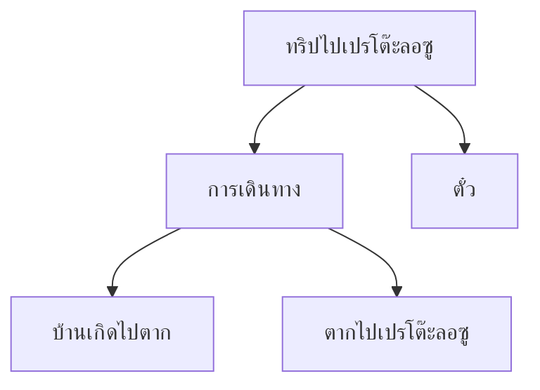
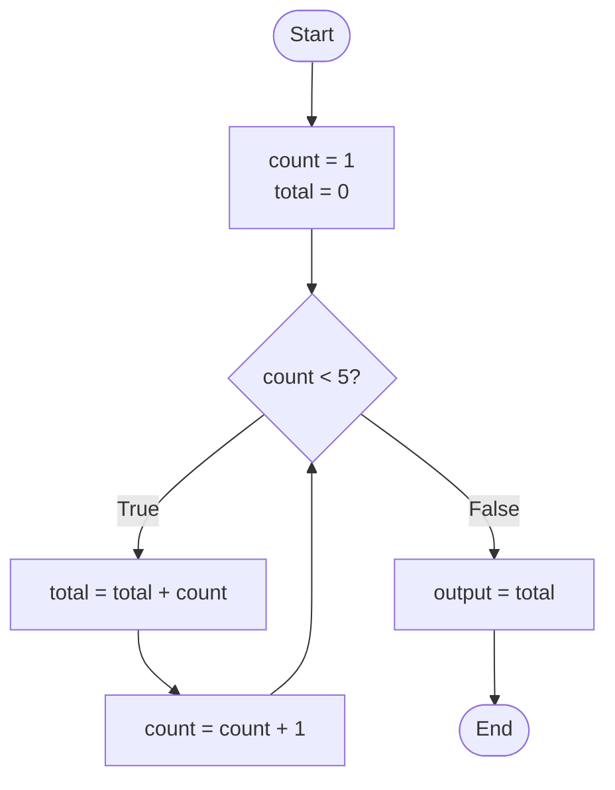
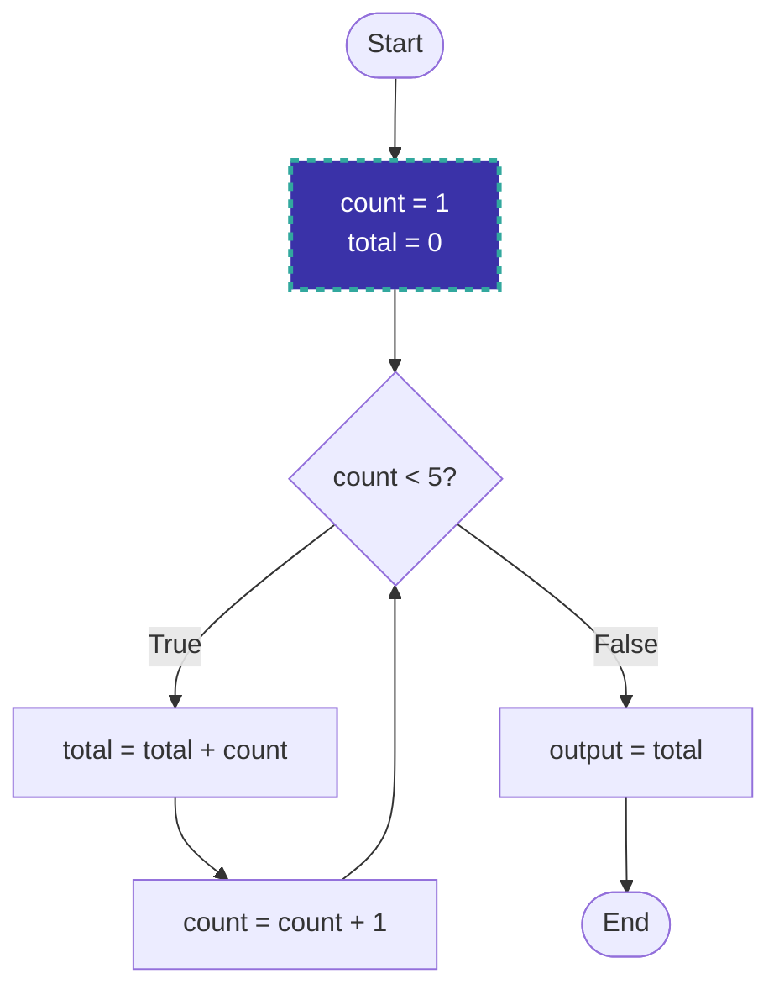
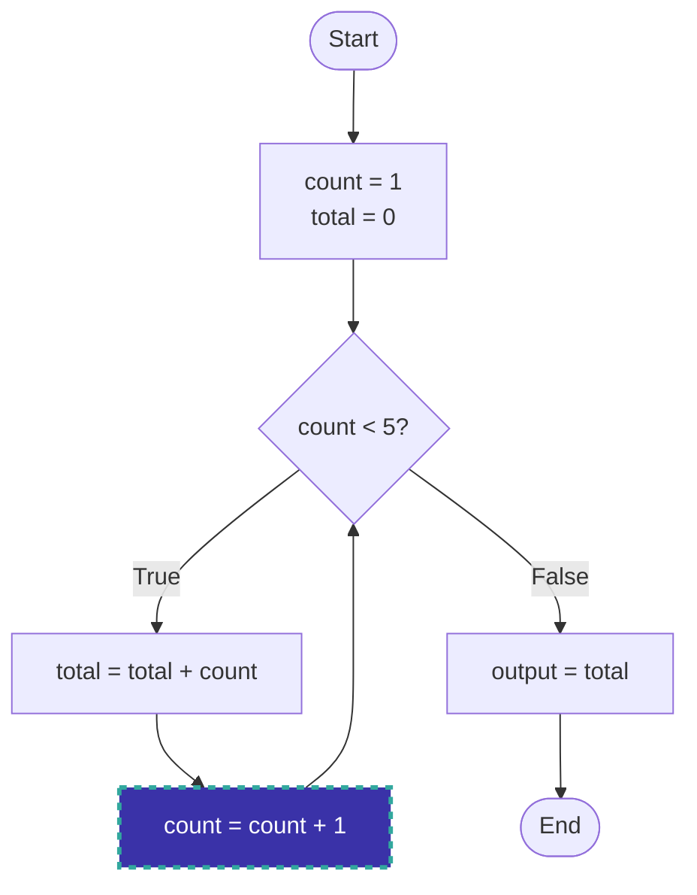
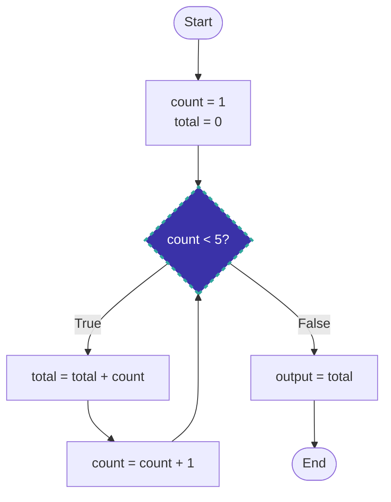
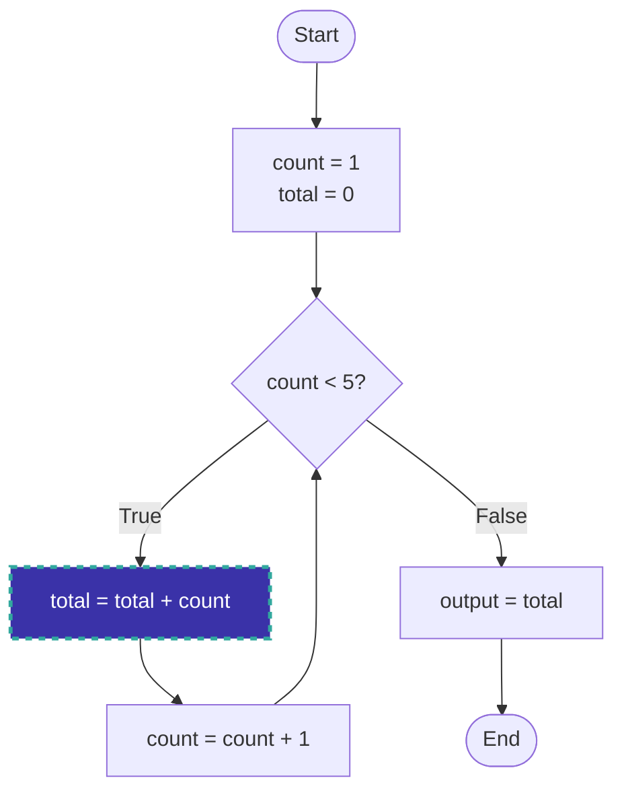
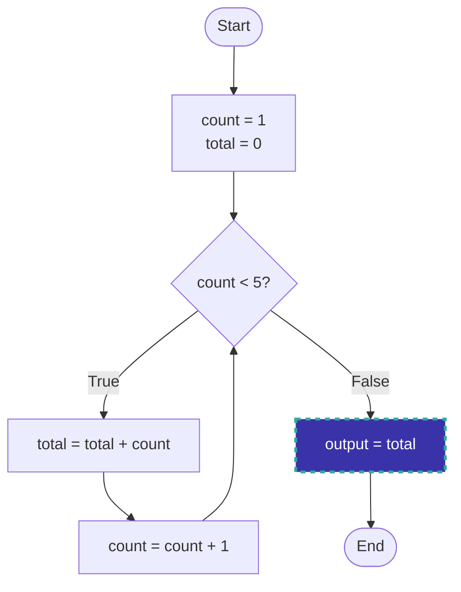

# Algorithm 

---
layout: section
---

# Computational Thinking

---
layout: two-cols
---

การคิดเชิงคอมพิวเตอร์ (Computational Thinking) เป็นรูปแบบการคิดเชิงวิเคราะห์ เป็นระบบ มีเหตุผล และเป็นขั้นเป็นตอน โดยทักษะนี้ต้องอาศัยองค์ประกอบ 4 อย่าง ได้แก่

1. การย่อยปัญหาหรือสรุปปัญหา (Decomposition)
2. การจดจำรูปแบบต่าง ๆ (Pattern Recognition)
3. วิเคราะห์ความคิดในแบบนามธรรม (Abstraction)
4. การออกแบบอัลกอริทึม (Algorithm Design)

::right::

<div class="text-center font-bold text-2xl">Computational Thiking</div>


[https://www.bbc.co.uk/bitesize/guides/zp92mp3/revision/1](https://www.bbc.co.uk/bitesize/guides/zp92mp3/revision/1)


---
layout: two-cols
---

# การย่อยปัญหาหรือสรุปปัญหา (Decomposition)

- จินตนาการว่าคุณกำลังวางแผนการเดินทางไปเปรโต๊ะลอซู

- สิ่งใดบ้างที่คุณจะต้องวางแผนเพื่อเดินทางจากบ้านเกิดของคุณไปยังเปรโต๊ะลอซู

::right::


[https://www.klukfoontour.com/petolosu2024](https://www.klukfoontour.com/petolosu2024)


---
layout: two-cols
---

# การย่อยปัญหาหรือสรุปปัญหา (Decomposition)

- สามารถเริ่มแบ่งปัญหาออกเป็นส่วนย่อย ๆ ได้ ดังนี้:
1. ใช้ยานพาหนะประเภทใดในการเดินทางจากบ้านเกิดไปจังหวัดตาก
2. เดินทางจากตากไปเปรโต๊ะลอซูอย่างไร
3. ต้องจองตั๋วอะไรบ้าง?

::right::



---
layout: two-cols
---


# Pattern Recognition หรือ การจดจำรูปแบบ 

- คือ หนึ่งในองค์ประกอบสำคัญของแนวคิดเชิงคำนวณ (Computational Thinking) ที่ช่วยให้เราสามารถระบุ กำหนด และใช้รูปแบบที่ซ้ำซากหรือลักษณะเฉพาะที่เกิดขึ้นในข้อมูล เพื่อนำไปสู่การแก้ปัญหาหรือการตัดสินใจที่ชาญฉลาด

- วิธีที่พบได้บ่อยที่สุดคือซูโดกุ การหารูปแบบในตารางขนาดเล็กแล้วจึงค้นหาในตารางขนาดใหญ่ ซูโดกุช่วยให้คุณพัฒนาทักษะการคิดคำนวณได้ โดยให้ความสำคัญกับการจดจำรูปแบบมากที่สุด

::right::

<div class="text-center font-bold text-2xl">Sudoku</div>


---
layout: two-cols
---

# Abstraction

- คือกระบวนการลบข้อมูลที่ไม่จำเป็นออกและมุ่งเน้นไปที่รายละเอียดที่สำคัญ 
วิธีนี้ช่วยให้คุณมีแนวคิดทั่วไปเกี่ยวกับปัญหาและวิธีแก้ไขปัญหา

ตัวอย่างที่ดีของการทำนามธรรมคือการใช้แผนที่ แผนที่จะรวมเฉพาะข้อมูลที่เกี่ยวข้องเท่านั้น
แผนที่ถนนในปารีสในตัวอย่างนี้ประกอบด้วยถนน แม่น้ำ และชื่อสถานที่สำคัญ
แผนที่นี้ไม่ได้รวมรายละเอียดที่ชัดเจนว่าอาคารต่างๆ มีลักษณะเป็นอย่างไรในชีวิตจริง

::right::

<div class="w-[380px]">


</div>

---
layout: two-cols
---

# Abstraction

- นอกจากนี้ ยังมีระดับของการแยกส่วนที่แตกต่างกันซึ่งมีวัตถุประสงค์การใช้งานที่แตกต่างกัน
แผนที่รถไฟใต้ดินปารีสมีการลบรายละเอียดออกไปอีก โดยแสดงเฉพาะเส้นทาง สถานี และแม่น้ำเท่านั้น

::right::

<div class="w-[380px]">


</div>

---
layout: two-cols
---

# Algorithm

- การคิดเชิงอัลกอริทึมคือกระบวนการพัฒนาอัลกอริทึมเพื่อแก้ปัญหา 
- อัลกอริทึม (Algorithm) คือ ชุดคำสั่งหรือขั้นตอนที่ชัดเจนและเป็นลำดับขั้นตอนในการแก้ปัญหาหนึ่งๆ โดยสามารถนำไปปฏิบัติตามได้ทั้งโดยมนุษย์หรือคอมพิวเตอร์ หรือทั้งสองอย่างร่วมกัน

ตัวอย่าง
- ขั้นตอนที่ 1: เดินทางไปยังสถานีรถไฟฟ้าสายสีเหลืองสถานีหัวหมาก
- ขั้นตอนที่ 2: ซื้อตั๋วรถไฟฟ้าไปยังสถานีลาดพร้าว 
- ขั้นตอนที่ 3: ขึ้นรถไฟฟ้าสายสีเหลืองมุ่งหน้าไปสถานีลาดพร้าว 

::right::

<div class="text-center font-bold text-2xl">วัดอรุณ</div>


---
layout: two-cols
---

- ขั้นตอนที่ 4: ถึงสถานีลาดพร้าว ให้เปลี่ยนสายรถไฟฟ้าจากสายสีเหลืองไปเป็นสายสีน้ำเงินสถานีพหลโยธิน
- ขั้นตอนที่ 5: ซื้อตั๋วรถไฟฟ้าไปยังสถานีอิสรภาพ
- ขั้นตอนที่ 6: ขึ้นรถไฟฟ้าสายสีน้ำเงินมุ่งหน้าไปยังสถานีอิสรภาพ
- ขั้นตอนที่ 7: ลงรถไฟฟ้าที่สถานีอิสรภาพ
- ขั้นตอนที่ 8: เดินทางไปยังวัดอรุณจากสถานีอิสรภาพ มีหลายวิธีในการเดินทางไปวัดอรุณ เช่น 
    1. เดิน: ใช้เวลาประมาณ 20-30 นาที
    2. เรียกรถแท็กซี่: ใช้เวลาประมาณ 10 นาที

::right::

<div class="text-center font-bold text-2xl">วัดอรุณ</div>


---
layout: section
---

# Concept (แนวคิดเบื้องต้น)

---
layout: two-cols
---

# 1. นิยามอย่างไม่เป็นทางการ

- “อัลกอริธึม” คือระเบียบวิธีหรือขั้นตอนที่มีจุดเริ่มต้นและจุดสิ้นสุดในการแก้ปัญหาหรือทำงานอย่างใดอย่างหนึ่ง
ตามนิยามนี้ อัลกอริธึมเป็นขั้นตอนการแก้ปัญหาที่เป็นอิสระต่อระบบและภาษาคอมพิวเตอร์ ถ้าจะให้นิยามที่กระชับมากขึ้นอาจเราอาจระบุได้ว่า อัลกอริธึมจะรับรายการข้อมูลนำเข้าและสร้างรายการผลลัพธ์

::right::

<div class="text-center font-bold text-2xl">นิยามของอัลกอริธึมที่ใช้ในคอมพิวเตอร์</div>


---
layout: two-cols
---

# 2. ตัวอย่าง

- การค้นหาเลขจำนวนเต็มที่มากที่สุด

- โจทย์: สมมติว่าเราต้องการออกแบบอัลกอริธึมเพื่อหาเลขจำนวนเต็มที่มากที่สุดในกลุ่มของเลขจำนวนเต็มบวกที่กำหนดให้  อัลกอริธึมจะต้องไม่ขึ้นอยู่กับเลขชุด ใดชุดหนึ่งโดยเฉพาะ ต้องสามารถทำงานได้กับทุกกรณีกับเซตของเลขจำนวนเต็มบวก
- แนวคิด: เราเห็นชัดเจนว่าการหาเลขที่มากที่สุดจากชุดของตัวเลขจำนวนมากๆนั้น คงไม่สามารถทำได้เพียงขั้นตอนเดียวแน่นอน ไม่ว่าจะทำโดยคนหรือโดยคอมพิวเตอร์ ดังนั้นอัลกอริธึมจำเป็นจะต้องตรวจสอบเลขแต่ละจำนวนอย่างละเอียด
- วิธีแก้ปัญหา: เราจะใช้วิธีการหยั่งรู้เพื่อแก้ปัญหานี้ เริ่มต้นจากเซตของเลขจำนวนน้อยๆก่อนเช่น 5 จำนวน แล้วจึงค่อยๆขยายวิธีการไปยังเลขจำนวนมากๆ 

::right::

<div class="text-center font-bold text-2xl">
การหาเลขที่มีค่ามากที่สุด ระหว่างเลขจำนวนเต็ม 5 จำนวน 
</div>


---
layout: two-cols
---

วิธีการแก้ปัญหาสำหรับเลข 5 ตัวที่มีหลักการและข้อจำกัดที่ชัดเจนก็
สามารถใช้แก้ปัญหาที่มีเลข 1000 หรือ 1000000 จำนวนได้เช่นกัน สมมติว่าเรามีเลข 5 จำนวน อัลกอริธึมจะตรวจสอบตัวเลขทีละตัว ดูตัวแรกโดยไม่ทราบว่าตัวที่สองคืออะไร? จากนั้นดูตัวที่สอง สาม สี่ ห้า ตามลำดับ


::right::

<div class="text-center font-bold text-2xl">
การหาเลขที่มีค่ามากที่สุด ระหว่างเลขจำนวนเต็ม 5 จำนวน 
</div>


---
layout: two-cols
---

- สมมติเราเรียกอัลกอริธึมนี้ว่า FindLargest อัลกอริธึมจะรับอินพุทเป็นจำนวนเต็ม 5 จำนวน แล้วส่งผลลัพธ์เป็นจำนวนเต็มที่มีค่ามากที่สุดออกมา เราเขียนเป็นรูปแบบดังนี้

::right::

<div class="text-center font-bold text-2xl">
การหาเลขที่มีค่ามากที่สุด ระหว่างเลขจำนวนเต็ม 5 จำนวน 
</div>


---
layout: two-cols
---

- อินพุท: อัลกอริธึมรับจำนวนเต็ม 5 จำนวนคือ     12  8  13  9  11
- การประมวลผล: อัลกอริธึมทำงาน 5 ขั้นตอนดังนี้ 

    1. อัลกอริธึมจะตรวจสอบตัวแรก (คือ 12) ก่อนเนื่องจาก
    อัลกอริธึมไม่สามารถเห็นเลขที่เหลืออยู่ได้ มันจึงกำหนดให้เลขตัวแรกเป็นค่าตัวเลขที่มีค่ามากที่สุด สมมติเราเก็บตัวเลขไว้ที่ตัวแปร Largest ดังนั้น ณ จุดนี้ ตัวแปร Largest จะมีค่าเท่ากับ 12 แล้วจึงไปทำในขั้นตอนต่อไป 

::right::

<div class="text-center font-bold text-2xl">
การหาเลขที่มีค่ามากที่สุด ระหว่างเลขจำนวนเต็ม 5 จำนวน 
</div>


---
layout: two-cols
---

2. อัลกอริธึมตรวจสอบตัวเลขตัวที่ 2 (คือ 8) แล้วเปรียบเทียบกับค่าใน Largest พบว่าค่าใน Largest มีค่ามากกว่าตัวเลขตัวที่ 2 ตัวแปร Largest จึงยังต้องเก็บค่าเดิม (คือ 12) ไว้ตามเดิมไม่มีการเปลี่ยนแปลง 


::right::

<div class="text-center font-bold text-2xl">
การหาเลขที่มีค่ามากที่สุด ระหว่างเลขจำนวนเต็ม 5 จำนวน 
</div>


---
layout: two-cols
---

3. ตรวจสอบอินพุทตัวที่ 3 (คือ 13) ซึ่งมีค่ามากกว่าค่าที่เก็บอยู่ใน Largest (คือ 12) แสดงว่าค่าที่เก็บอยู่ใน Largest ไม่ใช่ตัวเลขที่มีค่ามากที่สุดอีกต่อไปแล้ว จึงต้องเปลี่ยนค่าของ Largest จาก 12 เป็น 13 จากนั้นจึงไปทำขั้นตอนต่อไป

::right::

<div class="text-center font-bold text-2xl">
การหาเลขที่มีค่ามากที่สุด ระหว่างเลขจำนวนเต็ม 5 จำนวน 
</div>


---
layout: two-cols
---

4. ตรวจสอบอินพุทตัวที่ 4 (คือ 9) ซึ่งมีค่าน้อยกว่าค่าใน Largest จึงไม่ต้องเปลี่ยนแปลงอะไร ไปทำขั้นตอนที่ 5 ได้เลย

::right::

<div class="text-center font-bold text-2xl">
การหาเลขที่มีค่ามากที่สุด ระหว่างเลขจำนวนเต็ม 5 จำนวน 
</div>


---
layout: two-cols
---

5. ตรวจสอบอินพุทตัวที่ 5 ก็ไม่มีอะไรเปลี่ยนแปลง

- ผลลัพธ์: อัลกอริธึมส่งผลลัพธ์เป็นค่าของตัวแปร Largest คือ 13

::right::

<div class="text-center font-bold text-2xl">
การหาเลขที่มีค่ามากที่สุด ระหว่างเลขจำนวนเต็ม 5 จำนวน 
</div>


---
layout: two-cols
---

# 3. กำหนดการกระทำ (actions) ให้ชัดเจนมากขึ้น

- จากรูปที่แล้ว ไม่ได้ระบุว่าในแต่ละขั้นตอนนั้นต้องทำอะไร เราสามารถเพิ่มรายละเอียดได้ดังนี้
- ขั้นที่ 1: กำหนดให้ตัวแปร Largest เท่ากับอินพุทตัวแรก
- ขั้นที่ 2 ถึง ขั้นที่ 5: เปรียบเทียบค่าที่เก็บอยู่ใน Largest กับค่าอินพุทตัวที่กำลังตรวจสอบอยู่ ถ้าตัวเลขที่กำลังตรวจสอบมีค่ามากกว่าค่าที่อยู่ใน Largest ให้กำหนดค่าตัวแปร Largest เป็นค่าที่กำลังตรวจสอบ

::right::

<div class="text-center font-bold text-2xl">
นิยามการกระทำในอัลกอริธึม FindLargest
</div>


---
layout: two-cols
---

# 4.เพิ่มรายละเอียดให้มากขึ้น (Refinement) 

- อัลกอริธึมที่ผ่านมาจำเป็นที่จะต้องเพิ่มรายละเอียดให้มากขึ้นอีกเพื่อให้สามารถเปลี่ยนไปเป็นโปรแกรมได้โดยง่าย 

::right::

<div class="text-center font-bold text-2xl">
อัลกอริธึม FindLargest ที่ละเอียดมากขึ้น
</div>


---
layout: two-cols
---

อย่างไรก็ดี ยังมีปัญหาหลักอยู่ 2 ประการคือ 
1. การกระทำในขั้นที่ 1 แตกต่างจากการกระทำในขั้นที่ 2-5 และ 
2. คำสั่งกระทำที่ใช้ในขั้นที่ 1 ก็แตกต่างจากจากขั้นที่ 2-5 เราสามารถปรับอัลกอริธึมเพื่อขจัดปัญหาทั้งสองประการได้ โดยการเปลี่ยนข้อ ความในขั้นที่ 2-5
    - “ถ้าตัวเลขที่กำลังตรวจสอบอยู่มีค่ามากกว่าค่าใน Largest แล้ว ให้กำหนดค่า Largest เท่ากับค่าตัวเลขที่กำลังตรวจสอบ”
    - เหตุผลที่ขั้นที่ 1 แตกต่างจากขั้นที่ 2-5 เพราะตัวแปร Largest ยังไม่ได้มีการกำหนดค่าเริ่มต้น


::right::

<div class="text-center font-bold text-2xl">
อัลกอริธึม FindLargest ที่ละเอียดมากขึ้น
</div>


---
layout: two-cols
---

- ถ้าเรากำหนดค่าเริ่มต้นของ Largest = 0 (ไม่มีเลขจำนวนเต็มบวกใดน้อยกว่า 0) แล้วขั้นที่ 1 จะเหมือนกับขั้นที่ 2-5 
- ถ้าเราเพิ่มขั้นที่ 0 เพื่อกำหนดค่า Largest = 0 ก่อนเริ่มทำงาน จะได้ผลดังรูป


::right::

<div class="text-center font-bold text-2xl">
อัลกอริธึม FindLargest ที่ละเอียดมากขึ้น
</div>


---
layout: two-cols
---

# 5. การทำให้เป็นกรณีทั่วไป (Generalization)

- เราสามารถทำให้อัลกอริธึมทำงานได้กับเลขจำนวนเต็มบวกกี่จำนวนก็ได้ สมมติมีเลขจำนวนเต็มบวก N ตัว (N อาจจะเป็น 1,000 หรือ 10,000 หรือ 1,000,000 หรือมากกว่าก็ได้) ถ้าดูแบบผิวเผินเราอาจจะบอกว่า ก็เขียนตามรูปที่แล้ว โดยเขียนซ้ำๆเท่ากับ N ขั้นตอน เป็นไปได้แต่จะทำให้อัลกอริธึมยาวมาก มีวิธีที่ดีกว่า คือเราบอกให้คอมพิวเตอร์ทำซ้ำๆจำนวน N ครั้งดังรูป

::right::

<div class="text-center font-bold text-2xl">
กรณีทั่วไปของอัลกอริธึม FindLargest
</div>


---
layout: section
---

# โครงสร้าง 3 รูปแบบ Three constructs

---
layout: two-cols
---

# 1. โครงสร้างการเขียนอัลกอริธึม 3 รูปแบบ (Three Constructs)

- นักคอมพิวเตอร์ได้กำหนดโครงสร้าง 3 รูปแบบเพื่อใช้ในการเขียนโปรแกรมแบบโครงสร้างหรืออัลกอริธึม แนวคิดคือคอมพิวเตอร์โปรแกรมใดๆจะสามารถเขียนได้โดยใช้โครงสร้างเพียง 3 รูปแบบนี้ โครงสร้างทั้งสามรูปแบบได้แก่: 
    1. การทำตามลำดับ (sequence) 
    2. การตัดสินใจ (decision หรือ selection) และ 
    3. การทำซ้ำๆ (repetition) ดังรูป

::right::

<div class="text-center font-bold text-2xl">
โครงสร้าง 3 แบบ
</div>


---
layout: two-cols
---

- ได้มีการพิสูจน์แล้วว่าในการเขียนโปรแกรมคอมพิวเตอร์นั้นใช้โครงสร้างแค่ 3 รูปแบบนี้ก็เพียงพอ 
ไม่จำเป็นต้องใช้โครงสร้างแบบอื่น 

- การใช้โครงสร้างทั้งสามในการเขียนโปรแกรมหรือ 
อธิบาย อัลกอริธึม จะทำให้โปรแกรมหรืออัลกอริธึมเข้าใจได้ง่าย แก้ไขได้ง่าย และเปลี่ยนแปลงได้ง่าย

::right::

<div class="text-center font-bold text-2xl">
โครงสร้าง 3 แบบ
</div>


---
layout: section
---

# การแทนอัลกอริธึม Algorithm Representation

---

- ปกติการแทนอัลกอริธึมเรานิยมใช้รูปภาพ เพราะเข้าใจง่ายและมีความชัดเจน โดยทั่วไปเราใช้ 2 รูปแบบคือ 
    1. ผังงาน (flowchart): มีลักษณะคล้ายรูปภาพ โดยจะเน้นภาพรวมของ ตรรกะของอัลกอริธึมมากกว่ารายละเอียด ผังงานจะแสดงถึงขั้นตอนการทำงานของอัลกอริธึมตั้งแต่ต้นจนจบ รายละเอียดของผังงานจะกล่าวถึงในตอนหลังๆ

<div class="w-[700px] mx-auto">

<div class="text-center font-bold text-2xl">
ผังงานโครงสร้าง 3 แบบ
</div>


</div>

---

2. รหัสเทียม (pseudocode): เป็นการแทนอัลกอริธึมโดยใช้ภาษาเขียน มีลักษณะคล้ายภาษาอังกฤษที่ใช้กันโดยทั่วไป แต่ระดับความละเอียดนั้นแต่ละคนก็ใช้แตกต่างกันไป ไม่มีมาตรฐานใดกำหนดชัดเจน บางคนเขียนคล้ายๆภาษาอังกฤษ บางคนเขียนโดยใช้รูปแบบคล้ายภาษาปาสคาล  รายละเอียดจะอธิบายในบทต่อๆไป


<div class="w-[700px] mx-auto">

<div class="text-center font-bold text-2xl">
Pseudocode สำหรับโครงสร้าง 3 แบบ

</div>


</div>

---

# ตัวอย่างที่ 1

- จงเขียน algorithm ในรูป pseudocode เพื่อหาค่าเฉลี่ยของเลข 2 จำนวน

```
Algorithm 8.1: Average of two
	Input:  Two numbers
		1. Add the two numbers
		2. Divide the result by 2
		3. Return the result by step 2
```

---

# ตัวอย่างที่ 2

- จงเขียนอัลกอริธึมเพื่อเปลี่ยนค่าคะแนนให้เป็นเกรด ผ่าน/ไม่ผ่าน

```

Algorithm 8.2: Pass/No pass Grade
	Input: One number
	If (the number is greater than or equal to 70) Then
    	1.1  Set the grade to “pass”
	Else
   		1.2   Set the grade to “nopass”
	End If
	Return the grade

```

---
layout: two-cols
---

<div class="w-[400px] mx-auto">


</div>

::right::

# โจทย์
- What will be output when this flowchart is executed?
    1. 4
    2. 10
    3. 15
    4. There is an error in the flowchart

---
layout: two-cols
---

<div class="w-[400px] mx-auto">


</div>

::right::

**State**
```js
count = 1
total = 0
```

**Process**
- Assign 1 to the variable count
- Assign 0 to the variable total

**Output**

---
layout: two-cols
---

<div class="w-[400px] mx-auto">


</div>

::right::

**State**
```js
count = 1
total = 0
```

**Process**
- Check if the condition is True


**Output**

---
layout: two-cols
---

<div class="w-[400px] mx-auto">


</div>

::right::

**State**
```js
count = 1
total = 1
```

**Process**
- Add the value of count to the value held by total


**Output**

---
layout: two-cols
---

<div class="w-[400px] mx-auto">


</div>

::right::

**State**
```js
count = 2
total = 1
```

**Process**
- Add 1 to the value held by count


**Output**

---
layout: two-cols
---

<div class="w-[400px] mx-auto">


</div>

::right::

**State**
```js
count = 2
total = 1
```

**Process**
- Check if the condition is True


**Output**

---
layout: two-cols
---

<div class="w-[400px] mx-auto">


</div>

::right::

**State**
```js
count = 2
total = 3
```

**Process**
- Add the value of count to the value held by total


**Output**

---
layout: two-cols
---

<div class="w-[400px] mx-auto">


</div>

::right::

**State**
```js
count = 3
total = 3
```

**Process**
- Add 1 to the value held by count


**Output**

---
layout: two-cols
---

<div class="w-[400px] mx-auto">


</div>

::right::

**State**
```js
count = 3
total = 3
```

**Process**
- Check if the condition is True

**Output**

---
layout: two-cols
---

<div class="w-[400px] mx-auto">


</div>

::right::

**State**
```js
count = 3
total = 6
```

**Process**
- Add the value of count to the value held by total

**Output**

---
layout: two-cols
---

<div class="w-[400px] mx-auto">


</div>

::right::

**State**
```js
count = 4
total = 6
```

**Process**
- Add 1 to the value held by count

**Output**

---
layout: two-cols
---

<div class="w-[400px] mx-auto">


</div>

::right::

**State**
```js
count = 4
total = 6
```

**Process**
- Check if the condition is True

**Output**

---
layout: two-cols
---

<div class="w-[400px] mx-auto">


</div>

::right::

**State**
```js
count = 4
total = 10
```

**Process**
- Add the value of count to the value held by total

**Output**

---
layout: two-cols
---

<div class="w-[400px] mx-auto">


</div>

::right::

**State**
```js
count = 5
total = 10
```

**Process**
- Add 1 to the value held by count

**Output**

---
layout: two-cols
---

<div class="w-[400px] mx-auto">


</div>

::right::

**State**
```js
count = 5
total = 10
```

**Process**
- Check if the condition is True

**Output**

---
layout: two-cols
---

<div class="w-[400px] mx-auto">


</div>

::right::

**State**
```js
count = 5
total = 10
```

**Process**
- The loop terminates and the instruction from the False branch is executed

**Output**
- 10

---
layout: section
---

# นิยามอัลกอริธึมที่เป็นทางการมากขึ้น MORE FORMAL DEFINITION

---

- นิยาม: อัลกอริธึมคือเซตของขั้นตอนการแก้ปัญหาที่จัดเรียงลำดับอย่างชัดเจน (ordered set) ไม่คลุมเครือ (unambiguous steps) ก่อให้เกิดผลลัพธ์(produce a result) ภายในเวลาที่จำกัด (terminate in a finite time)
- Ordered set: หมายความว่าคำสั่งทั้งหมดต้องเรียงลำดับ และ well-defined 
- Unambiguous steps: หมายความว่าแต่ละขั้นตอนต้องมีความหมายชัดเจน ไม่เปิดโอกาสให้ตีความได้มากกว่า 1 อย่าง 
- Produce  result: หมายความว่าอัลกอริธึมจะต้องสร้างผลลัพธ์ที่เป็นรูปธรรม เช่นผลที่เป็นตัวเลข หรือผลที่เกิดจากการพิมพ์ เป็นต้น 
- Terminate in a finite time: หมายความว่าอัลกอริธึมจะต้องมีการจบสิ้น หรือจะต้องหยุดในที่สุด

---
layout: section
---

# อัลกอริธึมย่อย SUBALGORITHMS

---

- หลักการของการเขียนโปรแกรมเชิงโครงสร้าง (structured programming) คือการแบ่งอัลกอริธึมออกเป็นหน่วยย่อยๆ แต่ละหน่วยก็สามารถแบ่งย่อยๆลงไปได้อีกจนกระทั่งแต่ละส่วนเป็น intrinsic คือเมื่ออ่านแล้วเข้าใจได้ทันที ทำงานเพียงอย่างเดียว แต่ละส่วนย่อยที่ถูกแบ่งนี้มีชื่อเรียกหลายแบบเช่น subprogram, subroutines, procedures, functions, methods, modules เป็นต้น

<div class="flex gap-3">

<div class="w-1/3">

- ตัวอย่าง: เราสามารถแบ่งอัลกอริธึม FindLargest ออกเป็น subalgorithm โดยตั้งชื่อว่า “FindLarger” เพื่อให้ทำหน้าที่หาตัวเลขที่มีค่ามากกว่าระหว่างเลข 2 จำนวนใดๆ  อัลกอริธึมย่อย “FindLarger” จะถูกเรียกเพื่อให้ทำงานซ้ำๆในแต่ละรอบ ดังรูป

</div>

<div class="w-2/3 mx-auto">

<div class="text-center font-bold text-2xl">
Concept of a subalgorithm

</div>


</div>
</div>


---
layout: section
---

# ตัวอย่างอัลกอริธึมพื้นฐาน BASIC ALGORITHMS

---
layout: two-cols
---

# ตัวอย่างที่ 1: การหาผลรวมของเลขหลายๆจำนวน : SUMMATION

- การหาผลรวมของเลขหลายๆจำนวนนับเป็นการกระทำพื้นฐานที่ใช้แก้ปัญหาหลายๆอย่างเช่นการหาค่าเฉลี่ย การหายอดรวมทางบัญชี การหารยอดรวมของรายรับ-จ่าย เป็นต้น ขั้นตอนการทำงานเป็นดังนี้
	1. กำหนดค่าเริ่มต้นของ sum ให้เท่ากับ 0
    2. Loop: ในแต่ละรอบ บวกเลขที่รับเข้ามากับค่าใน sum
    3. ส่งผลลัพธ์สุดท้ายกลับหลังออกจาก Loop
แทน การทำงานอัลกอริธึม SUMMATION ดังรูป


::right::


<div class="w-[200px] mx-auto">

<div class="text-center font-bold text-2xl">
Summation
</div>


</div>

---

# การเรียงลำดับ

- การเรียงลำดับกลุ่มของตัวเลขนับเป็นการประยุกต์ที่สำคัญยิ่งในทางคอมพิวเตอร์ วิธีการเรียงลำดับมีหลายแบบ การเลือกใช้ขึ้นอยู่กับประเภทและจำนวนของข้อมูล ตัวอย่างอัลกอริธึมที่นิยมใช้กันมากมี 3 อัลกอริธึมคือ
    1. Selection Sort
    2. Bubble Sort
    3. Insertion Sort

---

<v-switch>

<template #0>

<div class="w-[700px] mx-auto">

<div class="text-center font-bold text-2xl">
Selection Sort
</div>


</div>
</template>

<template #1>

# Example 1 (1)


<div class="w-[400px] mx-auto">

<div class="text-center font-bold text-2xl">
Selection Sort
</div>


</div>
</template>

<template #2>

# Example 1 (2)

<div class="w-[400px] mx-auto">

<div class="text-center font-bold text-2xl">
Selection Sort
</div>


</div>
</template>

<template #3>

# Example 1 (3)

<div class="w-[200px] mx-auto">

<div class="text-center font-bold text-2xl">
Selection Sort Algorithm
</div>


</div>

</template>

</v-switch>


---


<v-switch>

<template #0>

<div class="w-[700px] mx-auto">

<div class="text-center font-bold text-2xl">
Bubble Sort
</div>


</div>
</template>

<template #1>

# Example 1 

<div class="w-[400px] mx-auto">

<div class="text-center font-bold text-2xl">
Bubble Sort
</div>


</div>

</template>

<template #2>


# Example 1 (2)

<div class="w-[500px] mx-auto">

<div class="text-center font-bold text-2xl">
Bubble Sort
</div>


</div>
</template>
</v-switch>


---

- อัลกอริทึมการเรียงลำดับแบบ bubble sort ทำงานโดยดำเนินการซ้ำๆ ในรายการ เปรียบเทียบรายการที่อยู่ติดกัน และสลับรายการหากรายการนั้นอยู่ในลำดับที่ไม่ถูกต้อง
- ทุกครั้งที่อัลกอริทึมดำเนินการซ้ำๆ ในรายการ เรียกว่าการผ่าน การดำเนินการซ้ำๆ ในรายการจะทำซ้ำจนกว่าจะสามารถเรียงลำดับรายการได้
- ในสไลด์ถัดไป คุณจะเห็นว่าอัลกอริทึมจะสลับรายการที่อยู่ติดกันซึ่งอยู่ในลำดับที่ไม่ถูกต้องอย่างไรในระหว่างการเรียงลำดับแบบฟองครั้งหนึ่ง

---

# Bubble sort: one pass

- แต่ละตัวเลขจะซ่อนอยู่ใต้ถ้วย ถ้วยจะต้องเรียงลำดับตามค่าต่ำสุดทางด้านซ้าย
<v-switch>
<template #0>


</template>
<template #1>


- นี่คือลำดับเริ่มต้นของถ้วย อย่างไรก็ตาม เมื่อคุณทำการเรียงลำดับแบบ bubble sort คุณจะเปรียบเทียบได้เพียงสองรายการในแต่ละครั้งเท่านั้น
</template>

<template #2>


- เริ่มจากถ้วยแรก
</template>

<template #3>


- เปรียบเทียบตัวปัจจุบันกับตัวถัดไป
</template>

<template #4>


- ถ้าตัวปัจจุบันมากกว่าตัวถัดไปก็ให้สลับ
</template>

<template #5>


- ถ้าตัวปัจจุบันมากกว่าตัวถัดไปก็ให้สลับ
</template>

<template #6>


- ตัวปัจจุบันก็จะไปอยู่ในตำแหน่งถัดไป
</template>

<template #7>


- เปรียบเทียบตัวปัจจุบันกับตัวถัดไป
</template>


<template #8>


- ถ้าตัวปัจจุบันมากกว่าตัวถัดไปก็ให้สลับ
</template>

<template #9>


- ถ้าตัวปัจจุบันมากกว่าตัวถัดไปก็ให้สลับ
</template>

<template #10>


- ตัวปัจจุบันก็จะไปอยู่ในตำแหน่งถัดไป
</template>

<template #11>


- เปรียบเทียบตัวปัจจุบันกับตัวถัดไป
</template>

<template #12>


- ถ้าตัวปัจจุบันมากกว่าตัวถัดไปก็ให้สลับ
</template>

<template #13>


- ตัวปัจจุบันก็จะไปอยู่ในตำแหน่งถัดไป
</template>

<template #14>


- เปรียบเทียบตัวปัจจุบันกับตัวถัดไป
</template>

<template #15>


- ถ้าตัวปัจจุบันมากกว่าตัวถัดไปก็ให้สลับ
</template>

<template #16>


- ถ้าตัวปัจจุบันมากกว่าตัวถัดไปก็ให้สลับ
</template>

<template #17>


- ตัวปัจจุบันก็จะไปอยู่ในตำแหน่งถัดไป
</template>

<template #18>


- เปรียบเทียบตัวปัจจุบันกับตัวถัดไป
</template>

<template #19>


- ถ้าตัวปัจจุบันมากกว่าตัวถัดไปก็ให้สลับ

</template>

<template #20>


- ตัวปัจจุบันก็จะไปอยู่ในตำแหน่งถัดไป
</template>

<template #21>


- เปรียบเทียบตัวปัจจุบันกับตัวถัดไป
</template>

<template #22>


- ถ้าตัวปัจจุบันมากกว่าตัวถัดไปก็ให้สลับ
</template>

<template #23>


- ถ้าตัวปัจจุบันมากกว่าตัวถัดไปก็ให้สลับ

</template>

<template #24>


- ตัวปัจจุบันก็จะไปอยู่ในตำแหน่งถัดไป
</template>

<template #25>


- เปรียบเทียบตัวปัจจุบันกับตัวถัดไป
</template>

<template #26>


- ถ้าตัวปัจจุบันมากกว่าตัวถัดไปก็ให้สลับ
</template>

<template #27>


- ถ้าตัวปัจจุบันมากกว่าตัวถัดไปก็ให้สลับ
</template>

<template #28>


- ตัวปัจจุบันก็จะไปอยู่ในตำแหน่งถัดไป
</template>

<template #29>


- เปรียบเทียบตัวปัจจุบันกับตัวถัดไป
</template>

<template #30>


- เปรียบเทียบตัวปัจจุบันกับตัวถัดไป
</template>

<template #31>


- ถ้าตัวปัจจุบันมากกว่าตัวถัดไปก็ให้สลับ

</template>

<template #32>


- ตอนนี้ดำเนินการเสร็จสิ้นแล้ว หากมีการสลับใดๆ ในการดำเนินการนี้ ให้ดำเนินการตามรายการต่อไปจนกว่าจะไม่มีการสลับใดๆ เกิดขึ้น

</template>


</v-switch>


---

# Bubble sort
<div>


</div>

- การตรวจสอบครั้งเดียวส่งผลให้องค์ประกอบที่ใหญ่ที่สุดไปถึงตำแหน่งสุดท้ายในตอนท้ายของรายการ เนื่องจากองค์ประกอบนั้นจะใหญ่กว่าองค์ประกอบถัดไปเสมอ
- ซึ่งหมายความว่าการตรวจสอบคู่องค์ประกอบสุดท้ายในครั้งต่อไปไม่จำเป็นต้องตรวจสอบองค์ประกอบที่ใหญ่ที่สุด เนื่องจากคุณทราบว่าองค์ประกอบที่ใหญ่ที่สุดอยู่ในตำแหน่งที่ถูกต้องแล้ว

---
layout: two-cols
---

# อัลกอริธึมสำหรับการสลับ 1 รอบ ของ bubble sort 
- คำแนะนำในการเรียงลำดับแบบ bubble sort 1 รอบสามารถเขียนได้ดังนี้:
1. นำรายการข้อมูลที่ต้องการเรียงลำดับมา
2. ทำซ้ำขั้นตอน a-c สำหรับรายการทั้งหมดในรายการ โดยเริ่มจากรายการแรก:
3. เปรียบเทียบรายการในตำแหน่งปัจจุบันกับรายการถัดไป
4. หากรายการในตำแหน่งปัจจุบันมีขนาดใหญ่กว่ารายการถัดไป ให้สลับรายการภายในรายการ
5. ไปที่รายการถัดไปในรายการ

::right::


---

<v-switch>

<template #0>

<div class="w-[700px] mx-auto">

<div class="text-center font-bold text-2xl">
Insertion Sort
</div>


</div>
</template>

<template #1>

# Example 1 

<div class="w-[400px] mx-auto">

<div class="text-center font-bold text-2xl">
Insertion Sort
</div>


</div>

</template>

<template #2>


# Example 1 (2)

<div class="w-[400px] mx-auto">

<div class="text-center font-bold text-2xl">
Insertion Sort
</div>


</div>
</template>
</v-switch>

---

# Insertion Sort

- อัลกอริธึมการเรียงลำดับแบบแทรกทำงานโดยการจัดกลุ่มรายการในรายการออกเป็นสองส่วน ได้แก่ รายการย่อยที่เรียงลำดับแล้วและรายการย่อยที่ไม่เรียงลำดับ
- ในแต่ละครั้งที่ผ่านรายการ รายการจากรายการย่อยที่ไม่เรียงลำดับจะถูกเปรียบเทียบกับรายการในรายการย่อยที่เรียงลำดับแล้ว จนกว่าจะแทรกลงในตำแหน่งที่ถูกต้อง
- ในสไลด์ถัดไป คุณจะเห็นวิธีที่อัลกอริธึมแทรกรายการที่ไม่เรียงลำดับหนึ่งรายการลงในตำแหน่งที่ถูกต้องในรายการก่อน นั่นคือ การผ่านอัลกอริธึมหนึ่งครั้ง

---


# Insertion Sort: single pass

- แต่ละหมายเลขซ่อนอยู่ใต้ถ้วย ถ้วยจะต้องเรียงลำดับโดยมีค่าต่ำสุดทางด้านซ้าย

<v-switch>
<template #0>


- ทำรายการที่มีการเรียงลำดับรายการแรกและรายการที่เหลือไม่ได้เรียงลำดับ

</template>

<template #1>


- จัดทำรายการโดยเรียงลำดับรายการแรกและรายการที่เหลือตามลำดับ
- ในแต่ละครั้ง รายการที่ไม่เรียงลำดับรายการแรก (ถ้วยสีเทาเข้ม) จะถูกแทรกในตำแหน่งที่เหมาะสมในรายการที่เรียงลำดับแล้ว 
</template>

<template #2>


- คัดลอกรายการที่ไม่เรียงลำดับแรกลงใน value
- จำเป็นต้องคัดลอกรายการสุดท้ายที่ไม่อยู่ในลำดับ เนื่องจากรายการถูก "เลื่อน" ไปทางขวา เพื่อให้มีพื้นที่สำหรับค่าใหม่ รายการสุดท้ายในรายการจึงจะถูกเขียนทับ
</template>

<template #3>


- เริ่มจากตัวสุดท้ายของรายการที่เรียงแล้ว
</template>

<template #4>


- **ถ้าเลขที่อยู่ในตำแหน่งปัจจุบันมากกว่า เลขที่อยู่ใน value** ให้คัดลอกเลขที่อยู่ในตำแหน่งปัจจุบัน ไปยังตำแหน่งที่อยู่ติดกันถัดไป
- เลื่อนตำแหน่งปัจจุบัน ไปยังตำแหน่งก่อนหน้าที่อยู่ติดกัน
</template>

<template #5>


- ถ้าเลขที่อยู่ในตำแหน่งปัจจุบันมากกว่า เลขที่อยู่ใน value **ให้คัดลอกเลขที่อยู่ในตำแหน่งปัจจุบัน ไปยังตำแหน่งที่อยู่ติดกันถัดไป**
- เลื่อนตำแหน่งปัจจุบัน ไปยังตำแหน่งก่อนหน้าที่อยู่ติดกัน
</template>

<template #6>


- ถ้าเลขที่อยู่ในตำแหน่งปัจจุบันมากกว่า เลขที่อยู่ใน value ให้คัดลอกเลขที่อยู่ในตำแหน่งปัจจุบัน ไปยังตำแหน่งที่อยู่ติดกันถัดไป
- **เลื่อนตำแหน่งปัจจุบัน ไปยังตำแหน่งก่อนหน้าที่อยู่ติดกัน**
</template>

<template #7>


- **ถ้าเลขที่อยู่ในตำแหน่งปัจจุบันมากกว่า เลขที่อยู่ใน value** ให้คัดลอกเลขที่อยู่ในตำแหน่งปัจจุบัน ไปยังตำแหน่งที่อยู่ติดกันถัดไป
- เลื่อนตำแหน่งปัจจุบัน ไปยังตำแหน่งก่อนหน้าที่อยู่ติดกัน
</template>

<template #8>


- ถ้าเลขที่อยู่ในตำแหน่งปัจจุบันมากกว่า เลขที่อยู่ใน value **ให้คัดลอกเลขที่อยู่ในตำแหน่งปัจจุบัน ไปยังตำแหน่งที่อยู่ติดกันถัดไป**
- เลื่อนตำแหน่งปัจจุบัน ไปยังตำแหน่งก่อนหน้าที่อยู่ติดกัน
</template>

<template #9>


- ถ้าเลขที่อยู่ในตำแหน่งปัจจุบันมากกว่า เลขที่อยู่ใน value ให้คัดลอกเลขที่อยู่ในตำแหน่งปัจจุบัน ไปยังตำแหน่งที่อยู่ติดกันถัดไป
- **เลื่อนตำแหน่งปัจจุบัน ไปยังตำแหน่งก่อนหน้าที่อยู่ติดกัน**
</template>

<template #10>


- ถ้าตัวเลขในตำแหน่งปัจจุบัน ไม่มากกว่าตัวเลขที่อยู่ใน value ให้คัดลอกตัวเลขที่อยู่ใน value แทรกลงไปรายการ
</template>

<template #11>


- คัดลอกตัวเลขที่อยู่ใน value ลงไปในถ้วยที่อยู่ในตำแหน่งถัดไปจากตำแหน่งปัจจุบัน
</template>

<template #14>


- ขณะนี้ดำเนินการเสร็จสิ้นไป 1 รอบ (การผ่านอัลกอริธึม 1 ครั้ง) โดยเพิ่มรายการย่อยที่เรียงลำดับไว้ 1 รายการ
</template>
</v-switch>

---

# อัลกอริะึมสำหรับการผ่านอัลกอริธึม 1 ครั้ง ของ Insertion Sort

- คำสั่งสำหรับการดำเนินการเรียงลำดับแบบแทรกครั้งเดียวสามารถเขียนได้ดังนี้:
    1. นำรายการที่มีรายการแรกเรียงลำดับและรายการที่เหลือไม่เรียงลำดับ
    2. คัดลอกรายการแรกที่ไม่เรียงลำดับลงในค่า
    3. ทำซ้ำขั้นตอน a-b โดยเริ่มจากรายการสุดท้ายที่เรียงลำดับแล้วจนกว่าจะไม่มีรายการเหลืออยู่หรือค่า value ที่จะแทรกในรายการ:
        - หากรายการในตำแหน่งปัจจุบันมีค่ามากกว่าค่า ให้คัดลอกรายการนั้นลงในรายการถัดไป แล้วไปที่รายการก่อนหน้าในรายการ
        - มิฉะนั้น ค่า value ก็พร้อมที่จะแทรกในรายการแล้ว
    4. คัดลอกค่า value ลงในรายการหลังตำแหน่งปัจจุบัน

---

# Insertion Sort: multiple pass

- ตอนนี้คุณได้เห็นวิธีการทำงานของการเรียงลำดับแบบแทรกในครั้งเดียวแล้ว สไลด์ต่อไปนี้จะแสดงให้เห็นหลายๆ ครั้งเพื่อแสดงให้คุณเห็นว่าการดำเนินการเรียงลำดับแบบแทรกเสร็จสมบูรณ์นั้นทำอย่างไร


---


- แต่ละหมายเลขซ่อนอยู่ใต้ถ้วย ถ้วยจะต้องเรียงลำดับโดยมีค่าต่ำสุดทางด้านซ้าย

<v-switch>
<template #0>


- จัดทำรายการข้อมูลที่ต้องการจัดเรียง

</template>

</v-switch>