# Programming Language

---
layout: section
---

# วิวัฒนาการของภาษาคอมพิวเตอร์

---

# วิวัฒนาการของภาษาคอมพิวเตอร์

- ในการเขียนโปรแกรมเพื่อสั่งงานให้คอมพิวเตอร์ทำงานตามที่ต้องการนั้น นักเขียนโปรแกรมจะต้องใช้ภาษาคอมพิวเตอร์ ซึ่งเป็นชุดของคำสั่งที่จัดเรียงอย่างมีระบบและถูกต้องตามหลักไวยากรณ์ของภาษา ตลอดระยะเวลาที่ผ่านมา ภาษาคอมพิวเตอร์ได้มีวิวัฒนาการมาอย่างต่อเนื่องจากภาษาเครื่อง (machine language) ไปสู่ภาษาธรรมชาติ (natural language) ตามรายละเอียดในรูป


---

# 1. ภาษาเครื่อง

- ภาษาเครื่อง (machine languages): ในระยะเริ่มแรกของการพัฒนาคอมพิวเตอร์ ภาษาเดียวที่มีคือภาษาเครื่อง 
- คอมพิวเตอร์แต่ละเครื่องจะมีภาษาของตนเองซึ่งประ กอบขึ้นด้วยเลข 0 และ 1 
- คำสั่งของภาษาเครื่องประกอบด้วย 0 กับ 1 เพราะวงจรภายในของคอมพิวเตอร์ทำจาก สวิทช์ ทรานซิสเตอร์ และ อุปกรณ์อิเล็กทรอนิคส์อื่น ๆ ที่มีสถานะเป็น ‘on’ กับ ‘off’ โดยที่ ‘off’ แทนด้วย 0 และ ‘on’ แทนด้วย 1

---

# Program 1 : Program in machine language

|Address|Data|
|:-:|:-:|
|00|1040|
|01|1141|
|02|3201|
|03|2242|
|04|0000|

- ภาษาที่เครื่องคอมพิวเตอร์จะเข้าใจได้มีภาษาเดียวคือ machine language

---

# 2. ภาษาสัญลักษณ์ (Symbolic Languages): 

- เนื่องจากภาษาเครื่องมีความยุ่งยากในการเขียนและการใช้ จึงทำให้ในต้นปี ค.ศ. 1950 (พ.ศ. 2493) นักคณิตศาสตร์ชาวอเมริกันได้พัฒนาภาษาใหม่ที่ยึดแนวมาจากภาษาเครื่องโดยใช้ symbols (สัญลักษณ์) หรือ mnemonics (สิ่งช่วยความจำ) แทนคำสั่งภาษาเครื่อง เนื่องจากภาษาใหม่ใช้ symbols แทนคำสั่ง ภาษาใหม่จึงถูกเรียกว่า symbolic languages โปรแกรม 2 ถ้าเปรียบเทียบกับโปรแกรมภาษาเครื่องในโปรกรม 1 จะเห็นว่าโปรแกรมใหม่พอที่จะอ่านเข้าใจได้ง่ายกว่า


---

# Program 2 : Program in machine language

|Instruction|Operand|
|:-:|:-:|
|LOAD|R<sub>0</sub>, M<sub>40</sub>|
|LOAD|R<sub>1</sub>, M<sub>41</sub>|
|ADDI|R<sub>2</sub>, R<sub>0</sub>, R<sub>1</sub>|
|STORE|M<sub>42</sub>, R<sub>2</sub>|
|HALT|0|

- นี่คือภาษา Assembly มีความใกล้เคียงกับภาษา Machine Language

---

# 3. ภาษาระดับสูง (High-Level Languages):

- ถึงแม้ว่าภาษาสัญลักษณ์จะช่วยให้การเขียนโปรแกรมง่ายขึ้นระดับหนึ่ง แต่นักเขียนโปรแกรมก็ยังจะ ต้องใช้คำสั่งที่เกี่ยวข้องกับฮาร์ดแวร์อยู่ นอกจากนี้การเขียนภาษาสัญลักษณ์ยังจะต้องเข้ารหัสทุกๆคำสั่งอย่างละเอียด ทำให้การเขียนโปรแกรมเป็นงานที่ยุ่งยากและน่าเบื่อหน่าย นักเขียนโปรแกรมควรไปใช้เวลากับการแก้ปัญหาโดยตรงมากกว่าที่จะต้องเสียเวลาในการเขียนโปรแกรม ด้วยเหตุนี้จึงทำให้มีการพัฒนาภาษาระดับสูงขึ้น

- ภาษาระดับสูงสามารถใช้กับเครื่องคอมพิวเตอร์ที่แตกต่างกันได้ ทำให้นักเขียนโปรแกรมมีเวลาให้กับการแก้ปัญหามากขึ้น ไม่ต้องมากังวลกับการติดต่อกับเครื่องคอมพิวเตอร์มากนัก ทำให้นักเขียนโปรแกรมไม่ต้องลงไปในรายละเอียดในการเขียนโปรแกรมภาษาสัญลักษณ์อีก แต่ภาษาระดับ สูงก็ยังต้องถูกแปลไปเป็นภาษาเครื่องอยู่ดี ตัวแปลภาษาดังกล่าวอาจเป็น**คอมไพเลอร์ (compiler)** หรือ **อินเตอร์พรีตเตอร์(interpreter)**

---

# Program 3 : Program in C++ Language

```cpp
/*	 This program reads two integer numbers from the 
	keyboard and prints their sum.
*/ 
#include <iostream.h>

int main (void)
{
// 	Local Declarations 
	int number1;
	int number2;
	int result;
//	 Statements 
	cin >> number1;
	cin >> number2;
	result = number1 + number2;
	cout << result;
	return 0;
}	// main 

```

---

# Program 4 : Program in C Language


```c
#include <stdio.h>

int main() {
    // Create integer variables
    int length = 4;
    int width = 6;
    int area;
    // Calculate the area of a rectangle
    area = length * width;
    // Print the variables
    printf("Length is: %d\n", length);
    printf("Width is: %d\n", width);
    printf("Area of the rectangle is: %d", area);
    return 0;
}

```

---
layout: section
---

# Translation

---

# Translation

- ภาษาใด ๆ ต้องถูกแปลงให้เป็นภาษาเครื่องหรือ source code เป็น object Code ก็คือ Machine Language 
- มี 2 วิธี
    1. Compilation : แปลทั้งโปรแกรม โปรแกรมมี 10 บรรทัด ก็แปลทั้ง 10 บรรทัด 
    2. Interpretation : แปลทีละคำสั่งแล้วทำงานที่ละบรรทัดถ้าผิดก็หยุดการแปล
        - First approach เช่น ภาษา BASIC, APL
        - Second approach เช่น ภาษา JAVA  (ผสมระหว่าง Compilation + Interpretation  เช่น Java ถูก Compilation ก่อนจากนั้นได้ bytecode แล้วไป interpret  ให้เป็น Machine language)        


---
layout: two-cols
---
# 1. อินเทอร์พรีเตอร์ (Interpreter)

- เปรียบเสมือนล่าม: อินเทอร์พรีเตอร์จะทำหน้าที่แปลคำสั่งของโปรแกรมทีละบรรทัด ในขณะที่โปรแกรมกำลังทำงานอยู่
กระบวนการ: เมื่อโปรแกรมเริ่มทำงาน อินเทอร์พรีเตอร์จะอ่านคำสั่งแรก แปลงเป็นภาษาเครื่องที่คอมพิวเตอร์เข้าใจ แล้วจึงสั่งให้คอมพิวเตอร์ทำงานตามคำสั่งนั้น เมื่อทำเสร็จแล้วจึงอ่านคำสั่งถัดไป ทำซ้ำไปเรื่อยๆ
- ข้อดี:
ง่ายต่อการพัฒนาและแก้ไขโปรแกรม เพราะสามารถแก้ไขและทดสอบโปรแกรมได้ทีละส่วน
ไม่ต้องรวบรวมโปรแกรมทั้งหมดก่อนใช้งาน


::right::

- ข้อเสีย:
โปรแกรมทำงานช้ากว่าการใช้คอมไพเลอร์ เนื่องจากต้องแปลคำสั่งทีละบรรทัดทุกครั้งที่รันโปรแกรม
ต้องมีอินเทอร์พรีเตอร์ติดตั้งอยู่บนเครื่องคอมพิวเตอร์ที่ต้องการรันโปรแกรม
ตัวอย่างภาษาที่นิยมใช้อินเทอร์พรีเตอร์: Python, JavaScript


---
layout: two-cols
---

# 2. คอมไพเลอร์ (Compiler)

- เปรียบเสมือนนักแปลหนังสือ: คอมไพเลอร์จะทำการแปลโปรแกรมทั้งหมดจากภาษาที่มนุษย์เขียน (เช่น C, C++, Java) ให้เป็นภาษาเครื่อง (machine code) ซึ่งเป็นภาษาที่คอมพิวเตอร์เข้าใจได้โดยตรง ก่อนที่จะนำไปรัน
กระบวนการ: เมื่อเขียนโปรแกรมเสร็จสิ้น เราจะใช้คอมไพเลอร์ในการแปลโปรแกรมทั้งหมดให้เป็นไฟล์ที่เรียกว่าไฟล์ปฏิบัติการ (executable file) เมื่อต้องการรันโปรแกรม ก็เพียงแค่เรียกใช้ไฟล์นี้
- ข้อดี:
โปรแกรมทำงานได้เร็ว เนื่องจากไม่ต้องเสียเวลาในการแปลคำสั่งทุกครั้งที่รัน
สามารถสร้างโปรแกรมที่ทำงานได้อิสระจากคอมไพเลอร์


::right::

- ข้อเสีย:
กระบวนการในการพัฒนาโปรแกรมอาจใช้เวลานานขึ้น เนื่องจากต้องรวบรวมและแก้ไขข้อผิดพลาดทั้งหมดก่อนที่จะสามารถรันโปรแกรมได้
หากมีการเปลี่ยนแปลงโปรแกรม ก็ต้องทำการคอมไพล์ใหม่ทุกครั้ง
ตัวอย่างภาษาที่นิยมใช้คอมไพเลอร์: C, C++, Java


---

# Compiler vs. Interpreter

<v-switch>

<template #0>

- Interpreter

<div class="w-[700px] mx-auto">


</div>


</template>

<template #1>

- Compiler

<div>


</div>

</template>

</v-switch>

---

# Translation Process

<v-switch>
<template #0>

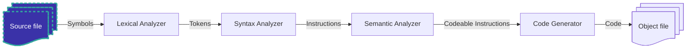

- จาก Source file ภาษาระดับสูง เป็น Symbols สัญลักษณ์ 

</template>

<template #1>

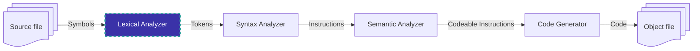

1. ผ่านกระบวนการ lexical analyzer เอาสัญลักษณ์เอาตัวอักษรมาทำให้เป็น Token 
 เช่นตัว C ตัว i ตัว n  รวมเป็น  cin  >> number1  จากนั้นได้ Token มาทีละตัว

การวิเคราะห์ระดับคำ (Lexical analysis)
- แยกโค้ดต้นฉบับออกเป็นหน่วยย่อยที่เรียกว่า "โทเค็น" (token)
- โทเค็นเหล่านี้ เช่น คำหลัก ตัวแปร ตัวดำเนินการ สัญลักษณ์ ฯลฯ
- เปรียบเสมือนตัวต่อตัวอักษร
- ตัวอย่าง: โทเค็น "int" "x" "=" "10" "+" "y" ";"


</template>

<template #2>

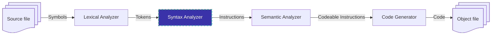
2. ผ่านกระบวนการ Syntax Analyzer ทำการวิเคราะห์ Token ให้เป็นคำสั่ง ได้ instruction  

การวิเคราะห์ไวยากรณ์ (Syntax analysis)

- ตรวจสอบว่าโทเค็นเรียงลำดับถูกต้องตามกฎไวยากรณ์ของภาษาที่ใช้
- เปรียบเสมือนการตรวจสอบโครงสร้างประโยค
- ตัวอย่าง: ตรวจสอบว่ามีวงเล็บเปิดปิดตรงกันหรือไม่
- ตรวจสอบว่าตัวแปรมีการประกาศก่อนใช้งานหรือไม่


</template>

<template #3>

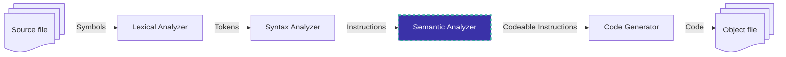

3. ผ่านกระบวนการ symatic analyser ตีความคำสั่งให้ทำอะไรเขียนถูกหลักไวยากรณ์หรือไม่ถ้าไม่ถูกก็จะแจ้งเป็น syntax error  

การวิเคราะห์ความหมาย (Semantic analysis)
- ตรวจสอบความหมายของโค้ด
- ตรวจสอบว่าโค้ดมีความสมเหตุสมผลหรือไม่
- ตรวจสอบว่ามีการใช้งานตัวแปรและฟังก์ชันอย่างถูกต้องหรือไม่
- ตัวอย่าง: ตรวจสอบว่าไม่สามารถบวกตัวเลขกับสตริงได้
- ตรวจสอบว่าฟังก์ชันถูกเรียกใช้ด้วยจำนวนอาร์กิวเมนต์ที่ถูกต้อง
</template>

<template #4>

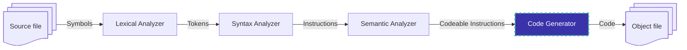

4. จากนั้นได้คำสั่งที่  Code ได้ก็เอาไป generate Code แปลงให้เป็น Machine Code แล้วก็ได้เป็น Machine Code

การสร้างโค้ด (Code generation)
- แปลงโค้ดต้นฉบับเป็นภาษาเครื่องที่คอมพิวเตอร์เข้าใจ
- เปรียบเสมือนการแปลภาษาไทยเป็นภาษาอังกฤษ
- ตัวอย่าง: แปลงโค้ด C++ เป็นภาษาเครื่อง x86

</template>

<template #5>

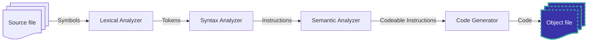

- ไฟล์อ็อบเจ็กต์คือไฟล์ที่ประกอบด้วย Machine Code

</template>

</v-switch>

---
layout: section

---

# Programming paradigms

---

# Categories of programming languages

<v-switch>

<template #0>

<div class="w-[700px] mx-auto">
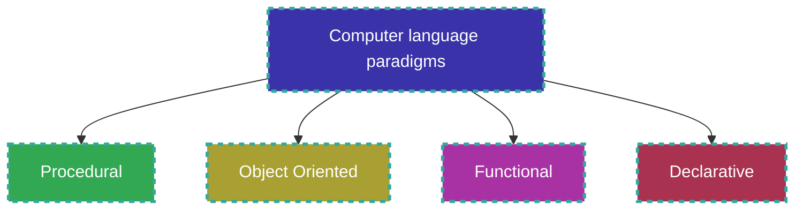
</div>


</template>

<template #1>

<div class="w-[700px] mx-auto">

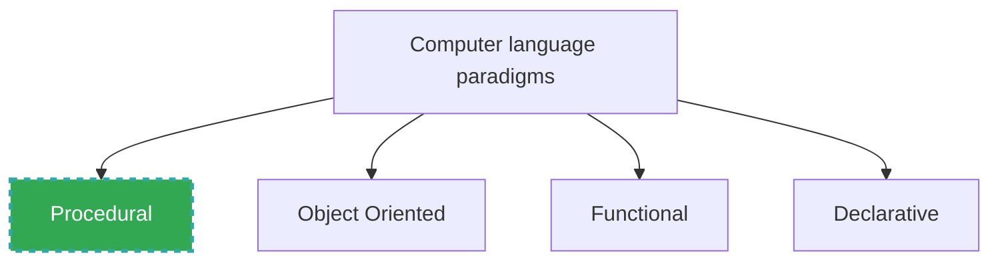
</div>

1. ภาษาโปรแกรมเชิงกระบวนการ (Procedural programming language)
มุ่งเน้นไปที่ขั้นตอน (procedure) ในการแก้ปัญหา
โปรแกรมเมอร์ต้องกำหนดขั้นตอนการทำงานทีละขั้นตอน
ภาษาโปรแกรมเชิงกระบวนการที่นิยมใช้ เช่น C, Java, Pascal

</template>

<template #2>

<div class="w-[700px] mx-auto">
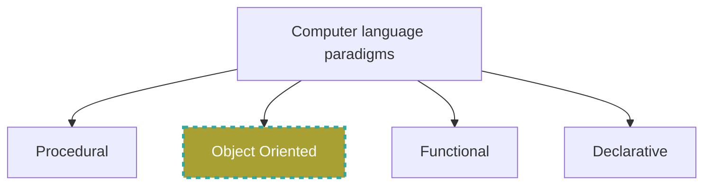
</div>

2. ภาษาโปรแกรมเชิงวัตถุ (Object-oriented programming language)
มุ่งเน้นไปที่การสร้าง "ออบเจกต์" (object)
ออบเจกต์คือตัวแทนของสิ่งของในโลกแห่งความเป็นจริง
ออบเจกต์ประกอบด้วยข้อมูล (data) และพฤติกรรม (behavior)
ภาษาโปรแกรมเชิงวัตถุที่นิยมใช้ เช่น C++, Java, Python


</template>

<template #3>

<div class="w-[700px] mx-auto">
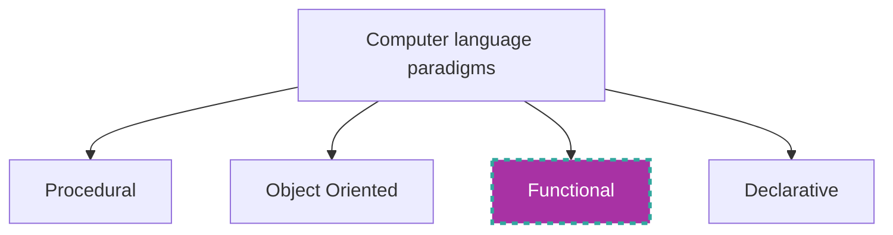
</div>

3. ภาษาโปรแกรมเชิงฟังก์ชัน (Functional programming language)
มุ่งเน้นไปที่ "ฟังก์ชัน" (function)
ฟังก์ชันคือบล็อกโค้ดที่ทำงานเฉพาะอย่าง
ภาษาโปรแกรมเชิงฟังก์ชันสนับสนุนการเขียนโปรแกรมแบบไร้สถานะ (stateless) และการเขียนโปรแกรมแบบเรียกซ้ำ (recursion)
ภาษาโปรแกรมเชิงฟังก์ชันที่นิยมใช้ เช่น Haskell, Lisp, Scheme


</template>

<template #4>

<div class="w-[700px] mx-auto">
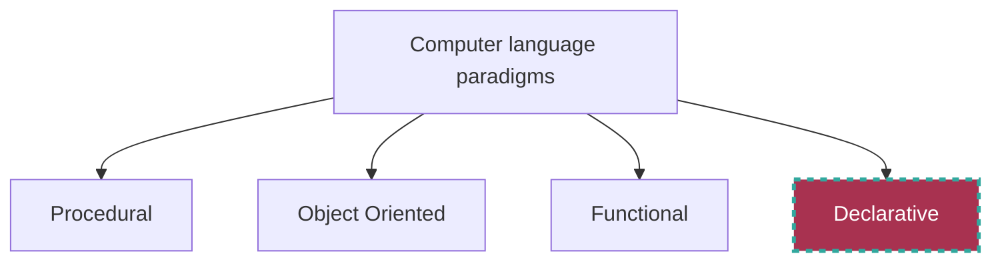
</div>

4. ภาษาโปรแกรมเชิงประกาศ (Declarative programming language)
มุ่งเน้นไปที่การระบุ "สิ่งที่ต้องการ" มากกว่า "วิธีการ"
โปรแกรมเมอร์ต้องระบุเป้าหมายที่ต้องการบรรลุ ภาษาโปรแกรมจะหาทางบรรลุเป้าหมายนั้นให้
ภาษาโปรแกรมเชิงประกาศที่นิยมใช้ เช่น SQL, Prolog, Haskell


</template>
</v-switch>

---
layout: section
---

# Common concepts

---

<v-switch>

<template #0>

- Common concepts มีด้วยกันอยู่ 9 ส่วน
    1. Indentifiers
    2. Data types
    3. Variables
    4. Literals
    5. Constants

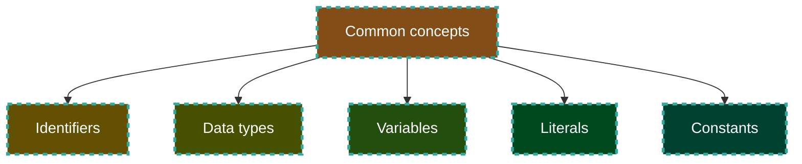


</template>


<template #1>

6. Input and Output
7. Expressions
8. Statements
9. Subprograms

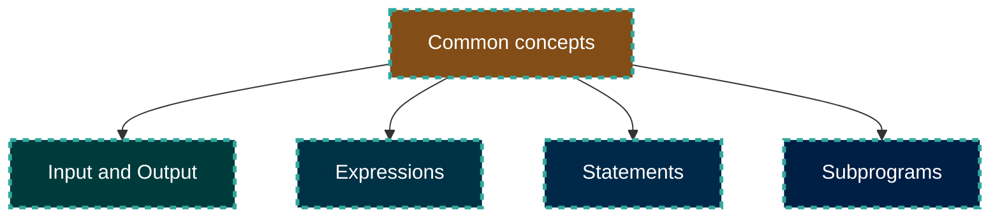
</template>

<template #2>

<div class="flex flex-col gap-3">
<div class="">

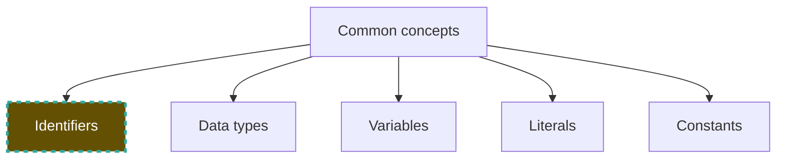
</div>

<div>

- Identifiers (name of objects) ในภาษาโปรแกรม คือ ชื่อที่ใช้เรียก referenced objectsต่างๆ ภายในโปรแกรม เรียกอีกอย่างง่ายๆ ว่า ชื่อตัวแปร (variable names) ก็ได้
&emsp;Identifiers มีหน้าที่สำคัญในการทำให้โปรแกรมอ่านเข้าใจง่าย ช่วยให้โปรแกรมเมอร์สามารถอ้างถึงข้อมูลต่างๆ ได้สะดวก โดยมีหลักเกณฑ์ในการตั้งชื่อดังนี้
- ต้องเป็นตัวอักษร a-z หรือ A-Z ตัวเลข 0-9 หรือ underscore (_)
- ห้ามขึ้นต้นด้วยตัวเลข
- บางภาษาอาจอนุญาตให้ใช้เครื่องหมายพิเศษบางอย่าง เช่น $ หรือ @ แต่ไม่นิยมใช้มากนักขึ้นอยู่กับกฎของแต่ละภาษาโปรแกรม
- ควรตั้งชื่อให้มีความหมาย สื่อถึงวัตถุประสงค์ของข้อมูลที่เก็บไว้

</div>
</div>
</template>

<template #3>

<div class="flex flex-col gap-3">
<div class="">


</div>

<div>

<div class="flex gap-3">

<div>

ตัวอย่าง Identifiers:
- ✔name - ชื่อ
- ✔age - อายุ
- ✔total_price - ราคารวม
- ✔is_active - สถานะการใช้งาน (active/inactive)
- ✔calculate_area - ฟังก์ชันสำหรับคำนวณพื้นที่
</div>
<div>

ตัวอย่าง Identifiers ที่ไม่ถูกต้อง:
- ❌1st_name (ห้ามขึ้นต้นด้วยตัวเลข)
- ❌#hashtag (บางภาษาไม่อนุญาตให้ใช้เครื่องหมาย #)
- ❌very_long_identifier (ขึ้นอยู่กับแต่ละภาษา ว่าจำกัดความยาวของชื่อหรือไม่)
</div>

</div>

</div>
</div>
</template>

<template #4>

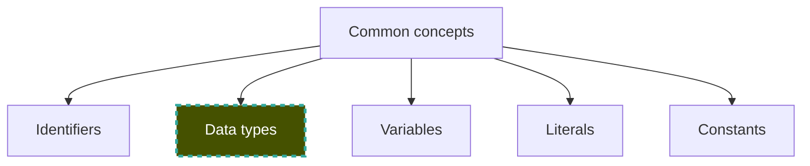

ประเภทข้อมูล (Data types) กำหนดประเภทของข้อมูลที่ตัวแปรสามารถเก็บไว้ ภาษาโปรแกรมส่วนใหญ่แบ่งประเภทข้อมูลออกเป็น 2 ประเภทหลัก ดังนี้:
1. ประเภทข้อมูลพื้นฐาน (Simple data types)
ประเภทข้อมูลพื้นฐานเป็นประเภทข้อมูลที่เรียบง่าย ไม่สามารถแยกย่อยออกเป็นประเภทย่อยอีกได้
ประเภทข้อมูลพื้นฐานที่พบได้ทั่วไป เช่น: 
- จำนวนเต็ม (Integer): เก็บค่าตัวเลขเต็มจำนวน เช่น 1, -10, 2048
- จำนวนจริง (Real): เก็บค่าตัวเลขทศนิยม เช่น 3.14, -5.2, 100.001
- ตัวละคร (Character): เก็บตัวอักษร สัญลักษณ์ หรือค่า ASCII เช่น 'a', 'Z', '$', '@'
- ตรรกะ (Boolean): เก็บค่าจริง (true) หรือเท็จ (false)

</template>

<template #5>


2. ประเภทข้อมูลผสม (Composite data types)
ประเภทข้อมูลผสมเป็นประเภทข้อมูลที่ซับซ้อน ประกอบไปด้วยข้อมูลหลายประเภทมารวมกัน
ประเภทข้อมูลผสมที่พบได้ทั่วไป เช่น: 
- อาร์เรย์ (Array): เก็บชุดข้อมูลที่มีประเภทเดียวกัน เรียงตามดัชนี (index) เช่น `int numbers[10];`
- เร็กคอร์ด (Record): เก็บชุดข้อมูลที่มีประเภทต่างกัน เรียกผ่านชื่อฟิลด์ (field) เช่น 
```c
struct Person { std::string name; int age; };
```

ตัวอย่างการใช้งาน
- จำนวนเต็ม: ใช้เก็บค่าอายุ รหัสสินค้า จำนวนสินค้า
- จำนวนจริง: ใช้เก็บค่าอุณหภูมิ น้ำหนัก คะแนนสอบ
- ตัวละคร: ใช้เก็บชื่อ นามสกุล ข้อความ อีเมล


</template>

<template #6>


- ตรรกะ: ใช้เก็บสถานะการใช้งาน ผลลัพธ์ของเงื่อนไข
- อาร์เรย์: ใช้เก็บข้อมูลนักเรียน คะแนนสอบ สินค้าในตะกร้า
- เร็กคอร์ด: ใช้เก็บข้อมูลบุคคล ข้อมูลลูกค้า ข้อมูลพนักงาน
ข้อดีของการใช้ประเภทข้อมูล
- ช่วยให้โปรแกรมอ่านเข้าใจง่าย
- ช่วยป้องกันข้อผิดพลาด
- เพิ่มประสิทธิภาพการทำงานของโปรแกรม
สรุป
ประเภทข้อมูลเป็นสิ่งสำคัญในภาษาโปรแกรม ช่วยให้โปรแกรมเมอร์สามารถจัดเก็บ จัดการ และใช้งานข้อมูลได้อย่างมีประสิทธิภาพ การเลือกใช้ประเภทข้อมูลที่เหมาะสม จะช่วยให้โปรแกรมทำงานได้อย่างถูกต้อง รวดเร็ว และอ่านเข้าใจง่าย

</template>
<template #7>

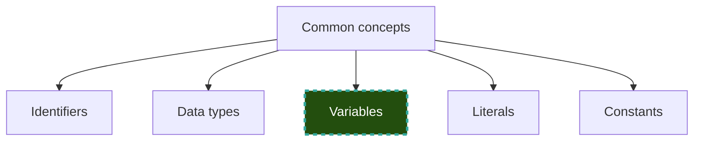
ตัวแปร (Variable) คือ พื้นที่จัดเก็บข้อมูล ภายในโปรแกรม

การทำงานกับตัวแปรแบ่งออกเป็น 2 ขั้นตอนหลัก ดังนี้:
1. การประกาศตัวแปร (Variable declaration)
การประกาศตัวแปร คือการแจ้งให้โปรแกรมทราบว่าเราต้องการใช้พื้นที่จัดเก็บข้อมูลชนิดใด
การประกาศตัวแปรประกอบด้วย: 
    - ชื่อตัวแปร (Identifier): ชื่อที่ใช้เรียก referenced ตัวแปร
    - ประเภทข้อมูล (Data type): กำหนดชนิดของข้อมูลที่ตัวแปรสามารถเก็บได้
2. การกำหนดค่าให้ตัวแปร (Variable initialization)
การกำหนดค่าให้ตัวแปร คือการกำหนดค่าเริ่มต้นให้กับตัวแปรที่ได้ประกาศไปแล้ว


</template>

<template #8>


- สรุป
เราต้อง ประกาศตัวแปร เพื่อแจ้งให้โปรแกรมรู้ว่าเราต้องการใช้พื้นที่จัดเก็บข้อมูล
เราสามารถ กำหนดค่าให้ตัวแปร หลังจากการประกาศ หรือระหว่างการประกาศก็ได้ (ขึ้นอยู่กับภาษาโปรแกรม)

- ข้อดีของการประกาศและการกำหนดค่าตัวแปร
ช่วยให้โปรแกรมอ่านเข้าใจง่าย
ช่วยป้องกันการใช้ตัวแปรที่ยังไม่ได้กำหนดค่า (Uninitialized variable) ซึ่งอาจทำให้โปรแกรมทำงานผิดพลาด


</template>

<template #9>

```mermaid

flowchart TD
    A[Common concepts]
    B[Identifiers]
    C[Data types]
    D[Variables]
    E[Literals]
    F[Constants]
    A-->B
    A-->C
    A-->D
    A-->E
    A-->F
    style E fill:#00491f,stroke:#32a89e,stroke-width:3px,color:#fff,stroke-dasharray: 5 5
```

Literals (ค่าคงที่ตามตัวอักษร)
คือ ค่าที่เขียนโดยตรงในโค้ด
ตัวอย่าง: 10, "Hello, world!", 3.14, 'A', true
ไม่สามารถเปลี่ยนแปลงค่าได้ ภายในบล็อกโค้ดเดียวกัน (บางภาษาอนุญาตให้เปลี่ยนแปลงได้ แต่ไม่แนะนำ)
- มักใช้ สำหรับกำหนดค่าคงที่ที่ใช้เพียงครั้งเดียว หรือใช้ในบริบทเฉพาะเจาะจง

</template>


<template #10>

```mermaid

flowchart TD
    A[Common concepts]
    B[Identifiers]
    C[Data types]
    D[Variables]
    E[Literals]
    F[Constants]
    A-->B
    A-->C
    A-->D
    A-->E
    A-->F
    style F fill:#00422f,stroke:#32a89e,stroke-width:3px,color:#fff,stroke-dasharray: 5 5
```

Constants (ค่าคงที่)
คือ ตัวแปรพิเศษที่มีค่าคงที่
ต้องประกาศ ด้วย keyword เฉพาะของภาษาโปรแกรม เช่น const ใน C++ หรือ final ใน Java
มีชื่อ เพื่ออ้างอิงถึงค่าคงที่นั้น
- ค่าคงที่ ถูกกำหนดเพียงครั้งเดียว
ห้ามเปลี่ยนแปลง ค่าหลังจากการประกาศ
มักใช้ สำหรับกำหนดค่าคงที่ที่ใช้หลายครั้งทั่วทั้งโปรแกรม ช่วยให้โปรแกรมอ่านเข้าใจง่าย และป้องกันการเปลี่ยนแปลงค่าโดยไม่ตั้งใจ

สรุป
- Literals เหมาะสำหรับการกำหนดค่าคงที่ที่ง่ายและใช้เพียงครั้งเดียว
- Constants เหมาะสำหรับการกำหนดค่าคงที่ที่มีความสำคัญ ใช้หลายครั้ง และต้องการป้องกันการเปลี่ยนแปลงค่าโดยไม่ตั้งใจ

</template>


<template #11>

```mermaid

flowchart TD
    A[Common concepts]
    G[Input and Output]
    H[Expressions]
    I[Statements]
    J[Subprograms]
    A-->G
    A-->H
    A-->I
    A-->J
    style G fill:#003b3c,stroke:#32a89e,stroke-width:3px,color:#fff,stroke-dasharray: 5 5
```

Input (อินพุต) และ Output (เอาต์พุต) ในภาษาโปรแกรม คือกระบวนการรับข้อมูลเข้าสู่โปรแกรมและส่งข้อมูลออกจากโปรแกรม
1. Input (อินพุต)
หมายถึง การรับข้อมูลจากแหล่งภายนอกเข้าสู่โปรแกรม
ข้อมูลอินพุตอาจมาจากแหล่งต่างๆ เช่น 
- ผู้ใช้ (ผ่านทางแป้นพิมพ์ เมาส์)
- ไฟล์
- เซ็นเซอร์ต่างๆ (กล้อง ไมโครโฟน)
- โปรแกรมอื่นๆ (การสื่อสารระหว่างโปรแกรม)


</template>

<template #12>

```mermaid

flowchart TD
    A[Common concepts]
    G[Input and Output]
    H[Expressions]
    I[Statements]
    J[Subprograms]
    A-->G
    A-->H
    A-->I
    A-->J
    style G fill:#003b3c,stroke:#32a89e,stroke-width:3px,color:#fff,stroke-dasharray: 5 5
```
- ภาษาโปรแกรมส่วนใหญ่มีฟังก์ชันสำหรับการรับข้อมูลอินพุต

ตัวอย่างฟังก์ชันรับข้อมูลอินพุตทั่วไป เช่น: 
- scanf &emsp;ในภาษา C
- input  &emsp;ในภาษา Python
- Scanner  &emsp;ในภาษา Java
</template>

<template #13>

```mermaid

flowchart TD
    A[Common concepts]
    G[Input and Output]
    H[Expressions]
    I[Statements]
    J[Subprograms]
    A-->G
    A-->H
    A-->I
    A-->J
    style G fill:#003b3c,stroke:#32a89e,stroke-width:3px,color:#fff,stroke-dasharray: 5 5
```
2. Output (เอาต์พุต)
หมายถึง การส่งข้อมูลออกจากโปรแกรมไปยังแหล่งภายนอก
ข้อมูลเอาต์พุตอาจแสดงผลไปยังแหล่งต่างๆ เช่น 
- หน้าจอ (console)
- ไฟล์
- เครื่องพิมพ์
- อุปกรณ์แสดงผลอื่นๆ (เช่น ลำโพง)


</template>

<template #14>

```mermaid

flowchart TD
    A[Common concepts]
    G[Input and Output]
    H[Expressions]
    I[Statements]
    J[Subprograms]
    A-->G
    A-->H
    A-->I
    A-->J
    style G fill:#003b3c,stroke:#32a89e,stroke-width:3px,color:#fff,stroke-dasharray: 5 5
```
- ภาษาโปรแกรมส่วนใหญ่มีฟังก์ชันสำหรับการส่งข้อมูลเอาต์พุต

ตัวอย่างฟังก์ชันส่งข้อมูลเอาต์พุตทั่วไป เช่น: 
- printf &emsp;ในภาษา C
- print &emsp;ในภาษา Python
- System.out.println &emsp;ในภาษา Java


</template>

<template #15>

```mermaid

flowchart TD
    A[Common concepts]
    G[Input and Output]
    H[Expressions]
    I[Statements]
    J[Subprograms]
    A-->G
    A-->H
    A-->I
    A-->J
    style H fill:#003245,stroke:#32a89e,stroke-width:3px,color:#fff,stroke-dasharray: 5 5
```
"นิพจน์" (Expressions) คือลำดับของตัวดำเนินการ (Operators) และตัวถูกดำเนินการ (Operands) ที่ดำเนินการรวมกันดังต่อไปนี้:

- Computes a value (คำนวณค่า)

- Designates an object or function (กำหนดวัตถุหรือฟังก์ชัน)

- Generates side effects (สร้างผลข้างเคียง)

</template>

<template #16>

```mermaid

flowchart TD
    A[Common concepts]
    G[Input and Output]
    H[Expressions]
    I[Statements]
    J[Subprograms]
    A-->G
    A-->H
    A-->I
    A-->J
    style H fill:#003245,stroke:#32a89e,stroke-width:3px,color:#fff,stroke-dasharray: 5 5
```
- ตัวดำเนินการ (Operator): สัญลักษณ์ที่ใช้ในการดำเนินการกับตัวถูกดำเนินการ ตัวอย่าง: +, -, *, /, %, ==, !=, <, >, <=, >=

- ตัวถูกดำเนินการ (Operand): ค่าที่ใช้ในการคำนวณ 
ตัวถูกดำเนินการอาจเป็น: 
    - ตัวแปร (variable)
    - ลิเตอร์รอล (literal) (ตัวเลข, ตัวหนังสือ)
    - นิพจน์อื่น (วงเล็บ)


</template>

<template #17>

```mermaid

flowchart TD
    A[Common concepts]
    G[Input and Output]
    H[Expressions]
    I[Statements]
    J[Subprograms]
    A-->G
    A-->H
    A-->I
    A-->J
    style I fill:#002949,stroke:#32a89e,stroke-width:3px,color:#fff,stroke-dasharray: 5 5
```

Program Statement คือ คำส่งที่ใช้ควบคุมการทำงานของโปรแกรม Statement หรือคำสั่ง 
- คำสั่ง (Statement) หมายถึงประโยคที่เขียนขึ้นเพื่อให้โปรแกรมทำงาน ประกอด้วยตัวแปร หรือนิพจน์ต่าง ๆ เพื่อใช้ประกาศตัวแปร กำหนดค่าเริ่มต้น กำหนดเงื่อนไข

1. Assignment Statement (การกำหนดค่า)
ใช้สำหรับ กำหนดค่า ให้กับตัวแปร
เขียนในรูปแบบ ตัวแปร = ค่า

ตัวอย่าง:
```cpp
// C++
int age = 25; // กำหนดค่า 25 ให้กับตัวแปร age 
double price = 19.99; // กำหนดค่า 19.99 ให้กับตัวแปร price 
char letter = 'A'; // กำหนดค่า 'A' ให้กับตัวแปร letter
```


</template>


<template #18>

```mermaid

flowchart TD
    A[Common concepts]
    G[Input and Output]
    H[Expressions]
    I[Statements]
    J[Subprograms]
    A-->G
    A-->H
    A-->I
    A-->J
    style I fill:#002949,stroke:#32a89e,stroke-width:3px,color:#fff,stroke-dasharray: 5 5
```

2. Compound Statement (คำสั่งกลุ่ม)
ใช้สำหรับ รวมกลุ่ม Statement หลายๆ คำสั่ง ให้ทำงานเป็นกลุ่มเดียว
เขียนโดยใช้วงเล็บปีกกา { }

3. Control Flow Statement (คำสั่งควบคุมการไหล)
ใช้สำหรับ ควบคุมลำดับการทำงาน ของโปรแกรม
ประเภทหลักๆ ของ Control Flow Statement ได้แก่: 
    - if-else: ตัดสินใจเลือกการทำงานตามเงื่อนไข
    - while loop: ทำซ้ำบล็อกโค้ดจนกว่าเงื่อนไขจะเป็นเท็จ
    - for loop: ทำซ้ำบล็อกโค้ดตามจำนวนรอบที่กำหนด
    - do-while loop: ทำซ้ำบล็อกโค้ดอย่างน้อย 1 รอบ จากนั้นตรวจสอบเงื่อนไข

</template>

<template #19>

```mermaid

flowchart TD
    A[Common concepts]
    G[Input and Output]
    H[Expressions]
    I[Statements]
    J[Subprograms]
    A-->G
    A-->H
    A-->I
    A-->J
    style J fill:#001f45,stroke:#32a89e,stroke-width:3px,color:#fff,stroke-dasharray: 5 5
```

Subprograms หรือ ซับโปรแกรม หมายถึง บล็อกโค้ดแยกต่างหาก ทำหน้าที่เฉพาะเจาะจง สามารถเรียกใช้งานซ้ำได้จากส่วนอื่นๆ ของโปรแกรม

ประโยชน์ของ Subprograms:
1. เพิ่มโมดูลาร์ริตี้: ช่วยให้แบ่งโค้ดออกเป็นส่วนย่อยๆ อ่านเข้าใจง่าย เขียนง่าย แก้ไขง่าย
2. ลดการดัปลิเคตโค้ด: ป้องกันการเขียนโค้ดซ้ำๆ ทำให้โปรแกรมมีขนาดเล็กลง
3. ส่งเสริมการ Reuse: สามารถนำ Subprograms ไปใช้ซ้ำในโปรแกรมอื่นๆ ได้
4. เพิ่มประสิทธิภาพ: ลดการคำนวณซ้ำๆ ทำให้โปรแกรมทำงานเร็วขึ้น


</template>


<template #20>

```mermaid

flowchart TD
    A[Common concepts]
    G[Input and Output]
    H[Expressions]
    I[Statements]
    J[Subprograms]
    A-->G
    A-->H
    A-->I
    A-->J
    style J fill:#001f45,stroke:#32a89e,stroke-width:3px,color:#fff,stroke-dasharray: 5 5
```

Local/Global variables (ตัวแปรท้องถิ่น/ตัวแปรทั่วโลก)
- Local variable (ตัวแปรท้องถิ่น): ประกาศและใช้งานภายใน Subprograms เท่านั้น หายไปเมื่อ Subprograms ทำงานเสร็จ ใช้งานได้เฉพาะฟังก์ชันที่ประกาศไว้เท่านั้น
- Global variable (ตัวแปรทั่วโลก): ประกาศและใช้งานได้ทุกที่ในโปรแกรม คงอยู่ตลอดจนกว่าโปรแกรมจะสิ้นสุด

Parameters คือตัวแปรที่ไว้สำหรับรับค่าในฟังก์ชั่น
- pass by value คือการ คัดลอกค่า ที่เก็บจากตัวแปรที่ส่ง ไปยังตัวแปรของฟังก์ชั่น
- pass by reference คือ การใช้งาน ข้อมูลที่เก็บจาก address ของตัวแปรที่ส่งไป ในฟังก์ชั่นนั้น เปลี่ยนค่าในฟังก์ชันแล้วตัวแปรจริงๆก็เปลี่ยนค่าตาม

</template>
</v-switch>

---
layout: cover
---

# วิศวกรรมซอฟต์แวร์ Software Engineering

---

# วงจรชีวิตของซอฟท์แวร์

- แนวคิดพื้นฐานของวิศวกรรมซอฟท์แวร์คือวงจรชีวิตซอฟท์แวร์ (software life cycle) ซอฟท์แวร์ก็เหมือนกับผลิตผลทั่วๆไปที่จะต้องผ่านวงจรของขั้นตอนที่ต้องทำซ้ำๆ

---

<div class="w-[200px] mx-auto">

<div class="font-bold text-2xl text-center">วงจรชีวิตของระบบ</div>


</div>

---

# วงจรชีวิตของซอฟท์แวร์ (2)

- โดยปกติซอฟท์แวร์จะถูกพัฒนาขึ้นโดยกลุ่มของโปรแกรมเมอร์ และจะถูกใช้งานไประยะหนึ่งก่อนที่จะมีการปรับปรุงแก้ไขอย่างต่อเนื่อง ซึ่งอาจเกิดจากความผิดพลาดที่มีอยู่ในตัวโปรแกรม กฎระเบียบหรือเงื่อนไขมีการเปลี่ยนแปลง หรือแม้แต่นโยบายขององค์กรเปลี่ยนไป

- การใช้งานและการปรับปรุงแก้ไขซอฟท์แวร์จะดำเนินต่อไปจนกระทั่งซอฟท์แวร์ล้าสมัย ซึ่งเกิดจากโปรแกรมที่ใช้หมดประสิทธิภาพ ภาษาที่ใช้เขียนไม่มีการใช้อีกต่อไป องค์กรมีการเปลี่ยนแปลงโครงสร้างหรือนโยบายครั้งใหญ่ เป็นต้น

---

# วิศวกรรมซอฟต์แวร์

- วิศวกรรมซอฟท์แวร์ คือการสร้างและการใช้วิธีการและหลักการอันเป็นที่ยอมรับทางวิศวกรรมเพื่อให้ได้มาซึ่งซอฟท์แวร์ที่มีความน่าเชื่อถือเมื่อ

- กระบวนการพัฒนาประกอบด้วย 4 ระยะ
    1. การวิเคราะห์ (Analysis)
    2. การออกแบบ (Design)
    3. การทำให้เกิดขึ้น (Implementation)
    4. การทดสอบ (Testing)

---

# ขั้นตอนการพัฒนาระบบ

<div class="w-[700px] mx-auto">

```mermaid

flowchart TD
    A[System Development] --> B[Analysis]
    A --> C[Design]
    A --> D[Implementation]
    A --> E[Testing]

```

</div>

---

# วงจรชีวิตของซอฟต์แวร์

- ระยะที่ 1: การวิเคราะห์ เป็นการกำหนดความต้องการของระบบ (What the software should do?) มี 4 ขั้นตอนคือ
    1. กำหนดผู้ใช้ (Define the User)
    2. กำหนดความต้องการของผู้ใช้ (Define the Needs)
    3. กำหนดความต้องการของระบบ (Define the Requirements)
    4. กำหนดวิธีการ (Define the Methods)

- ระยะที่ 2: การออกแบบ เป็นการระบุรายละเอียดว่าความต้องการจากระยะที่ 1 จะสำเร็จได้อย่างไร ต้องทำอย่างไร (How the software should be built?)

- ระยะที่ 3: การทำให้เกิดขึ้น เป็นการลงมือเขียนโปรแกรม (coding)โดยใช้ภาษาที่กำหนดไว้ บางครั้งอาจมีการใช้เครื่องมือช่วย (tools) เช่น code generator, debugger, etc.


---

# วงจรชีวิตของซอฟต์แวร์ (2)

- ระยะที่ 4: การทดสอบ เป็นกิจกรรมที่ทำการตรวจสอบความถูกต้องของโปแรกมก่อนการนำไปใช้งาน การทดสอบโปรแกรมมี 2 วิธีหลักๆคือ
	1. White Box Testing
	2. Black Box Testing

- Black box testing คือ การ test ที่เราไม่สนใจภายในของระบบ ให้มองภาพเหมือนกล่องทึบ 1 ใบ เราจะมองแค่ภายนอกของกล่อง ไม่สนใจว่าข้างในกล่องมีอะไร
เราจะไม่มีการเข้าถึง source code เราจะสนใจแค่ว่า เมื่อใส่ input เข้าไปในระบบ แล้ว output ที่ได้ ตรงตาม expected result หรือไม่
ทำการ test จากมุมมองของผู้ใช้งานจริง ไม่ใช่ผู้ที่ออกแบบโปรแกรม ซึ่งในบางครั้งการออกแบบ อาจจะไม่ได้ตรงตามความต้องการของผู้ใช้งานจริงก็ได้

- White box testing คือ การ test ที่เราจะ focus ไปที่ภายในของระบบ ถ้าเทียบกับกล่องแล้ว ให้มองภาพเป็นกล่องใส 1 ใบ เราจะเห็นภายในกล่องว่าประกอบด้วยอะไรบ้าง ซึ่งถ้าพูดง่ายๆก็คือ code ที่ developer เขียนนั่นเอง
เราจะทำ test logic ข้างใน source code โดยที่ white box testing จะถูกใช้ในการทำ unit test และ component test โดยจะออกแบบ Test case ให้ครอบคลุมทั้ง เงื่อนไข และ input ต่างๆ 

---

# แบบจำลองการพัฒนาโปรแกรม

- แบบจำลองน้ำตก (Waterfall Model) เป็นการพัฒนาที่ระยะก่อนหน้าจะต้องเสร็จครบถ้วนสมบูรณ์ก่อนที่ระยะต่อไปจะดำเนินการได้ 
- เนื่องจากโมเดลน้ำตก (Waterfall Model) มีข้อเสียคือ ต้องมีการดำเนินการเป็นขั้นตอนให้เสร็จสิ้นก่อนจึงจะดำเนินการขั้นต่อไป ซึ่งหากเป็นโครงการซอฟต์แวร์ที่มีขนาดใหญ่อาจต้องใช้เวลามาก

<div class="mx-auto w-[400px]">


</div>

---

# แบบจำลองการพัฒนาโปรแกรม (2)

- แบบจำลองที่เพิ่มรายระเอียด (Incremental Model) เป็นการพัฒนาแบบวนซ้ำหลายๆรอบ ในแต่ละรอบจะเพิ่มเติมรายละเอียดเข้าไปเพื่อให้โปรแกรมสมบูรณ์มากขึ้นๆ 
- หลักการของ Incremental Model คือ การแบ่งระบบงานออกเป็นระบบย่อยต่าง ๆ โดยระบบย่อยเรียกว่า Increment เปรียบเสมือนกับโครงการขนาดเล็ก (Mini Project) โดยจะทำการพัฒนาระบบงานที่เป็นงานหลักของระบบก่อน จากนั้นพัฒนาต่อเติมในแต่ละ  Increment ตามลำดับ จนกระทั้งได้ระบบงานที่เสร็จสมบูรณ์
 	

<div class="mx-auto w-[400px]">


</div>


---

# คุณภาพของซอฟต์แวร์

- การกำหนดคุณภาพซอฟท์แวร์: คุณภาพซอฟท์แวร์กำหนดไว้ดังนี้
    - ซอฟแวร์ที่ตอบสนองความต้องการที่ชัดเจนและโดยนัยของผู้ใช้ มีระบบการจัดทำเอกสารที่ดี ตอบสนองมาตรฐานการดำเนินงานขององค์กร ได้อย่างมีประสิทธิภาพและทำงานบนฮาร์ดแวร์ที่ถูกพัฒนาขึ้นขององค์กร

---

# องค์ประกอบของคุณภาพซอฟต์แวร์

- องค์ประกอบของคุณภาพซอฟต์แวร์ (Software Quality Factors) หมายถึง คุณสมบัติที่วัดผลคุณภาพของซอฟต์แวร์ องค์ประกอบเหล่านี้ช่วยให้ผู้ใช้ประเมินว่าซอฟต์แวร์นั้นมีประโยชน์ น่าเชื่อถือ และใช้งานง่ายหรือไม่


<v-switch>

<template #0>

<div class="w-[600px] mx-auto">

```mermaid
flowchart TD
    A[Quality Factors] --> B[Operability] 
    A --> C[Maintainability] 
    A --> D[Transferability]

    style A fill:#824d17,stroke:#32a89e,stroke-width:3px,color:#fff,stroke-dasharray: 5 5
    style B fill:#645002,stroke:#32a89e,stroke-width:3px,color:#fff,stroke-dasharray: 5 5
    style C fill:#455100,stroke:#32a89e,stroke-width:3px,color:#fff,stroke-dasharray: 5 5
    style D fill:#234e0e,stroke:#32a89e,stroke-width:3px,color:#fff,stroke-dasharray: 5 5
```
</div>

</template>

<template #1>
<div class="w-[600px] mx-auto">

```mermaid
flowchart TD
    A[Quality Factors] --> B[Operability] 
    A --> C[Maintainability] 
    A --> D[Transferability]

    style B fill:#645002,stroke:#32a89e,stroke-width:3px,color:#fff,stroke-dasharray: 5 5
```

</div>

1. Operability (การใช้งาน)
Operability หมายถึง ความง่ายในการใช้งานซอฟต์แวร์ ผู้ใช้ควรสามารถเข้าใจ ใช้งาน และควบคุมซอฟต์แวร์ได้อย่างง่ายดาย โดยไม่ต้องใช้ความพยายามหรือความรู้มากเกินไป
เช่น:
    - ซอฟต์แวร์มีอินเทอร์เฟซผู้ใช้ที่ใช้งานง่าย เข้าใจง่าย และจดจำง่าย
    - ซอฟต์แวร์มีฟังก์ชันการทำงานที่ชัดเจน ตรงประเด็น และใช้งานง่าย
    - ซอฟต์แวร์มีเอกสารประกอบที่ครบถ้วน ชัดเจน และเป็นประโยชน์

</template>


<template #2>
<div class="w-[600px] mx-auto">

```mermaid
flowchart TD
    A[Quality Factors] --> B[Operability] 
    A --> C[Maintainability] 
    A --> D[Transferability]

    style C fill:#455100,stroke:#32a89e,stroke-width:3px,color:#fff,stroke-dasharray: 5 5
```

</div>

2. Maintainability (การบำรุงรักษา)
Maintainability หมายถึง ความง่ายในการปรับเปลี่ยน แก้ไข และปรับปรุงซอฟต์แวร์ โปรแกรมเมอร์ควรสามารถเข้าใจ โมเดียร์ฟาย และขยายซอฟต์แวร์ได้อย่างง่ายดาย โดยไม่ต้องใช้เวลามากเกินไป
เช่น:
    - โค้ดซอฟต์แวร์มีโครงสร้างที่ชัดเจน อ่านง่าย และเข้าใจง่าย
    - โค้ดซอฟต์แวร์มีการใช้ตัวแปรและฟังก์ชันอย่างเหมาะสม
    - โค้ดซอฟต์แวร์มีการใส่คอมเมนต์อธิบายอย่างละเอียด
    - ซอฟต์แวร์มีเครื่องมือสำหรับการทดสอบและตรวจสอบอย่างมีประสิทธิภาพ


</template>


<template #3>
<div class="w-[600px] mx-auto">

```mermaid
flowchart TD
    A[Quality Factors] --> B[Operability] 
    A --> C[Maintainability] 
    A --> D[Transferability]

    style D fill:#234e0e,stroke:#32a89e,stroke-width:3px,color:#fff,stroke-dasharray: 5 5
```

</div>

3. Transferability (การถ่ายโอน)
Transferability หมายถึง ความง่ายในการติดตั้ง ซอฟต์แวร์บนระบบปฏิบัติการ ฮาร์ดแวร์ และสภาพแวดล้อมใหม่ ๆ ผู้ใช้ควรสามารถติดตั้งและใช้งานซอฟต์แวร์บนระบบต่าง ๆ ได้โดยไม่ต้องมีปัญหา
เช่น:
    - ซอฟต์แวร์รองรับระบบปฏิบัติการและฮาร์ดแวร์ที่หลากหลาย
    - ซอฟต์แวร์มีกระบวนการติดตั้งที่ง่ายและรวดเร็ว
    - ซอฟต์แวร์มีเอกสารประกอบเกี่ยวกับการติดตั้งและใช้งานบนระบบต่าง ๆ
    - ซอฟต์แวร์รองรับการอัปเดตและปรับปรุงเวอร์ชันใหม่ ๆ


</template>


</v-switch>

---

# องค์ประกอบของคุณภาพซอฟต์แวร์ (2)

<v-switch>


<template #0>

```mermaid
flowchart TD
    A[Operability]
    A --> B[Accuracy] 
    A --> C[Efficiency]
    A --> D[Reliability]
    A --> E[Security]
    A --> F[Timeliness]
    A --> G[Usability]
    style B fill:#645002,stroke:#32a89e,stroke-width:3px,color:#fff,stroke-dasharray: 5 5
```
<div class="flex gap-3">

<div class="w-1/2">

1. Accuracy (ความถูกต้อง):
ความหมาย: ผลลัพธ์ที่ซอฟต์แวร์คำนวณหรือแสดงนั้น ถูกต้อง ตรงตามความเป็นจริง
ตัวอย่าง: 
- โปรแกรมคำนวณเงินเดือนที่คำนวณภาษีถูกต้อง
</div>

<div class="w-1/2">

- เครื่องคิดเลขวิทยาศาสตร์ที่คำนวณผลลัพธ์ทางคณิตศาสตร์ได้แม่นยำ
- ระบบตรวจจับใบหน้าที่สามารถระบุบุคคลได้ถูกต้อง
- โปรแกรมแปลภาษาที่แปลข้อความได้ถูกต้องตามความหมาย

</div>
</div>
</template>

<template #1>

```mermaid
flowchart TD
    A[Operability]
    A --> B[Accuracy] 
    A --> C[Efficiency]
    A --> D[Reliability]
    A --> E[Security]
    A --> F[Timeliness]
    A --> G[Usability]
    style C fill:#455100,stroke:#32a89e,stroke-width:3px,color:#fff,stroke-dasharray: 5 5
```
<div class="flex gap-3">

<div class="w-1/2">

2. Efficiency (ประสิทธิภาพ):
ความหมาย: ความสามารถของซอฟต์แวร์ในการทำงานได้อย่างรวดเร็ว ใช้ทรัพยากรระบบน้อย
ตัวอย่าง: 
    - เว็บไซต์ที่โหลดข้อมูลได้รวดเร็ว
    - โปรแกรมตัดต่อวิดีโอที่สามารถเรนเดอร์วิดีโอได้อย่างรวดเร็ว

</div>

<div class="w-1/2">

- อัลกอริทึมการค้นหาที่สามารถค้นหาข้อมูลได้อย่างรวดเร็ว
- โปรแกรมบีบอัดไฟล์ที่สามารถบีบอัดไฟล์ขนาดใหญ่ลงได้อย่างมีประสิทธิภาพ

</div>
</div>
</template>

<template #2>

```mermaid
flowchart TD
    A[Operability]
    A --> B[Accuracy] 
    A --> C[Efficiency]
    A --> D[Reliability]
    A --> E[Security]
    A --> F[Timeliness]
    A --> G[Usability]
    style D fill:#234e0e,stroke:#32a89e,stroke-width:3px,color:#fff,stroke-dasharray: 5 5
```
<div class="flex gap-3">

<div class="w-1/2">

3. Reliability (ความน่าเชื่อถือ):
ความหมาย: ซอฟต์แวร์ทำงานได้อย่างถูกต้องและต่อเนื่องโดยไม่เกิดข้อผิดพลาด
ตัวอย่าง: 
    - เซิร์ฟเวอร์อีเมล์ที่ทำงานได้ตลอด 24/7
    - โปรแกรมสำรองข้อมูลที่ทำงานได้อย่างถูกต้อง
    - ระบบปฏิบัติการที่ไม่ค้างหรือหยุดทำงาน
    - โปรแกรมป้องกันไวรัสที่สามารถป้องกันภัยคุกคามได้อย่างมีประสิทธิภาพ


</div>

<div class="w-1/2">

หมายเหตุ: 
- 24/7 เป็นตัวเลขย่อที่มาจาก “24 ชั่วโมงต่อวัน, 7 วันต่อหนึ่งสัปดาห์” หรือ “24 ชั่วโมงต่อวัน, 7 วันต่อหนึ่ง

</div>
</div>
</template>


<template #3>

```mermaid
flowchart TD
    A[Operability]
    A --> B[Accuracy] 
    A --> C[Efficiency]
    A --> D[Reliability]
    A --> E[Security]
    A --> F[Timeliness]
    A --> G[Usability]
    style E fill:#00491f,stroke:#32a89e,stroke-width:3px,color:#fff,stroke-dasharray: 5 5
```
<div class="flex gap-3">

<div class="w-1/2">

4. Security (ความปลอดภัย):
ความหมาย: ซอฟต์แวร์ป้องกันข้อมูลและระบบจากภัยคุกคาม เช่น แฮกเกอร์ ไวรัส มัลแวร์
ตัวอย่าง: 
    - ระบบเข้ารหัสข้อมูล
    - โปรแกรมไฟร์วอลล์
    - การควบคุมการเข้าถึงข้อมูล
    - การอัปเดตซอฟต์แวร์อย่างสม่ำเสมอ

</div>

<div class="w-1/2">


</div>
</div>
</template>


<template #4>

```mermaid
flowchart TD
    A[Operability]
    A --> B[Accuracy] 
    A --> C[Efficiency]
    A --> D[Reliability]
    A --> E[Security]
    A --> F[Timeliness]
    A --> G[Usability]
    style F fill:#00422f,stroke:#32a89e,stroke-width:3px,color:#fff,stroke-dasharray: 5 5
```
<div class="flex gap-3">

<div class="w-1/2">

5. Timeliness (ความตรงต่อเวลา): ผลลัพธ์ออกมาถูกต้องทันสมัย ตามสมัยไหม
ความหมาย: ซอฟต์แวร์พัฒนาและส่งมอบตามกำหนดเวลา
ตัวอย่าง: 
    - โปรเจคซอฟต์แวร์ที่มีการวางแผนและจัดการเวลาอย่างมีประสิทธิภาพ
    - การใช้เครื่องมือและเทคนิคการพัฒนาซอฟต์แวร์ที่ทันสมัย
    - การสื่อสารและการทำงานเป็นทีมที่มีประสิทธิภาพ
    - การทดสอบซอฟต์แวร์อย่างละเอียด
</div>

<div class="w-1/2">


</div>
</div>
</template>


<template #5>

```mermaid
flowchart TD
    A[Operability]
    A --> B[Accuracy] 
    A --> C[Efficiency]
    A --> D[Reliability]
    A --> E[Security]
    A --> F[Timeliness]
    A --> G[Usability]
    style G fill:#003b3c,stroke:#32a89e,stroke-width:3px,color:#fff,stroke-dasharray: 5 5
```
<div class="flex gap-3">

<div class="w-1/2">

6. Usability (การใช้งาน): มีคนใช้จริงไหม
ความหมาย: ผู้ใช้สามารถใช้งานซอฟต์แวร์ได้ง่าย เข้าใจง่าย และสะดวก
ตัวอย่าง: 
    - ซอฟต์แวร์ที่มีอินเทอร์เฟซผู้ใช้ที่ใช้งานง่าย
    - เอกสารประกอบที่ชัดเจน
    - การออกแบบที่สวยงาม
    - การรองรับผู้ใช้ที่มีความพิการ

</div>

<div class="w-1/2">


</div>
</div>
</template>


<template #6>

<div class="mx-auto w-[700px]">

```mermaid
flowchart TD
    A[Maintainability]
    A --> B[Changeability] 
    A --> C[Corectability]
    A --> D[Flexibility]
    A --> E[Testability]
    style B fill:#645002,stroke:#32a89e,stroke-width:3px,color:#fff,stroke-dasharray: 5 5
```
</div>
<div class="flex gap-3">

<div class="w-1/2">

1. Changeability (ความสามารถในการเปลี่ยนแปลง):
ความหมาย: ความง่ายในการปรับเปลี่ยนฟังก์ชันการทำงานของซอฟต์แวร์
ตัวอย่าง: 
    - เว็บไซต์ที่สามารถเพิ่มฟีเจอร์ใหม่ๆ ได้โดยไม่กระทบส่วนอื่น
    - เกมส์ที่สามารถเพิ่มเลเวลใหม่ๆ หรือไอเท็มใหม่ๆ ได้


</div>

<div class="w-1/2">

- โปรแกรมที่มีการออกแบบแบบโมดูล ทำให้สามารถเปลี่ยนแปลงส่วนใดส่วนหนึ่งได้โดยไม่ต้องส่งผลต่อส่วนอื่น
- โค้ดที่มีการใช้ตัวแปรและฟังก์ชันอย่างเหมาะสม ช่วยให้ปรับแต่งการทำงานได้ง่าย

</div>
</div>
</template>

<template #7>

<div class="mx-auto w-[700px]">
```mermaid
flowchart TD
    A[Maintainability]
    A --> B[Changeability] 
    A --> C[Corectability]
    A --> D[Flexibility]
    A --> E[Testability]
    style C fill:#455100,stroke:#32a89e,stroke-width:3px,color:#fff,stroke-dasharray: 5 5
```
</div>
<div class="flex gap-3">

<div class="w-1/2">

2. Correctability (ความสามารถในการแก้ไข): มีการกู้คืนกลับมาได้ไหม
ความหมาย: ความง่ายในการระบุ แก้ไข และทดสอบข้อผิดพลาด (Bug) ในซอฟต์แวร์
ตัวอย่าง: 
    - โค้ดที่มีการแบ่งเป็นโมดูล ทำให้ระบุจุดเกิดข้อผิดพลาดได้ง่าย
    - การเขียน unit test เพื่อทดสอบการทำงานของแต่ละส่วนของโปรแกรม


</div>

<div class="w-1/2">

- การใช้เครื่องมือ debugging ที่มีประสิทธิภาพ
- เอกสารประกอบที่ชัดเจน อธิบายการทำงานของโค้ดอย่างละเอียด
- การกู้คืน (Recovery) หมายถึง ความสามารถของซอฟต์แวร์ในการกลับสู่สถานะปกติหลังจากเกิดความผิดพลาดหรือล้มเหลว

</div>
</div>
</template>


<template #8>

<div class="mx-auto w-[700px]">
```mermaid
flowchart TD
    A[Maintainability]
    A --> B[Changeability] 
    A --> C[Corectability]
    A --> D[Flexibility]
    A --> E[Testability]
    style D fill:#234e0e,stroke:#32a89e,stroke-width:3px,color:#fff,stroke-dasharray: 5 5
```
</div>
<div class="flex gap-3">

<div class="w-1/2">

3. Flexibility (ความยืดหยุ่น):
ความหมาย: ซอฟต์แวร์สามารถปรับเปลี่ยนเพื่อรองรับการใช้งานรูปแบบใหม่ ๆ สภาพแวดล้อมใหม่ ๆ หรือความต้องการของผู้ใช้ที่เปลี่ยนแปลงไป
ตัวอย่าง: 
- โปรแกรมที่มีการออกแบบแบบโมดูล ทำให้สามารถเพิ่มหรือลบโมดูลได้ตามต้องการ
- โปรแกรมที่มีระบบตั้งค่า (Configuration) ที่ผู้ใช้สามารถปรับแต่งได้


</div>

<div class="w-1/2">

- โปรแกรมที่มีภาษาที่รองรับการเขียนโค้ดแบบยืดหยุ่น เช่น Python, Java
- โปรแกรมที่มี API ที่เปิดให้นักพัฒนาภายนอกสามารถสร้างโมดูลหรือแอปพลิเคชันเพิ่มเติมได้

</div>
</div>
</template>

<template #9>

<div class="mx-auto w-[700px]">
```mermaid
flowchart TD
    A[Maintainability]
    A --> B[Changeability] 
    A --> C[Corectability]
    A --> D[Flexibility]
    A --> E[Testability]
    style E fill:#00491f,stroke:#32a89e,stroke-width:3px,color:#fff,stroke-dasharray: 5 5
```
</div>
<div class="flex gap-3">

<div class="w-1/2">

4. Testability (ความสามารถในการทดสอบ):
ความหมาย: ความง่ายในการเขียน ทดสอบ และหาข้อผิดพลาดในซอฟต์แวร์
ตัวอย่าง: 
    - โค้ดที่มีโครงสร้างที่ชัดเจน อ่านง่าย และเข้าใจง่าย
    - โค้ดที่มีการใช้ตัวแปรและฟังก์ชันอย่างเหมาะสม

</div>

<div class="w-1/2">

- โค้ดที่มีการเขียน unit test
- โปรแกรมที่มีเครื่องมือสำหรับการทดสอบอัตโนมัติ
- เอกสารประกอบที่ชัดเจน อธิบายการทำงานของโค้ดอย่างละเอียด


</div>
</div>
</template>

<template #10>

<div class="mx-auto w-[700px]">
```mermaid
flowchart TD
    A[Transferability]
    A --> B[Code reusability] 
    A --> C[Interoperability]
    A --> D[Portability]
    style B fill:#645002,stroke:#32a89e,stroke-width:3px,color:#fff,stroke-dasharray: 5 5
```
</div>
<div class="flex gap-3">

<div class="w-1/2">
1. Code reusability (การนำโค้ดกลับมาใช้ใหม่):
ความหมาย: ความสามารถในการนำโค้ดเดิมมาใช้ซ้ำในส่วนอื่นของโปรแกรมหรือโปรแกรมใหม่

- ประโยชน์: 
    - ช่วยให้ประหยัดเวลาในการพัฒนาซอฟต์แวร์
    - ช่วยให้โค้ดมีมาตรฐานและสม่ำเสมอ
    - ช่วยให้ง่ายต่อการบำรุงรักษาซอฟต์แวร์

</div>

<div class="w-1/2">

- ตัวอย่าง: 
    - การสร้างไลบรารีฟังก์ชันที่ใช้งานได้ทั่วไป
    - การใช้โค้ดเดิมจากโปรเจคก่อนหน้ามาประยุกต์ใช้ในโปรเจคใหม่
    - การออกแบบโมดูลซอฟต์แวร์ที่สามารถนำไปใช้ใหม่ได้


</div>
</div>
</template>

<template #11>

<div class="mx-auto w-[700px]">
```mermaid
flowchart TD
    A[Transferability]
    A --> B[Code reusability] 
    A --> C[Interoperability]
    A --> D[Portability]
    style C fill:#455100,stroke:#32a89e,stroke-width:3px,color:#fff,stroke-dasharray: 5 5
```
</div>
<div class="flex gap-3">

<div class="w-1/2">

2. Interoperability (การทำงานร่วมกันได้): API เชื่อมต่อระบบอื่น ๆ ได้ไหม
ความหมาย: ความสามารถของซอฟต์แวร์ในการทำงานร่วมกับซอฟต์แวร์อื่น ๆ ได้อย่างราบรื่น


</div>

<div class="w-1/2">
ประโยชน์: 

- ช่วยให้ง่ายต่อการรวมระบบซอฟต์แวร์
- ช่วยให้ผู้ใช้สามารถใช้ซอฟต์แวร์ต่างๆ ร่วมกันได้
- ช่วยให้ธุรกิจสามารถประหยัดค่าใช้จ่ายในการพัฒนาซอฟต์แวร์


</div>
</div>
</template>


<template #12>

<div class="mx-auto w-[700px]">
```mermaid
flowchart TD
    A[Transferability]
    A --> B[Code reusability] 
    A --> C[Interoperability]
    A --> D[Portability]
    style C fill:#455100,stroke:#32a89e,stroke-width:3px,color:#fff,stroke-dasharray: 5 5
```
</div>
<div class="flex gap-3">

<div class="w-1/2">

2. Interoperability (การทำงานร่วมกันได้): API เชื่อมต่อระบบอื่น ๆ ได้ไหม
ความหมาย: ความสามารถของซอฟต์แวร์ในการทำงานร่วมกับซอฟต์แวร์อื่น ๆ ได้อย่างราบรื่น

</div>

<div class="w-1/2">
ตัวอย่าง: 

- โปรแกรมตัดต่อวิดีโอที่สามารถเปิดไฟล์วิดีโอจากโปรแกรมอื่นได้
- แอปพลิเคชันที่สามารถแชร์ข้อมูลกับแอปพลิเคชันอื่นๆ บนอุปกรณ์เดียวกัน
- ซอฟต์แวร์ที่รองรับมาตรฐานการสื่อสารข้อมูล


</div>
</div>
</template>

<template #13>

<div class="mx-auto w-[700px]">
```mermaid
flowchart TD
    A[Transferability]
    A --> B[Code reusability] 
    A --> C[Interoperability]
    A --> D[Portability]
    style D fill:#234e0e,stroke:#32a89e,stroke-width:3px,color:#fff,stroke-dasharray: 5 5
```
</div>
<div class="flex gap-3">

<div class="w-1/2">

3. Portability (การย้ายถิ่นฐาน):
ความหมาย: ความสามารถของซอฟต์แวร์ในการทำงานบนระบบปฏิบัติการ ฮาร์ดแวร์ และสภาพแวดล้อมใหม่ ๆ


</div>

<div class="w-1/2">
ประโยชน์: 

- ช่วยให้ง่ายต่อการติดตั้งและใช้งานซอฟต์แวร์บนระบบต่างๆ
- ช่วยให้ผู้ใช้สามารถอัปเกรดระบบฮาร์ดแวร์ได้โดยไม่ต้องกังวลว่าซอฟต์แวร์จะทำงานไม่ได้
- ช่วยให้ธุรกิจสามารถประหยัดค่าใช้จ่ายในการซื้อฮาร์ดแวร์ใหม่


</div>
</div>
</template>


<template #14>

<div class="mx-auto w-[700px]">
```mermaid
flowchart TD
    A[Transferability]
    A --> B[Code reusability] 
    A --> C[Interoperability]
    A --> D[Portability]
    style D fill:#234e0e,stroke:#32a89e,stroke-width:3px,color:#fff,stroke-dasharray: 5 5
```
</div>
<div class="flex gap-3">

<div class="w-1/2">

3. Portability (การย้ายถิ่นฐาน):
ความหมาย: ความสามารถของซอฟต์แวร์ในการทำงานบนระบบปฏิบัติการ ฮาร์ดแวร์ และสภาพแวดล้อมใหม่ ๆ


</div>

<div class="w-1/2">
ตัวอย่าง: 

- แอปพลิเคชันมือถือที่รองรับทั้งระบบ Android และ iOS
- ซอฟต์แวร์ที่มีไฟล์ติดตั้งสำหรับระบบปฏิบัติการต่างๆ (Windows, macOS)
- เว็บไซต์ที่สามารถใช้งานได้บนเบราว์เซอร์ต่างๆ


</div>
</div>
</template>
</v-switch>

---

# การจัดทำเอกสาร

- ซอฟท์แวร์ที่ดีต้องมีเอกสารประกอบ เอกสารอาจอยู่ในรูปสิ่งพิมพ์หรืออิเล็กทรอนิกส์ วัตถุประสงค์ของเอกสารคือให้ผู้ใช้สามารถใช้งานได้ง่าย และช่วยให้การเปลี่ยนแปลงแก้ไขสะดวกและรวดเร็วขึ้น โดยปกติ เอกสารแบ่งออกเป็น 3 ประเภทใหญ่ๆ คือ
    1. User documentation เอกสารคู่มือสำหรับผู้ใช้งาน
    2. Technical documentation เอกสารสำหรับการติดตั้งและบริการ
    3. System documentation เป็นเอกสารที่ทำขึ้นในแต่ละระยะของการพัฒนาซอฟท์แวร์

---

# System documents

- เอกสารในระยะการวิเคราะห์ 
    - บันทึกความต้องการ
- เอกสารในระยะการออกแบบ 
    - บันทึกพิมพ์เขียวของซอฟท์แวร์
- เอกสารในระยะการทำให้เกิดขึ้น 
    - บันทึกรายละเอียดของโปรแกรม ข้อยกเว้นต่างๆ ตลอดจนสิ่งแวดล้อมในการทำงานของโปรแกรม
- เอกสารในระยะการทดสอบ 
    - บันทึกผลการทดสอบอย่างละเอียด 
    - บันทึกกระบวนการทำงานของโปรแกรม 
    - บันทึกประวัติการทำงานของโปรแกรม

