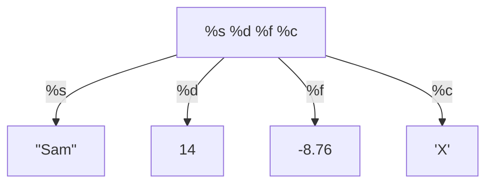

# Lab 1 - Basic C Programming Language

---

# รูปแบบของโปรแกรม

<div class="flex justify-between">
<div class="text-center border-2 border-green-500 p-2">

1. Command Line <material-symbols:check class="text-green-500"/> 
</div>
<div class="text-center border-2 border-red-500 p-2">

2. Graphical User Interface <material-symbols:close class="text-red-500"/> 

</div>
</div>

---

# โครงสร้างโปรแกรมภาษา C

1. Preprocessor Directive
2. Main Function
3. Statement

```c {all|1|3,6|4-5}
#include <stdio.h> // 1. Preprocessor Directive

int main(){  // 2. Main Function
    printf("Hello World!"); // 3. Statement
    return 0; // Statement
}
```

# OUTPUT ??

<v-clicks>

```

Hello World

```

</v-clicks>

---
layout: two-cols
---

# Example 

- [https://onlinegdb.com/AD3bU_HX0](https://onlinegdb.com/AD3bU_HX0)
- <QRCode value="https://onlinegdb.com/AD3bU_HX0" :size="200" render-as="svg"/>
- กดปุ่ม <div class="bg-green-500 px-2 py-1 w-14 inline"><material-symbols-open-in-new /> Fork</div>


::right::

# โจทย์ 1

1. ลองเปลี่ยนจาก Hello World เป็น Hello Student!
    - เปลี่ยนเสร็จแล้วกดปุ่ม <div class="bg-green-500 px-2 py-1 w-14 inline"><material-symbols-play-arrow-rounded /> Run</div> 


```c
#include <stdio.h> 

int main(){  
    printf("Hello Student!"); 
    return 0;
}
```

2. ลองเปลี่ยนจาก Hello World เป็นรหัสนักศึกษา
    - เปลี่ยนเสร็จแล้วกดปุ่ม <div class="bg-green-500 px-2 py-1 w-14 inline"><material-symbols-play-arrow-rounded /> Run</div>
    

```c
#include <stdio.h> 

int main(){  
    printf("46270304"); // Student Id 
    return 0;
}
```


---

# ฟังก์ชันหลักของโปรแกรม (Main Function)


<div class="border border-yellow-500 p-2 w-fit"> ⚠ ทุกโปรแกรมต้องมี มี โดยโปรแกรมหลักจะเริ่มต้นด้วย main() และตามด้วยเครื่องหมาย

 ปีกกาเปิด `{` และปีกกาปิด `}`

```c
int main()
{
    return 0;
}
```
</div>

- แต่ละคำสั่ง (Statement) จะต้องจบด้วยเซมิโคลอน `;` (Semicolon)
- ต้องมี return 0; เสมอ และต้องใส่เลขจำนวนเต็ม เช่น 0 = Success , 1 = Failure 

```c
return 0; // Success
return 1; // Failure
```

---

# ฟังก์ชั่นพิมพ์ข้อความบนหน้าจอ (printf)


- เป็นคำสั่งที่ใช้ในการแสดงผลออกทางจอภาพ โดยมีรูปแบบการใช้งานดังนี้
    - control หรือ format string
         เป็นส่วนที่ใส่ข้อความที่จะแสดงผล และส่วนควบคุมลักษณะการแสดงผล รวมทั้งบอกตำแหน่งที่ตัวแปรจะแสดงผล
    
    - variable list
         เป็นตัวแปรที่ต้องการจะแสดงผล ในกรณีที่ต้องการแสดงข้อความ 
    ไม่จำเป็นต้องมีส่วนนี้

```c
printf("ข้อความ หรือ control หรือ format string", variable list );

```

---

# Example 2

```c
#include <stdio.h> 

int main(){  
    printf("Hello Ramkamhaeng University"); 
    printf("Department of Computer Science"); 
    return 0;
}
```


# OUTPUT

```
Hello Ramkamhaeng UniversityDepartment of Computer Science
```

- จะให้ข้อความไม่ติดกันแบบนี้จะทำยังไง?

```
Hello Ramkamhaeng University
Department of Computer Science
```


---

# การใช้อักขระควบคุมการแสดงผล


<div class="flex gap-3">

<div>

- คำสั่ง `printf( )` สามารถควบคุมการแสดงผล ด้วยอักขระที่มี backslash นำหน้า

<div class="grid grid-cols-4 border w-96">
<div class="p-2 border-b">\n</div>
<div class="col-span-3 p-2 border-t-0 border-l border-b">ขึ้นบรรทัดใหม่</div>
<div class="p-2 border-b">\t</div>
<div class="col-span-3 p-2 border-b border-l">เว้นระยะ 1 tab</div>
<div class="p-2 border-b">\\</div>
<div class="col-span-3 p-2 border-b border-l">แสดง \</div>
<div class="p-2 border-b">\"</div>
<div class="col-span-3 p-2 border-b border-l">แสดง "</div>
</div> 

</div>

<div>

- CODE

```c
#include <stdio.h>
int main(){
    printf("Hello Ramkamhaeng University\n");
    printf("Department of Computer Science");
    return 0;
}

```

- OUTPUT
```
Hello Ramkamhaeng University
Department of Computer Science
```

</div>

</div>

---
layout: two-cols
---


# Example 

- [https://onlinegdb.com/AD3bU_HX0](https://onlinegdb.com/AD3bU_HX0)
- <QRCode value="https://onlinegdb.com/AD3bU_HX0" :size="200" render-as="svg"/>
- กดปุ่ม <div class="bg-green-500 px-2 py-1 w-14 inline"><material-symbols-open-in-new /> Fork</div>

::right::

# โจทย์ 2

- เขียนโปรแกรมให้แสดงข้อความดังนี้ 

```
\\\\\\\\\\\\\\\\\\\\\\\\\\\\\\
\\  Hello, Krit Chomaitong  \\
\\  Ramkamhaeng University  \\
\\  Computer Science        \\
\\  "46270304"              \\
\\\\\\\\\\\\\\\\\\\\\\\\\\\\\\
```

---

# ชนิดของตัวแปร

- Characters
- Integers
- Floating points ( Real numbers )

---
layout: two-cols-header
---

<style>
    table {
        @apply border;
    }
    th, td {
        @apply border 
    }
</style>

# Characters

- ภาษา C จะรู้จักตัวอักษรอยู่ 256 ตัวอักษร ซึ่งจะเรียกลุ่มตัวอักษรนี้ว่า ASCII Table เช่น `'@'` &emsp; `'a'`  &emsp;  `'A'`  &emsp;  `'4'` &emsp;   `'%'`  &emsp;  `'+'`  &emsp;  `'-'`  &emsp;  `''` 

- ถ้ามีตัวอักษรมากกว่า 1 ตัว แล้วอยู่ใน `""` จะเรียกว่า string เช่น `"Hello World"`

::left::


|Dec|Hex|Oct|Char|Description|
|:-:|:-:|:-:|:-:|:-:|
|64|40|100|@|Commertial at/At sign|
|65|41|101|A|Latin capital letter A|
|66|42|102|B|Latin capital letter B|
|67|43|103|C|Latin capital letter C|
|68|44|104|D|Latin capital letter D|

::right::

|Dec|Hex|Oct|Char|Description|
|:-:|:-:|:-:|:-:|:-:|
|69|45|105|E|Latin capital letter E|
|70|46|106|F|Latin capital letter F|
|71|47|107|G|Latin capital letter G|
|72|48|108|H|Latin capital letter H|
|73|49|109|I|Latin capital letter I|

---

# Integers & Float

- คือตัวเลขฐาน 10 เช่น 10 &emsp; 54 &emsp; 0 &emsp; -121 &emsp; -68 &emsp; 752
- ถ้ามีจุดทศนิยม ก็จะเรียกว่า Float เช่น 547.43 &emsp; 0.0 &emsp; 0.44384 &emsp; 9.1923 &emsp; -168.470 &emsp; .22
- CODE

```c
#include <stdio.h>
int main(){
    printf("I am learning the %c programming language\n", 'C');
    printf("I knew %d data types in %c programming language\n", 3, 'C');
    printf("I am %.1f percent(%%) ready to move on ", 99.9);
    printf("to the next section!\n");
    return 0;
}
```

- OUTPUT?? ให้นักศึกษาลองหาคำตอบ
<v-clicks>
```
I am learning the C programming language
I knew 3 data types in C programming language
I am 99.9 percent(%) ready to move on to the next section!
```
</v-clicks>

---

# การ comment code

- การ comment code เป็นการอธิบายโปรแกรมว่าทำงานอย่างไร จะมีประโยชน์กับ Programmers คนอื่นๆ ที่มาแก้ไข Code ของเราต่อ ช่วยลดการหา Bugs

```c
return ((s1 < s2) ? s1 : s2);
```

- แต่ถ้าเขียน comment กำกับด้วยจะเข้าใจง่ายขึ้น

```c
return ((s1 < s2) ? s1 : s2); /* หาจำนวนที่น้อยที่สุดระหว่าง 2 จำนวน */
```

- ถ้าในกรณีนี้ไม่จำเป็น

```c
printf("Payroll") /* Prints the word "Payroll" */
```


---

# การ comment code (2)

- เครื่องหมาย `/*` มีไว้สำหรับการ comment หลายๆบรรทัด `*/`

```c
/*
บรรทัด 1
บรรทัด 2
*/
```

- เครื่องหมาย `//` มีไว้สำหรับการ comment บรรทัดเดียว

```c
printf("No newline at the end!"); // ไม่มี \n ครั้งถัดไปที่ printf จะติดกัน
```
---

# การใช้ Whitespace 

- ถ้าเขียน Code ติดกันจะอ่านได้ยาก ไม่แนะนำ

```c
#include<stdio.h>
int main(){float a=0,b=1;printf("There are 2 numbers: %f and %f", a, b);return 0;}
```

- การใช้ Whitepsace หรือช่องว่างหรือการขึ้นบรรทัดใหม่ จะทำให้ Code อ่านได้ง่ายขึ้น

```c
#include<stdio.h>

int main(){
    float a=0, b=1;

    printf("There are 2 numbers: %f and %f", a, b);

    return 0;
}
```

---

# การแปลงข้อมูลเป็น Characters เพื่อพิมพ์ทางหน้าจอ

|Conversion Character|Description|
|:-:|:-:|
|%d|Integer|
|%f|Floating-point|
|%c|Character|
|%s|String|

---

# การแปลงข้อมูลเป็น Characters เพื่อพิมพ์ทางหน้าจอ (2)

- ตัวอย่าง 
```c
printf("%s %d %f %c\n", "Sam", 14, -8.76, 'X');
```



---

# การแปลงข้อมูลเป็น Characters เพื่อพิมพ์ทางหน้าจอ (3)

- CODE
```c

printf("%f %.3f %.2f, %.1f", 4.5678, 4.5678, 4.5678, 4.5678);
```

- OUTPUT?? ให้นักศึกษาลองหาคำตอบ
<v-clicks>
```
4.567800 4.568 4.57, 4.6
```
</v-clicks>

- CODE 
```c

printf("%5d", 12); //พิมพ์ให้ได้ 5 ตัว
```

- OUTPUT?? ให้นักศึกษาลองหาคำตอบ
<v-clicks>
```
   12 // มีอักขระว่าง 3 ตัวนำ ___12 
```
</v-clicks>

- CODE
```c

printf("%5.3f", 1.2); // พิมพ์ให้ได้ 5 ตัว โดยคิดจากจุดทศนิยมก่อน 
```

- OUTPUT?? ให้นักศึกษาลองหาคำตอบ
<v-clicks>

```

1.200 // มีอักขระว่าง 3 ตัวนำ 1.200

```

</v-clicks>

---

# หลักการตั้งชื่อตัวแปร

- ต้องขึ้นต้นด้วยตัวอักษรภาษาอังกฤษ (ตัวใหญ่หรือเล็กก็ได้) หรือขีดล่าง `_`
- ตามด้วยตัวอักษรภาษาอังกฤษ ตัวเลข หรือขีดล่าง (Underscore) `_`
-  ***ไม่มีช่องว่างหรือตัวอักษรพิเศษอื่นๆ*** เช่น `!`, `@`, `#`, `$`, `%`, `^` เป็นต้น
- ตัวพิมพ์ใหญ่และเล็กจะเป็นคนละตัวกันเช่น NAME, name, Name, NamE
- ห้ามซ้ำกับคำสงวน Reserved Words ของภาษา C เช่น char, do, const, break,…
- ห้ามตั้งชื่อซ้ำกับ Function ที่อยู่ใน Library ของภาษา C เช่น printf, scanf, …
- ไม่เกิน 31 ตัวอักษร


---

# การประกาศตัวแปร

- ประกาศด้วย type ตามด้วย ชื่อตัวแปร

```c
char answer;
int quantity;
float price;
int x,y;
```

- ประกาศค่าเริ่มต้นให้กับตัวแปร

```c
answer = 'B';
quantity = 14;
price = 7.95;
x = 0;
y = 1;
```
